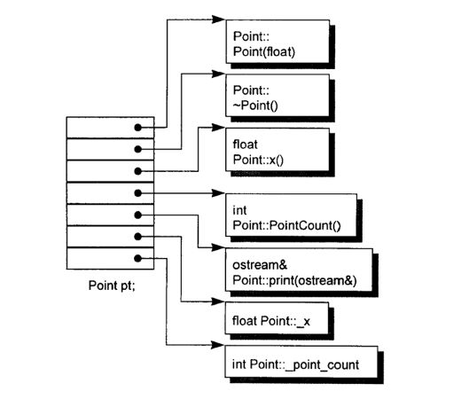
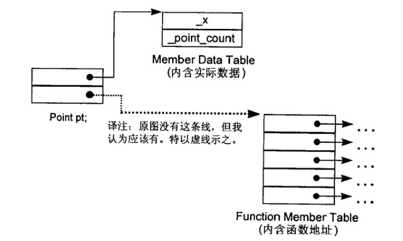
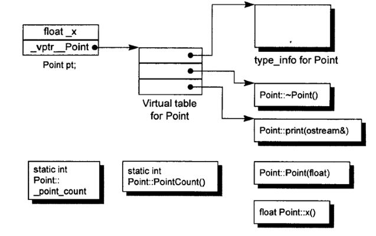
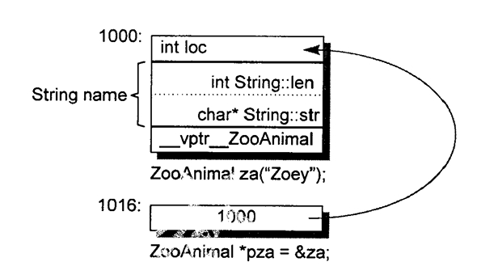
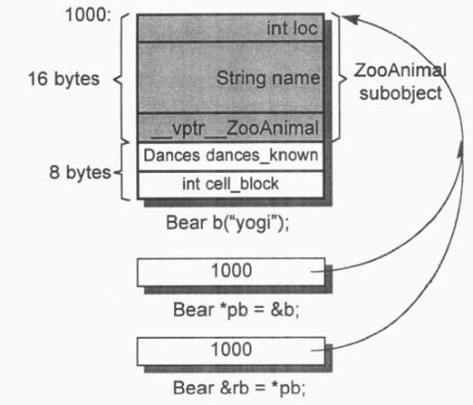
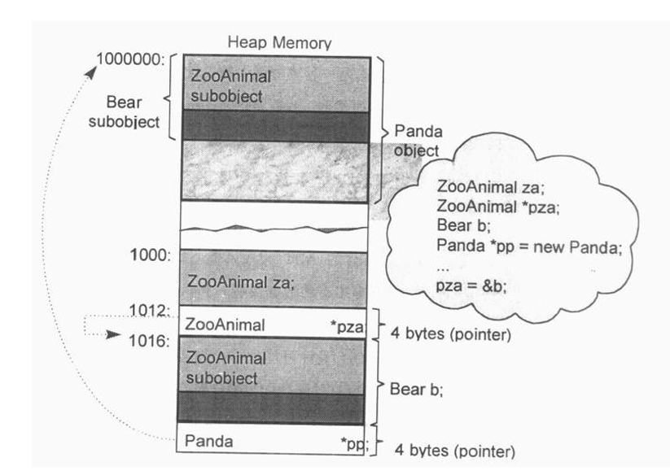
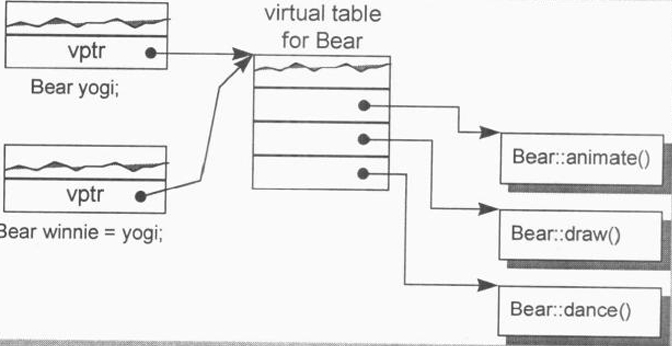
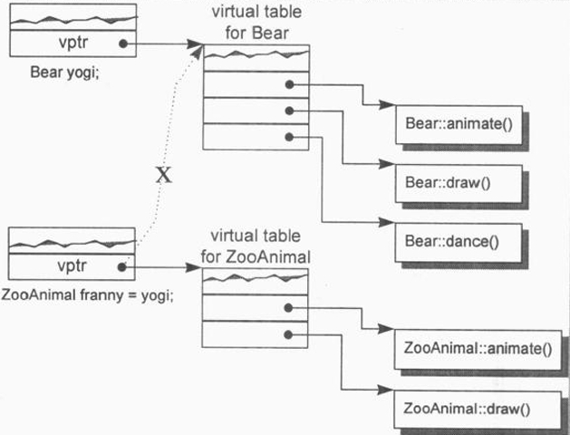
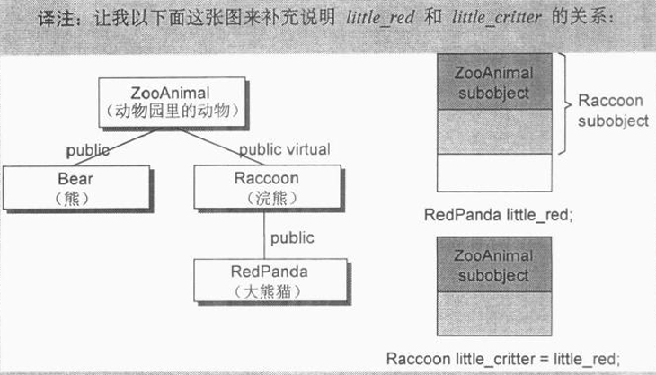

# 关于对象

## C++对象模式

在C++中，有两种class data members: static和nonstatic，以及三种class member functions: static、nonsiatic和 virtual。已知下面这个 class Point 声明：

```c++
class Point{
	public:
		point(float xval);
		virtoal ~Point();
		float x()const;
		static int PointCount();
	protected:
		virtual ostream& print(ostream &os) const;
		float x;
		static int point count;
};
```

1. **简单对象模型：**

   第一个模型十分简单。它可能是为了尽量减低C++编译器的设计复杂度而开发出来的，赔上的则是空间和执行期的效率。在这个简单模型中，一个object是一系列的 slots，每一个 slot指向一个 members。Members 按其声明次序，各被指定一个 slot。每一个data member或function member 都有自己的一个 slot。

   

   **优缺点：**

   - 优点：设计简单，指针的大小是固定的，这种模型可以避免“不同类型members需要不同存储空间”的问题
   - 缺点：多了一层间接性，空间和执行期效率稍低。 应用： 未实际应用。

2. **表格驱动对象模型:**
   为了对所有classes的所有objects 都有一致的表达方式,另一种对象模型是把所有与 members相关的信息抽出来，放在一个datamember table 和一个member functiontable之中，class object本身则内含指向这两个表格的指针。Member function table 是一系列的 slots,每一个 slot 指出一个 member function;Datamembertable 则直接含有 data本身。

   

   **优缺点：**

   - 优点：弹性较大，可以修改成员变量
   - 缺点：多了一层间接性，付出了空间和执行效率的代价

3. C++对象模型：

   Stroustrup当初设计(当前亦仍占有优势)的C++对象模型是从简单对象模型派生而来的，并对内存空间和存取时间做了优化。在此模型中，非静态数据成员被配置于每一个类对象之内，静态数据成员则被存放在所有的类对象之外。静态和非静态函数成员也被放在所有的类对象之外。虚函数则以两个步骤支持之:

   1. 每一个类产生出一堆指向虚拟函数的指针，放在表格之中。这个表格被称为虚拟函数!表(vtbl)中的一个实例。
   2. 每一个类对象被添加了一个指针，指向相关的虚拟表。通常这个指针被称为虚拟表。Vptr的设定(set)和重置(reset)都由每一个类的构造函数，析构函数和复制赋值运算符自动完成(我将在第5章讨论)。每一个类所关联的type_infoobject(用以支持非时间类型标识，RTTI)也经由虚拟表被指出来，通常是放在表格的第一个slot处。

   

   **特性：**

- 每个非内联(non-inline)成员函数只会诞生一个函数实例. 而内联函数会在每个使用者身上产生一个函数实例.

- C++在布局以及存取时间上的额外负担主要由虚(virtual)引起的:

  1. 虚函数机制(virtual function)用于支持一个有效率的运行期绑定(runtime binding).
  2. 虚基类(virtual base class) 用以实现多次出现在继承体系中的基类, 有一个单一而被共享的实例.
  3. 额外负担, 派生类转换。

- 在C++ 中，有两种静态的数据成员（static）、非静态的数据成员（nonstatic）；

- 有三种成员函数：静态的函数（static）、非静态的函数（nonstatic）、虚函数（virtual）

  **优缺点：**

- 优点：在于它的空间和存取时间的效率;
- 缺点：如果应用程序代码本身未曾改变，但所用到的classobjects的nonstatic datamembers 有所修改(可能是增加、移除或更改)，那么那些应用程序代码同样得重新编译，关于这点，前述的双表格模型就提供了较大的弹性，因为它多提供了一层间接性，不过它也因此付出空间和执行效率两方面的代价。

## class 和 struct

**关键词所带来的差异(A Keyword Distinction )**

struct的默认访问修饰符是public；而class的默认访问修饰符是private。 struct的默认继承方式是public，而class的默认继承方式是private。除此之外使用时没有区别。

- 某种意义上, 在C++中struct和class这两个关键字是可以互换的。

**关键字的困扰：struct 和 class**

- class不仅是一个关键字, 它还会引入它所支持的封装和继承的哲学。
- 为了维护c++与C语言之间的兼容性，重载函数的解决方式变得很复杂。

**策略性正确的struct（The Politically Correct Struct）**

```
struct mumble
{
	/* stuff */
	char pc[1];
}

//从档案或标准输入装置中取得一个字符串，然后为struct本身和该字符串配置足够的内存

struct mumble* pmumbl = (struct mumble*)malloc(sizeof(struct mumble) + strlen(string) + 1);
strcpy(*pmumbl.pc, string);
```

如果我们改用class来声明，而该class是:

- 指定多个 access sections，内含数据:
- 从另一个 class 派生而来;
- 定义有一个或多个 virtual functions;

这里讲述的是在C中，struct没有访问修饰符，因此struct中的成员变量是按声明顺序出现的内存中的，而在C++中，中凡处于同一个accesssection的数据，必定保证以其声明次序出现在内存布局当中。然而被放置在多个access sections中的各笔数据，排列次序就不一定了。下面的声明中，前述的C伎俩或许可以有效运行，或许不能，需视protected datamembers 被放在 private datamembers 的前面或后面而定(译注:放在前面才可以):

```c++
class stumble
{
	public:
		// operations...
	protected:
		// protected stuff
	private:
		/* private stuff */
		char pc[1];
};
```

同样的道理,baseclasses和derived classes的 data members 的布局也没有谁先谁后的强制规定，因而也就不保证前述的伎俩一定有效。虚函数也会其失效。

如果一个程序员迫切需要一个相当复杂的C++class 的某部分数据，使他拥有C声明的那种样子：

- 继承（不在推荐）：那一部分最好抽取出来成为一个独立的struct声明。将C与C++组合在一起的作法就是，从C struct中派生C++的部分:

  ```c++
  struct C_point{...};
  class Point :public C_point{...};
  ```

  C与C++都将支持：

  ```c++
  extern void draw_line(Point,Point);
  extern "C" void draw_rect(C_point, C_point);
  draw_line(Point(0,0),Point(100，100));
  draw_rect(Point(0,0)，Point(100，100));
  ```

- 组合而非继承, 才是把C和C++结合在一起的唯一可行方法：

  上述习惯用法现已不再被推荐，因为某些编译器(如Microsoft C++)在支持virtual function的机制中对于class的继承布局做了一些改变(请看3.4 节的讨论)。组合(composition)，而非继承，才是把C和C++结合在一起的唯一可行方法(conversion运算符提供了一个十分便利的萃取方法):

  ```c++
  struct C_point{...};
  class Point{
  	public:
  		operator C_point() { returnc_point; }
          // ...
      private :
  		C_point _c_point;
  }
  ```

## 对象的差异

**三种程序设计范式**

- 程序模型：
  - 像C一样，普通的程序
- 抽象数据类型模型（ADT）：
  - 如string类，所谓的抽象由public接口提供。
- 面向对象模型（OO）：
  - C++通过class的pointers和references来支持多态，这种程序设计风格被称为“面向对象”。   - 在此模型中有一些彼此相关的类型，通过抽象的base class封装起来。

**OO（Object-Oriented，面向对象）和ADT（Abstract Data Type，抽象数据类型）区别：**

ADT（抽象数据类型）

1. 定义：ADT是对数据结构的一种抽象描述，它关注的是数据类型的逻辑定义，包括数据的存储结构和在此结构上可以执行的操作，而不关心这些操作的具体实现细节。ADT提供了一种封装机制，隐藏了数据的内部表示，只暴露必要的接口给用户。
2. 特点：
   - 抽象性：ADT强调的是数据类型的逻辑特性，而不是物理实现。
   - 封装性：隐藏数据结构和实现细节，只暴露接口。
   - 通用性：ADT的定义独立于任何编程语言，可以用任何支持相应数据结构的语言实现。
3. 示例：string等都是典型的ADT，它们定义了数据的添加、删除、查看等操作，而不关心这些操作是如何具体实现的。

OO（面向对象）

1. 定义：面向对象编程是一种编程范式，它使用“对象”来设计软件，这些对象包含了数据（属性）和操作这些数据的方法（行为）。OO不仅仅是关于数据类型，更是一种软件设计思想，强调通过对象的组合、继承和多态来构建复杂系统。
2. 特点：
   - 封装：与ADT相似，但更全面，不仅限于数据，还包括方法的封装。
   - 继承：允许创建分层的类结构，子类可以继承父类的属性和方法，并可进行扩展或覆盖。
   - 多态：同一种消息可以被不同的对象以不同的方式响应，增加了代码的灵活性和可复用性。
3. 示例：在面向对象的语言如Java或C++中，定义一个“动物”类，可以有“名字”和“年龄”属性，以及“叫”这样的方法。然后，可以创建“狗”和“猫”这样的子类，它们继承自“动物”类，并可以重写或添加新的方法。

OB提供一个 public 接口和一个 private 实作品，包括数据和算法，但是不支持类型的扩充。一个OB设计可能比一个对等的OO设计速度更快而且空间更紧凑。速度快是因为所有的函数引发操作都在编译时期解析完成，对象建构起来时不需要设置 virtual机制;空间紧凑则是因为每一个class object 不需要负担传统上为了支持 virtual 机制而需要的额外负荷，不过，OB 设计比较没有弹性

**对象的大小**

1. 非静态的数据成员
2. 字节对齐额外需要的空间。
3. 为了支持多态(virtual机制)，内部产生的额外空间。

**指针的类型**

```c++
class ZooAnimal
{
	public:
		ZooAnimal();
		virtual ~ZooAnimal();
		virtual void rotate();
	protected:
		int loc;
		String name;
};
```

```c++
ZooAnimal* px;
int* pi;
Array<String>* pta;
```

以内存需求的观点来说，没有什么不同!它们三个都需要有足够的内存来放置一个机器地址(通常是个 word,译注).“指向不同类型之各指针”间的差异既不在其指针表示法不同，也不在其内容(代表一个地址)不同，而是在其所寻址出来的 object 类型不同。也就是说，“指针类型”会教导编译器如何解释某个特定地址中的内存内容及其大小:

1. 一个指向地址1000的整数指针，在32位机器上，将盖地址空间1000~1003(译注:因为32位机器上的整数是4-bytes)
2. 如果 String 是传统的8-bytes(包括一个 4-bytes 的字符指针和一个用来表示字符串长度的整数)，那么一个ZooAnimal指针将横跨地址空间1000~1015(译注:4+8+4)



加上多态之后：

```c++
class Bear : public ZooAnimal
{
	public:
		Bear();
		~Bear();
		// ...
		void rotate();
		virtual void dance();
		// ...
	protected:
		enum Dances { ... };
		Dances dances_known;
		int cell_block;
};
Bear b( "Yogi” );
Bear *pb = &b;
Bear &rb = *pb;
```

不管是pointer或reference 都只需要一个word的空间(在32位机器上是 4-bytes)。Bear object 需要 24 bytes，也就是ZooAnimal的16bytes加上Bear所带来的8bytes：



假设：

```c++
Bear b;
ZooAnimal *pz = &b;
Bear *pb = &b;
```

它们每个都指向Bear object的第一个 byte。其间的差别是，pb 所涵盖的地址包含整个 Bear object，而pz所涵盖的地址只包含 Bear object中的 ZooAnimal subobject。除了 ZooAnimal subobject 中出现的 members，你不能够使用pz来直接处理Bear的任何members。唯一例外是通过 virtual 机制：

```c++
//不合法:cellblock不是ooAnimal的一个member,
//虽然我们知道 pz当前指向一个 Bear object.
pz->cell block;
// ok:经过一个明白的 downcast 操作就没有问题!
((Bear*)pz)->cell block;
//下面这样更好，但它是一个run-time operation(译注:成本较高)
if(Bear*pb2=dynamic cast<Bear*>(pz ))
    pb2->cell block;
//ok:因为cellblock是Bear的一个 member.
pb->cell block;
```

再假设：

```c++
Bear b;
2ooAnimal za = b;//译注:这会引起切割(siiced)
//调用 2ooAnimal::rotate()
za.rotate();
```

如果初始化函数(译注:应用于上述assignment操作发生时)将一个object内容完整拷贝到另一个 object中去，为什么za的vptr 不指向 Bear 的 virtual table?

答案是，编译器在(1)初始化及(2)指定(assignment)操作(将一个 class object 指定给另一个 class object)之间做出了仲裁。编译器必须确保如果某个 object 含有一个或一个以上的 vptrs，那些 vptrs 的内容不会被 base class object 初始化或改变。

为什么 rotate()所调用的是 ZooAnimal实体而不是Bear 实体?

答案是:za 并不是(而且也绝不会是)一个Bear，它是(并且只能是)一个ZooAnimal。多态所造成的“一个以上的类型”的潜在力量并不能够实际发挥在“直接存取 objects” 这件事情上。有一个似是而非的观念:OO 程序设计并不支持对object的直接处理，举个例子，下面这一组定义:

```c++
ZooAnimal za;
ZooAnimal *pza;
Bear b;
Panda *pp = new panda; //Panda继承Bear
pza = &b;
```

其内存布局可能如下：



将za或b的地址，或Pp所含的内容(也是个地址)指定给pza，显然不是问题。一个pointer或一个reference 之所以支持多态，是因为它们并不引发内存中任何“与类型有关的内存委托操作(type-dependentcommitment)”;会受到改变的只是它们所指向的内存的“大小和内容解释方式”而已。然而，任何人如果企图改变object za的大小，便会违反其定义中受契约保护的“资源需求量”。如果把整个Bearobject指定给za，则会溢出它所配置得到的内存。执行结果当然也就不对了，当一个 base class object 被直接初始化为(或是被指定为)一个 derived classobject 时，derived object 就会被切割(sliced)，以塞人较小的 base type 内存中derived type 将没有留下任何蛛丝马迹。多态于是不再呈现，而一个严格的编译器可以在编译时期解析一个“通过该 obiect 而触发的 virtual function 调用操作”，因而回避 virtual 机制。如果 virtual function 被定义为 inline，则更有效率上的大收获。

# 构造函数语义学

## Default Constructor的建构操作

对于 class X，如果没有任何 user-declared constructor，那么会有一个 default constructor 被暗中(implicitly)声明出来……一个被暗中声明出来的 defaul constructor 将是一个 trivial (浅薄而无能，没啥用的)constructor…，没有存在以下四种情况而又没有声明任何 constructor 的classes，我们说它们拥有的是 implicit trivial default constructors，它们实际上并不会被合成出来。在合成的 default constructor 中，只有 base class subobjects  和 member class objects 会被初始化。所有其它的 nonstatic data member，如整数、整数指针、整数数组等等都不会被初始化。这些初始化操作对程序而言或许有要，但对编译器则并非必要。如果程序需要一个“把某指针设为0”的 default constructor，那么提供它的人应该是程序员.

**“带有 Default Constructor ”的Member Class Object**

如果一个 class 没有任何 constructor，但它内含一个 member object，而后者有default constructor，那么这个class的implicit default constructor 就是non trivial”，编译器需要为此 class合成出一个 default constructor。不过这个合成操作只有在constructor真正需要被调用时才会发生。在C++各个不同的编译模块中（不同的编译模块意指不同的档案），编译器如何避免合成出多个default constructor（譬如说一个是为 A.C 档合成,另一个是为 B.C档合成）呢?

解决方法是把合成的default constructor、copy constructor、destructor、assignment copy operator 都以 inline 方式完成。一个 inline函数有静态链接（staticlinkage），不会被档案以外者看到，如果函数太复杂，不适合做成 inline，就会合成出一个explicitnon-inlinestatic 实体。

举个例子：

```c++
class Foo{	public: Foo(); Foo(int)...	};
class Bar{	public: Foo foo; char*str;	};		//内涵非继承

void foo_bar()
{
    Bar bar;	//Bar::foo 必须在此处初始化
				//译注: Bar::foo是一个member object,而其class Foo
    			//		拥有 default constructor，符合本小节主题  
    if(bar.str){ }..
}
```

被合成的 Bar default constructor内含必要的代码，能够调用class Foo 的default constructor 来处理 member object Bar::foo，但它并不产生任何码来初始化Bar::str.是的，将Bar::str初始化是编译器的责任，将Bar::str初始化则是程序员的责任。被合成的defaultconstructor看起来可能像这样：

```c++
inline
Bar::Bar()
{
	//c++ 伪码
	foo.Foo:Foo();
}
```

被合成的 default constructor 只满足编译器的需要，而不是程序的需要。为了让这个程序片段能够正确执行，字符指针 str 也需要被初始化.让我们假设程序员经由下面的 default constructor 提供了 str 的初始化操作:

```c++
//程序员定义的 default constructor
Bar::Bar(){ str = 0; }
```

现在程序的需求获得满足了，但是编译器还需要初始化 member object foo.由于 default constructor 已经被明确地定义出来,编译器没办法合成第二个。编译器的行动：”如果classA内含一个或一个以上的 member classobjects，那么class d的每一个 constructor 必须调用每一个 member classes 的 default constructor”。编译器会扩张已存在的 constructors，在其中安插一些码使得 user code 在被执行之前，先调用必要的 default constructors。沿续前一个例子，扩张后的constructors 可能像这样:

```c++
//扩张后的 default constructor
//c++伪码
Bar::Bar()
{ 
	foo.Foo::Foo();
	str = 0;
}
```

如果有多个 class member objects 都要求 constructor 初始化操作，C++ 语言要求以“ member objects 在 class 中的声明次序”来调用各个 constructors。这一点由编译器完成，它为每一个 constructor 安插程序代码，以 member 声明次序”调用每一个 member 所关联的 default constructors.这些码将被安插在 explicit user code 之前。

**“带有 Default Constructor”的 Base Class**

如果一个没有任何 constructors 的 class 派生自一个“带有 default constructor”的 base class,那么这个 derived class 的 default constructor 会被视为 nontrivial，并因此需要被合成出来。它将调用上一层 base classes 的 default constructor(根据它们的声明次序)。对一个后继派生的 class 而言，这个合成的 constructor和一个“被明确提供的 default constructor”没有什么差异。如果设计者提供多个 constructors ，但其中都没有 default constructor ，编译器会扩张现有的每一个 constructors，将“用以调用所有必要之 default constructors ”的程序代码加进去，它不会合成一个新的 default constructor，这是因为其它“由user所提供的 constructors 存在的缘故。如果同时亦存在着“带有 default constructors ”的 member class objects，那些 default constructor 也会被调用——在所有 base class constructor 都被调用之后。

**“带有一个 Virtual Function”的 Class**

另有两种情况，也要合成出 default constructor：

- class 声明(或继承)一个 virtual function；
- 派生自一个继承串链，其中有一个或更多的 virtual base classes；

不管哪一种情况，由于缺乏由 user 声明的 constructors，编译器会详细记录合成一个 default constructor 的必要信息。以下面这个程序片段为例：

```c++
class Widget
{
	public:
		virtual void flip() = 0;
		...
};

void flip(const Widget& widget) { widget.flip(); }

//假设 Bell 和 Whistle 都派生自 Widget
void foo()
{
	Bell b;
	Whistle w;
	
	flip(b);
	flip(w);
}
```

下面两个扩张操作会在编译期间发生:

1. 一个 virtual function table(在 cfront 中被称为 vtbl)会被编译器产生出来，内放 class 的 virtual functions 地址；
2. 在每一个 class object 中，一个额外的 pointer member(也就是 vptr)会被编译器合成出来，内含相关的 class vtbl 的地址；

此外，widget.flip() 的虚拟引发操作(virtual invocation)会被重新改写，以使用 widget 的 vptr 和 vtbl 中的 flip() 条目:

```c++
//widget.flip()的虚拟引发操作（virtual invocation）的转变
(*widget.vptr[1](&widget))
```

其中:

- 1 表示 flip() 在 virtual table 中的固定索引；
- &widget 代表要交给“被调用的某个 flip() 函数实体”的this 指针；

为了让这个机制发挥功效，编译器必须为每一个 Widget(或其派生类之) object  的 vptr 设定初值，放置适当的 virtual table 地址。对于 class 所定义的每一个 constructor 编译器会安插一些码来做这样的事情(请看5.2节)。对于那未声明任何 constructor 的 classes，编译器会为它们合成一个 default constructor，以便正确地初始化每一个 class object 的 vptr。

**“带有一个 Virtual Base Class”的 Class**

Virtual base class 的实现法在不同的编译器之间有极大的差异。然而，每一种实现法的共通点在于必须使 virtual base class 在其每一个 derived cass object 中的位置，能够于执行期准备妥当。例如下面这段程序代码中：

```c++
class X { public: int i; };
class A : public virtual X { public: int j; };
class B : public virtual X { public : double d; };
class C : public A, public B { public : int k; };

//无法在编译时期决定(resolve)出pa->x::i的位置
void foo(const A* pa) { pa->i = 1024; }

main()
{
	foo( new A );
    foo( new C )
}
```

对于 foo(const A* pa)，当传入 A 或 C 的实例时，pa->i 的实际偏移位置在编译期并不固定，因为 pa 的具体类型在运行时才知道。具体而言：

- 当 pa 指向 A 的实例时，X 的位置可能直接在 A 内存布局的一部分；
- 当 pa 指向 C 的实例时，X 的位置可能更复杂，因为 C 是 A 和 B 的子类，且 X 通过虚继承共享在 A 和 B 中；

编译器必须改变“执行存取操作”的那些码，使 X::i 可以延迟至执行期才决定下来。原先 cfront 的做法是靠“在derived class obiect 的每一个 virtual base classes 中安插一个指针”完成。所有“经由 reference 或 pointer 来存取一个 virtual base class”的操作都可以通过相关指针完成。在我的例子中，foo() 可以被改写如下，以符合这样的实现策略：

```c++
//可能的编译器转变操作
void foo(const A* pa) { pa->_vbcX->i = 1024; }
```

其中 vbcX 表示编译器所产生的指针，指向 virtual base class X。正如你所臆测的那样，_vbcX(或编译器所做出的某个什么东西)是在 class object 建构期间被完成的。对于class 所定义的每一个 constructor，编译器会安插那些“允许每一个 virtual base class 的执行期存取操作”的码，如果 class 没有声明任何 constructors，编译器必须为它合成一个 default constructor.

## Copy Constructor的建构操作

如果 class 没有提供一个 explicit copy constructor 又当如何?当 class object 以“相同 class 的另一个 object ”作为初值时，其内部是以所谓的 default memberwise initialization 手法完成的，也就是把每一个内建的或派生的 data member(例如一个指针或一数目组)的值，从某个object拷贝一份到另一个 object身上。不过它并不会拷贝其中的member class object，而是以递归的方式施行 memberwise inirializaton。

如果一个 Class 没有声明一个 copy constructor，编译器就会隐式声明一个 copy constructor，只有编译器需要的时候，编译器才会定义一个 copy constructor 实例，并合成于程序之中，而编译器需要的时候是指 Class 不展现出bitwise copy semantics（位逐次拷贝）。即“如果一个 Class 未定义出 copy constructor，编译器就会自动为它产生出一个”这句话是不对的，只有当 Class 不展现出 bitwise copy semantics 时编译器才会产生一个。

**Bitwise Copy Semantics(位逐次拷贝)**

```c++
#include "Word.h"

Word noun("book");

void foo()
{
	Word verb = noun;
}
```

在使用复制构造时，如果该class没有定义 explicit copy constructor，那么是否会有一个编译器合成的实体被调用呢？这就得视该 class 是否展现"bitwise copy semantics”而定。

声明一：

```c++
class Word
{
	public:
		Word(const char*);
		~Word() { delete [] str; }
		// ...
	private:
		int cnt;
		char *str;
}
```

这种情况下并不需要合成出一个 default copy constructor，因为上述声明展现了“default copy semantics”，而 verb 的初始化操作也就不需要以一个函数调用收场。当然，程序的执行将因为 class Word 如此宣告而灾情惨重。如今local object verb 和 global object noun 都指向相同的字符串。在退出 foo() 之前，local object verb 会执行 destnuctor，于是字符串被删除，global objectnoun 从此指向一堆无意义之物。memberstr 的问题只能够靠“由 class 设计者实现出一个 explicit copy constructor 以改写 default memberwise initiaization”或是靠“不允许完全拷贝”解决之。不过这和“是否有一个 copy constructor 被编译器合成出来”没有关系。

声明二：

```c++
class Word
{
	public:
		Word(const String&);
		~Word() { delete [] str; }
		// ...
	private:
		int cnt;
		String str;
}
```

其中 String 声明了一个 explicit copy constructor :

```c++
class String
{
	public:
		String(const char*);
		String(const String&);
		~String();
		// ...
}
```

在这个情况下，编译器必须合成出一个 copy constructor 以便调用 member class String object 的 copy constructor:

```c++
//一个被合成出来的 copy constructor
//C++伪码
inline Word::Word(const Word& wd)
{
	str.String::String(wd.str);
	cnt = wd.cnt;
}
```

**不要 Bitwise Copy Semantics !**

1. 当 class 内含一个 member object 而后者的 class 声明有一个 copy constructor 时(不论是被class设计者明确地声明，就像前面的 String那样；或是被编译器合成，像class Word那样)；
2. 当 class 继承自一个 base class 而后者存在有一个 copy constructor 时(再次强调，不论是被明确声明或是被合成而得)；
3. 当 class 声明了一个或多个 virtual functions 时；
4. 当 class 派生自一个继承串链，其中有一个或多个 virtual base classes 时；

在这些情况下 class 不再保持 bitwise copy semantics”，而且 default copy constructor 如果未被声明的话，会被视为是 nontrivial。在这四种情况下，如果缺乏一个已声明的 copy constructor，编译器为了正确处理“以一个 class object 作为另一个 class object 的初值”，必须合成出一个 copy constructor。

前两种情况中，编译器必须将 member 或 base class 的“copy constructors 调用操作”安插到被合成的 copy constructor 中。后两种情况解释分析如下：

**重新设定 Virtual Table 的指针**

只要有一个 class 声明了一个或多个 virtual functions 就会如此：

- 增加一个 virtual function table(vtbl)，内含每一个有作用的 virtual function 的地址。
- 将一个指向 virtual function table 的指针(vptr)，安插在每一个classobject 内。

很显然，如果编译器对于每一个新产生的 class object 的 vptr 必须成功而正确地设好其初值。因此，当编译器导人一个 vptr 到 class 之中时，该class就不再展现 bitwise semantics 了。现在，编译器需要合成出一个 copy constructor，以求将 vptr 适当地初始化：

```c++
class ZooAnimal
{
	public:
		ZooAnimal();
		virtual ~ZooAnimal();
		
		virtual void animate();
		virtual void draw();
		// ...
	private:
		//ZooAnimal 的animate() 和 draw()
		//所需的数据
}

class Bear : public ZooAnimal
{
	public:
		Bear();
		virtual void dance();
		void animate();
		void draw();
		// ...
	private:
		//Bear 的animate() 和 draw() 和 dance()
		//所需的数据
}
```

ZooAnimal class object 以另一个 ZooAnimal class object 作为初值，或 Bearclass object 以另一个 Bear class object 作为初值，都可以直接靠“bitwise copysemantics”完成（除了可能会有的pointermember 之外）。

例如：

```c++
Bear yogi;
Bear winnie = yogi;
```

yogi会被 default Bear constructor初始化。而在 constructor中,yogi的 vptr被设定指向 Bearclass的 virtual table(靠编译器安插的码完成)。因此，把 yogi的vptr值拷贝给winnie的vptr 是安全的。



当一个base class object以其 derived class的object 内容做初始化操作时其vptr复制操作也必须保证安全，例如:

```c++
ZooAnimal franny = yoai; //会发生切割行为
```

franny 的 vptr 不可以被设定指向 Bear class 的 virtual table(但如果 yogi 的 franny vptr 被直接“bitwise copy”的话，就会导致此结果)，否则当下面程序片段中的 draw() 被调用而 fanny 被传进去时，就会“炸毁”(blowup)（通过 franny 调用 virtual function draw()，调用的是 Zoonimal 实体而非 Bear 实体(甚至虽然 fanny 是以 Bear object yogi 作为初值)，因为 fanny 是一个 ZooAnimal object。事实上，yogi 中的 Bear 部分已经在 fanny 初始化时被切割(sliced)掉了。如果 fanny 被声明为一个 reference (或如果它是一个指针，而其值为yogi的地址)，那么经由 fanny 所调用的 draw()才会是 Bear 的函数实体）:

```c++
void draw(const ZooAnimal& zoey) { zoey.draw(); }
void foo()
{
	//franny 的 vptr 指向 ZooAnimal 的 virtual table
	ZooAnimal franny = yogi;
	
	draw(yogi);		//Bear::draw()
	drwa(franny);	//ZooAnimal::draw(s)
}
```



**处理 Virtual Base Class Subobject**

一个 class object 如果以另一个 object 作为初值，而后者有一个 virtual base class subobject，那么也会使“bitwisecopy semantics”失效。因为每一个编译器对于虚拟继承的支持承诺，都表示必须让“derived class object中的 virtual base class subobject 位置”在执行期就准备妥当。维护“位置的完整性”是编译器的责任。“Bitwise copy semantics”可能会破坏这个位置，所以编译器必须在它自己合成出来的 copy constructor 中做出仲裁。

例如：

```c++
class Raccoon : public virtual ZooAnimal
{
	public:
    	//编译器所产生的代码(用以调用ZooAnimal的default constructor、将Raccoon的vptr初始化，
    	//并定位出 Raccoon中的 ZooAnimal subobject)被安插在两个 Raccoon constructors 之内。
		Raccoon() { /*设定 private data 初值*/ }
		Raccoon(int val) { /*设定 private data 初值*/ }
		// ...
	private:
		// 所有必要的数据
}

class RedPanda : public Raccoon
{
	public:
		RedPanda() { /*设定 private data 初值*/ }
		RedPanda(int val) { /*设定 private data 初值*/ }
		// ...
	private:
		// 所有必要的数据
}
```

一个 virtual base class 的存在会使 bitwise copy semantics 无效，其次，问题并不发生于“一个 class object 以另一个同类的 object 作为初值”之时，而是发生于“一个 class object 以其 derived classes 的某个 object 作为初值”之时。

```c++
RedPanda little_red;
Racoon little_critter = little_red
```

在这种情况下，为了完成正确的 little_critter 初值设定，编译器必须合成个 copy constructor，安插一些码以设定 virtual base class pointer/offset 的初值(或只是简单地确定它没有被抹消)，对每一个 members 执行必要的memberwise 初始化操作，以及执行其它的内存相关工作。



在下面的情况中，编译器无法知道是否"bitwise copy semantics”还保持着,因为它无法知道(没有流程分析) Raccoon 指针是否指向一个真正的 Raccoon object，或是指向一个 derived class object:

```c++
RedPanda *ptr;
Racoon little_critter = *ptr;
```

## 程序转化语意学

**明确的初始化操作**

```c++
void foo_bar()
{
	X x1(x0);		//定义了x1
	X x2 = x0;		//定义了x2
	X x3 = X(x0);	//定义了x3
    // ...
}
```

必要的程序转化有两个阶段:

1. 重写每一个定义，其中的初始化操作会被剥除。(译注:这里所谓的“定义”是指上述的 x1，x2，x3 三行；在严谨的C++用词中，“定义”是指“占用内存”的行为)
2. class的 copy constructor 调用操作会被安插进去

举个例子，在明确的双阶段转化之后，foo_bar() 可能看起来像这样:

```c++
//可能的程序转换
//c++ 伪码
void foo_bar()
{
	X x1;	//译注:定义被重写，初始化操作被剥除
	X x2;
	X x3;
	
	//编译器安插 X copy construction
	x1.X::X(x0);	//表现出对 copy constructor 的调用：X::X(const X& xx);
	x2.X::X(x0);
	x3.X::X(x0);
}
```

**参数的初始化**

C++ Standard说，把一个 class object 当做参数传给一个函数(或是作为一个函数的返回值)，相当于以下形式的初始化操作:

```c++
X xx = arg; //其中xx代表形式参数(或返回值)而arg代表真正的参数值
```

例如：

```c++
void foo(X x0);

//调用
X xx;
// ...
foo(xx);
```

在编译器实现技术上，有一种策略是导入所谓的暂时性object，并调用 Copy constructor 将它初始化，然后将该暂时性 object 交给函数：

```c++
//编译器产生出来的暂时对象
X _temp0;
_temp0.X::X(xx);

foo(_temp0);
void foo(X& x0);
```

避免再次拷贝给形参 x0 ，foo() 的声明因而也必须被转化，形式参数必须从原先的一个 class X object 改变为一个 class X reference，像这样:

```c++
void foo(X& x0);
```

其中 class X 声明了一个 destructor，它会在 foo() 函数完成之后被调用，对付那个暂时性的 object。

**返回值的初始化**

已知函数定义：

```c++
X bar()
{
	X xx;
	// 处理xx...
	
	return xx;
}
```

Stroustrup 在 cfront 中用一个双阶段转化把 bar() 的返回值如何从局部对象 xx 中拷贝过来：

1. 首先加上一个额外参数，类型是 class object 的一个 reference。这个参数将用来放置被“拷贝建构(copy constructed)“而得的返回值。
2. 在 return 指令之前安插一个 copy constructor 调用操作，以便将欲传回之 object 的内容当做上述新增参数的初值。

转换后的代码如下：

```c++
//函数转换以反映出 copy constructor
//c++ 伪码
void
bar(X& _result)
{
	X xx;
	//编译器所产生的 default constructor 调用操作
	xx.X::X();
	// ...处理 xx
	
	//编译器所产生的 copy constructor 调用操作
	_result.X::XX(xx);
	
	return;
}
```

现在编译器必须转换每一个  bar() 调用操作，以反映其新定义。例如:

```c++
X xx = bar()
//被转换为
X xx;		 //注意，不必施行 default constructor 调用操作
bar(xx);

bar().memfunc();
//可能被转换为
X _temp0;	//编译器产生的暂时对象
(bar(_temp0), _temp0).memfunc();

X （*pf)();
pf = bar;
//被转换为
void (*pf)(X&);
pf = bar;
```

**在使用者层面做优化**

替换下面代码：

```c++
X bar(const T& y,constT& z)
{
	X xx;
    // ...以y和z来处理 xx
    
    return xx;	
}
```

为：

```c++
X bar(const T& y, const T& z)
{
	return X(y, z);
}
```

第一份代码那会要求 xx 被“memberwise”地拷贝到编译器所产生的 _result 之中。而第二份代码的定义会被编译器转换为：

```c++
//c++ 伪码
void
bar(X& _result, const T& y, const T&z)
{
	_result.X::X(y, z);
	return;
}
```

_result 被直接计算出来，而不是经由 copy constructor 拷贝而得!

不过这种解决方法受到了某种批评，怕那些特殊计算用途的 constructor 可能会大量扩散，在这个层面上，class 的设计是以效率考虑居多，而不是以“支持抽象化”为优先。

**在编译层面做优化**

在一个如 bar() 这样的函数中，所有的 return 指令传回相同的具名数值，因此编译器有可能自己做优化，方法是以 _result: 参数取代 named return vaue.例如下面的 bar() 定义:

```
X bar()
{
	X xx;
	// 处理xx...
	
	return xx;
}
```

编译器把其中的 xx 以 _result 取代:

```c++
void
bar(X& _result)
{
	// default constructor 被调用
	// c++ 伪码
	_result.X::X();
	
	// ...直接处理 _result
	
	return;
}
```

考虑下面的代码：

```c++
class test
{
	friend test foo(double);
	public:
		test()
		{
			memset(array, 0, 100 * sizeof(double));
		}
	private:
		double array[100];
}

test foo(double val)
{
	test local;
	local.array[0] = val;
	local.array[99] = val;
	
	return local;
}

//有一个 main() 函数调用上述foo() 函数一千万次:
int main()
{
    for(int cnt = 0; cnt < 1000000; cnt++)
        test t = foo(double(cnt));
    return 0;
}
```

这个程序的第一个版本不能实施NRV优化，因为 test class 缺少一个 copy constructor。第二个版本加上一个inline copy constructor 如下:

```c++
inline
test::test(const test& t)
{
	memcpy(this, &t, sizeof(test));
}
```

这个 copy constructor 的出现激活了 C++ 编译器中的 NRV 优化。现在编译器无论是否明确定义拷贝构造函数都会进行NRV优化，参考：

1. [第二章构造函数语义学--关于NRV优化和copy constructor-CSDN博客](https://blog.csdn.net/aiyun1242/article/details/101811414)
2. [NRV优化详解-CSDN博客](https://blog.csdn.net/gettogetto/article/details/52863376)
3. [具名返回值优化（NRV） - 流云cpp - 博客园](https://www.cnblogs.com/lycpp/p/16822425.html)

虽然NRV优化提供了重要的效率改善，它还是饱受批评。

1. 第一个原因是优化由编译器默默完成，而它是否真的被完成，并不十分清楚(因为很少有编译器会说明其实现程度，或是否实现）（可以忽略这个原因，现代编译器基本都会完成)；

2. 第二个原因是，一旦函数变得比较复杂，优化也就变得比较难以施行。在cfont中，只有当所有的 named return 指令句发生于函数的 top level 时，优化才施行。如果导入“a nested local block with a return statement”，cfront就会静静地将优化关闭，许多程序员主张对于这种情况应该以“特殊化的 constructor”策略取代之。

3. 第三个原因则是从相反的方向出发。某些程序员真的不喜欢应用程序被优化，想象你已经摆好了你的 copy constructor 的阵势，使你的程序“以 copying 方式产生出一个 object 时”，对称地调用 destructor，例如:

   ```c++
   void foo()
   {
   	//这里希望有一个 copy constructor
   	X xx = bar();
   	// ...
   	//这里调用 destructor
   }
   ```

   在此情况下，对称性被优化给打破了，程序虽然比较快，却是错误的。

**Copy Constructor：要还是不要 ?**

已知 3D 坐标点类：

```c++
class Point3D
{
	public:
		Point3D(float x, float y, float z);
		//...
    	Point3d operator+(const Point3d&, const Point3d&);
	private:
		float _x, _y, _z;
};
```

上述 class 的 default copy constructor 被视为 trivial。它既没有任何 member(或base)class objects 带有 copy constructor，也没任何的 virtual base class 或 virtual function。所以，默认情况下，在调用 operator+ 时，一个 Point3d class object 的“memberwise初始化操作会导致“bitwise copy”，这样的效率很高，也相当安全。若启动编译器的NRV优化，必须显示定义 copy constructor ，如下：

```c++
Point3d::Point(const Point3d & rhs)
{
	_x = rhs._x;
	_y = rhs._y;
	_z = rhs._z;
}
```

但这样更有效率：

```c++
Point3d::Point(const Point3d & rhs)
{
	memcpy(this, &rhs, sizeof(Point3d));
}
```

同样的，现代 c++ 编译器无论是否明确定义拷贝构造函数都会进行NRV优化，直接在返回值上构造，因此如果想使用第二个明确定义的拷贝构造版本，需要禁止编译器的NRV优化。例如：

```c++
#include <iostream>
#include <cstring>  // For memcpy

using namespace std;

class Point3d {
public:
    float _x, _y, _z;

    // 构造函数
    Point3d(float x, float y, float z) : _x(x), _y(y), _z(z) 
    {
        cout << "constructor" << endl;
    }
    inline Point3d(const Point3d& rhs)
    {
        memcpy(this, &rhs, sizeof(Point3d));
        cout << "copy constructor" << endl;
    }
    // 显示坐标
    void show() const {
        std::cout << "Point(" << _x << ", " << _y << ", " << _z << ")\n";
    }
};

// 返回一个 Point3d 对象
Point3d foo() {
    Point3d p(1.0f, 2.0f, 3.0f);
    return p;  // 编译器将会使用 NRV 优化
}

int main() {
    // 创建一个 Point3d 对象
    Point3d pt1 = foo();  // 调用 foo 返回一个对象

    pt1.show();  // 输出 "Point(1.0, 2.0, 3.0)"
    return 0;
}

//是否明确定义拷贝构造，输出的一样
//constructor
//Point(1, 2, 3)

//g++支持禁用掉返回值优化，只需要添加编译参数-fno-elide-constructors即可
//此时的输出如下：
//constructor
//copy constructor
//Point(1, 2, 3)
```

## 成员初始化列表

当你写下一个 constructor 时，你有机会设定 class members 的初值。要不是经由 member initializationlist，就是在 constructor 函数本身之内。除了四种情况你的任何选择其实都差不多，下列情况中，为了让你的程序能够被顺利编译，你必须使用memberinitialization list：

1. 当初始化一个 reference member 时；
2. 当初始化一个 cons tmember 时；
3. 当调用一个 base class 的 constructor，而它拥有一组参数时；
4. 当调用一个 member class 的 constructor，而它拥有一组参数时；

看下面的例子：

```c++
clas Ward
{
	string _name;
	int _cnt;
	public:
		Word()
		{
			_name = 0;
			_cnt = 0;
		}
};
```

在这里，Word constructor 会先产生一个暂时性的 String object，然后将它初始化，再以一个 assignment 运算符将暂时性 object 指定给name，然后再摧毁那个暂时性 object。

```c++
//c++ 伪码
Word::Word(/* this pointer goes here */)
{
	_name.String::String();
	String temp = string(0);
	_name.String::operator=(temp);
	temp.String::~String();
	
	_cnt = 0;
}
```

更有效率地实现：

```c++
Word::Word : _name(0)
{
	_cnt = 0;
}
```

被扩张为：

```c++
//c++ 伪码
Word::Word(/* this pointer goes here */)
{
	_name.String::String(0);
	_cnt = 0;
}
```

出于代码的一致性，一些程序员也这么做，即使是一个行为良好的 member 如 _cnt：

```c++
Word::Word : _name(0), _cnt(0)
{
	
}
```

编译器会一一操作 initialization list，以适当次序在constructor 之内安插初始化操作，并且在任何 explicit user code 之前。并且 list 中的项目次序是由 class 中的 members 声明次序决定，不是由 initialization list 中的排列次序决定。在本例的 Word class 中，name 被声明于 cnt 之前，所以它的初始化也比较早。

问题一：

初始化次序”和“initialization list中的项目排列次序”之间的外观错乱会导致下面意想不到的危险:

```c++
class X
{
	int i;
	int j;
	public:
		X(int val)
		: j(val)
		, i(j)
		{
		
		}
		...
}
```

上述程序代码看起来像是要把 j 设初值为 val，再把 i 设初值为 j 问题在于，由于声明次序的缘故，initializationlist中的 i(j)其实比 j(val) 更早执行。但因为 j 一开始未有初值，所以 i(j) 的执行结果导致 i 无法预知其值。编译器应该发出一个警告消息，但事实并非如此，绝大多数编译器并没有这样的警告。

修改后的代码：

```c++
X::X(int val)
: j(val)
{
	i = j；
}
```

这样的初始化并不会继续保持按声明次序初始化。

问题二：

是否你能够像下面这样,调用一个 member function 以设定一个 member 的初值:

```c++
X::X(int val)
	:i(xfoo(val)), j(val)
	{
	
	}
```

其中 xfoo() 是 X 的一个 member function。答案是 yes。

忠告：请使用“存在于 constructor 体内的一个 member”，而不要使用“存在于 member initialization list 中的 member”，来为另一个 member 设定初值。你并不知道 xfoo() 对 X object 的依赖性有多高，如果你把 xfoo() 放在constructor 体内，那么对于“到底是哪一个member在 xfoo()执行时被设立初值”这件事，就可以确保不会发生模棱两可的情况。

Member function的使用是合法的(当然我们必须不考虑它所用到的members是否已初始化)，这是因为和此 object相关的 this 指针已经被建构妥当，而 constructor 大约被扩充为:

```c++
X::X( /* this pointer*/ int val)
{
	i = this->xfoo(val);
    j = val;
}
```

问题三：

最后，如果一个 derived class member function 被调用，其返回值被当做 base class constructor 的一个参数，将会如何:

```c++
class FooBar : public X
{
	int _fval;
	public:
		int fval() { return _fval; }
		FooBar(int val)
        : _fval(val),
        , X(fval())
        { }
}
```

C++ 伪码：

```c++
FooBar：：FooBar( /* this pointer goes here */)
{
	X::X(this, this->fval());
	_fval = val;
}
```

很明显会出现同问题一的错误。

# Data语意学

前言

```c++
class X	{ ... };

class Y : public virtual X { ... }；

class C : public virtual X { ... }；

class A : public Y, public Z { ... }；

int main()
{
    int *a;
    cout << sizeof(X) << endl;
    cout << sizeof(Y) << endl;
    cout << sizeof(Z) << endl;
    cout << sizeof(A) << endl;
    cout << sizeof(a) << endl;
}
```

**空 class 的大小为1**

事实上并不是空的，它有一个隐晦的 1 byte，那是被编译器安插进去的一个char。这使得这个class的两个 objects 得以在内存中配置独一无二的地址：

```c++
 if(&b != &c) cout << "yes" << endl;
```

**X 和 Y 的大小**

1. 语言本身所造成的额外负担(overhead)：当语言支持 virtual base classes 时，就会导致一些额外负担。在 derived class 中，这个额外负担反映在某种形式的指针身上，它或者指向 virtual base class subobject，或者指向一个相关表格；表格中存放的若不是 virtual base class subobject的地址，就是其偏移量(offset)。在 x64 的机器上，指针是 8 bytes；
2. 编译器对于特殊情况所提供的优化处理： Virtual base class X subobject 的 1 bytes ，传统上它被放在 derived class 的固定(不变动)部分的尾端，某些编译器会对 empty virtual base 提供特殊支持。在这个特殊支持之下，一个empty virtual base class 被视为 derived class object 最开头的一部分，也就是说它并没有花费任何的额外空间。这就节省了 1 bytes(译注:因为既然有了 members，就不需要原本为了 empty class 而安插的一个 char)。若没有特殊支持，Virtual base class X subobject的 1 bytes大小也出现在class Y 和 Z 身上，传统上它被放在derivedclass的固定(不变动)部分的尾端；
3. Alignment的限制：class Y 和 Z 的大小若没有第 2 点的特殊处理为 5 bytes。在大部分机器上，群聚的结构体大小会受到 alignment 的限制，使它们能够更有效率地在内存中被存取。alignment在 x64 位机器上是 8 bytes，所以class Y和Z必须填补 1 bytes。最终得到的结果就是 16 bytes。若存在特殊处理，也就不存在第 3 点，class Y 和 Z 的大小则均为 8 bytes。

**A的大小：**

1. 被大家共享的唯一一个 class X 实体，大小为 1 byte；
2. Base class Y的大小，减去“因 virtual base class X而配置”的大小，结果是 8 bytes。Base class Z的算法亦同。加起来是 8 bytes；
3. class A 自己的大小：0 byte；
4. class A 的alignment数量(如果有的话)。前述三项总合，表示调整前的大小是 17 bytes。classA必须调整至 8 bytes边界，所以需要填补 7 bytes。结果是 24 bytes；

如果编译器会对 empty virtual base 提供特殊支持：

 class X 实体的 1 byte会被拿掉，于是额外的 7 bytes填补也没有了，因此 class A的大小是 16 bytes；

## Data Member的绑定

略；

## Data Member的布局

当前各家编译器都是把一个以上的 access sections 连锁在一起，依照 data members 声明的次序，成为一个连续区块。Accesssections 的多寡并不会招来额外负担，例如在一个 section 中声明 8 个 members，或是在 8 个 sections 中总共声明 8 个members，得到的 object 大小是一样的，static data members 都不会被放进对象布局中，每一个 static data member 只有一个实体，存放在程序的 data segment 之中。members 的排列只需符合“较晚出现的 members 在 class object 中有较高的地址”这一条件即可(请看C++Standard9.2节)，也就是说，各个 members 并不一定得连续排列，因为 members 的边界调整(alignment)可能就需要填补一些 bytes。

编译器还可能会合成一些内部使用的 data members，以支持整个对象模型 vptr 就是这样的东西，当前所有的编译器都把它安插在每一个“内含 virtual function 之 class ”的 object 内。传统上它被放在所有有明确声明的 members 的最后。不过如今也有一些编译器把 vptr 放在一个 class object 的最前端。C++Standard 秉持先前所说的“对于布局所持的放任态度允许编译器把那些内部产生出来的 members 自由放在任何位置上，甚至放在那些被程序员声明出来的 members 之间。

```c++
class X
{
    public:
        virtual void foo() {};
};

class Y : public X
{
    public:
        int y;
    public:
        int x;
        void foo() {};
};


int main()
{
    Y b;
    cout << &b.x << endl;	//地址在成员y地址之后
    cout << &b.y << endl;	//地址在vptr地址之后
    cout << &b << endl;		//起始地址即为vptr的地址
}
```

## Data Member的存取

```c++
class Point3d
{
    public :
    	// ...
	private:
		float x;
    	static List<Point3d*> *freeList;
    private:
		float y;
		static constintchunkSize=250;
    private:
		float z;
};

Point3d origin, *pt = &origin;
```

 **Static Data Members**

每一个 static datamember 只有一个实体，存放在程序的 data segment 之中每次程序参阅(取用)static member，就会被内部转化为对该唯一的 extern 实体的直接参考操作。例如:

```c++
//origin.chunkSize = 250
Point3d::chunkSize = 250;

//pt->chunkSize = 250
Point3d::chunkSize = 250;
```

member 其实并不在 class object 之中因此存取 static members 并不需要通过 class object。但如果 chunkSize 是一个从复杂继承关系中继承而来的 member，或许它是一个“virtual base class 的 virtual base class”(或其它同等复杂的继承结构)的 member也说不定。但那无关紧要，程序之中对于 static members 还是只有唯一 一个实体，而其存取路径仍然是那么直接。

如果 static datamember 的存取是经由函数调用(或其它某些语法)而被存取呢?举个例子，如果:

```c++
foobar().chunkSize = 250;
```

在C++的准标准(pre-Standard)规格中没有人知道会发生什么事，因为 ARM 并未指定 foobar() 是否必须被求值(evaluated)。cfront 的做法是简单地把它丢掉。但 C++Standard 明确要求 foobar() 必须被求值(evaluated)，虽然其结果并无用处。下面是一种可能的转化:

```c++
(void) foobar();
Point3d.chunkSize = 250;
```

若取一个 static data member 的地址，会得到一个指向其数据类型的指针，而不是一个指问其 class member 的指针，因为 static member 并不内含在一个 class object 之中。例如:

```c++
&Point3d::chunkSize;
```

会获得类型如下的内存地址:

```c++
const int*
```

如果有两个 classes，每一个都声明了一个 static member，feeList,那么当它们都被放在程序的 data segment 时，就会导致名称冲突。编译器的解决方法是暗中对每一个 static data member 编码(这种手法有个名称:name-mangling)以获得一个独一无二的程序识别代码，有多少个编译器，就有多少种 name-mangling 做法！通常不外乎是表格、语法措辞等等。任何 name-mangling 做法都有两个要点:

1. 一种算法，推导出独一无二的名称；
2. 万一编译系统(或环境工具)必须和使用者交谈，那些独一无二的名称可以轻易被推导回到原来的名称；

 **NonStatic Data Members**

Nonstatic datamembers 直接存放在每一个 class object 之中，除非经由明确的(explicit)或暗喻的(implicit) class object，否则没有办法直接存取它们。只要程序员在一个 member function 中直接处理一个 nonstatic data member，所谓“implicit class object”就会发生。例如下面这段码:

```c++
Point3d
Point3d::translate(const Point3d& pt)
{
	x += pt.x;
	y += pt.y;
	z += pt.z;
}
```

表面上所着到的对干 z 的直接存取，事实上是经由一个"implicit classobject"(由 this 指针表达)完成。事实上这个函数的参数是:

```c++
Point3d
Point3d::translate(Point3d *const this, const Point3d& pt)
{
	x += pt.x;
	y += pt.y;
	z += pt.z;
}
```

欲对一个 nonstatic data member 进行存取操作,编译器需要把 class object 的起始地址加上 data member 的偏移量(ofset)。举个例子，如果:

```c++
origin._y = 0.0
```

那么地址 &origin._Y 将等于：

```c++
&origin + (&Point3d::_y - 1);
```

请注意其中的 -1 操作。指向 data member 的指针，其 offset 值总是被加上1,这样可以使编译系统区分出“一个指向 data member 的指针，用以指出 class 的第一个 member”和“一个指向 data member 的指针，没有指出任何 member”两种情况。

每一个 non static data member 的偏移量(offset)在编译时期即可获知，甚至如果 member 属于一个 base class subobject(派生自单一或多重继承串链)也是一样。因此，存取一个 non static datamember，其效率和存取一个 Cstruct member或一个 non derived class 的 member 是一样的。而虚拟继承将为“经由 base class subobject 存取 class members”导入一层新的间接性:

```c++
Point3d *pt3d;
pt3d->_x = 0.0
```

其执行效率在 _x 是一个 struct member、一个 class member、单一继承、多重继承的情况下都完全相同。但如果 _x 是一个 virtual base class 的 member，存取速度会比较慢一点。

以两种方法存取 x：

```c++
origin.x = 0.0
pt -> x = 0.0
```

“当 Point3d是一个 derived class，而在其继承结构中有一个 virtual base class，并且被存取的 member (如本例的 _x)是一个从该 virtual base class 继承而来的 member 时，就会有重大的差异”，这时候我们不能够说 pt 必然指向哪一种 class type(因此我们也就不知道编译时期这个 member 真正的 offset 位置)，所以这个存取操作必须延迟至执行期，经由一个额外的间接导引，才能够解决。但如果使用 origin，就不会有这些问题，其类型无疑是Point3d class，而即使它继承自 virtual base class，members 的 offset 位置也在编译时期就固定了。一个积极进取的编译器甚至可以静态地经由 origin 就解决掉对 _x的存取。

## 继承与Data

### 只要继承不要多态

或许希望，不论是 2D 或 3D 坐标点，都能够共享同一个实体，但又能够继续使用“与类型性质相关(所谓type-specific)”的实体，我们有一个设计策略，就是从 Point2d 派生出一个 Point3d，于是 Point3d 将继承 x 和 y 坐标的一切(包括数据实体和操作方法)。带来的影响则是可以共享“数据本身”以及“数据的处理方法”，并将其局部化。一般而言，具体继承(concrete inheritance，译注:相对于虚拟继承 virtual inheritance)并不会增加空间或存取时间上的额外负担。看下面的代码：

```c++
class Point2d
{
	public:
		point2d(float x = 0.0, float y = 0.0)
			: _x(x)
			, _y(y)
        { }
        float x() { return _x; }
        float y() { return _y; }
        
        void x(float newX) { _x = newX; }
        void y(float newY) { _y = newY; }
        
        void operator+=(const Point2d& rhs)
        {
        	_x += rhs.x();
        	_y += rhs.y();
        }
    private:
    	float _x, _y;
}

class Point3d : public Point2d
{
	public:
		point3d(float x = 0.0, float y = 0.0, float z = 0.0)
			: point2d(x, y)
			, _z(z)
        { }
        float z() { return _z; }
        
        void z(float newZ) { _z = newZ; }
        
        void operator+=(const Point3d& rhs)
        {
        	Point2d::operator+=(rhs);
        	_z += rhs.z();
        }
    private:
    	float _z;
}
```

好处就是可以把管理 x 和 y 坐标的程序代码局部化。此外这个设计可以明显表现出两个抽象类之间的紧密关系。当这两个 classes 独立的时候，Point2d object 和 Point3d object的声明和使用都不会有所改变。所以这两个抽象类的使用者不需要知道 objects 是否为独立的 classes 类型，或是彼此之间有继承的关系。

但是经验不足的人可能会重复设计一些相同操作的函数。以我们例子中的 constructor 和 operator+= 为例，它们并没有被做成 inline 函数(也可能是编译器为了某些理由没有支持 inline member functions)。Poinr3d object 的初始化操作或加法操作，将需要部分的 Point2d object 和部分的 Point3d object 作为成本。一般而言，选择某些函数做成 inline 函数，是设计 class 时的一个重要课题。其次第二个易犯的错误是，把一个 class 分解为两层或更多层，有可能会为了“表现 class 体系之抽象化”而膨胀所需空间。C++语言保证“出现在 derived class 中的 base class subobject 有其完整原样性”，正是重点所在。具体分析如下：

```c++
class concrete
{
	public:
		// ...
	private:
		int val;
		char c1;
		char c2;
		char c3;
}
```

在一部32位机器中，每一个 Concrete class object 的大小都是 8 bytes，细分如下:

1. val 占用 4 bytes;
2. c1、c2和c3各占用 1 bytes;
3. alignment(调整到 word 边界)需要 1 bytes。

把 Concrete 分裂为三层结构：

```c++
class concrete1
{
	public:
		// ...
	private:
		int val;
		char bit1;
}

class concrete2 : public concrete1
{
	public:
		// ...
	private:
		char bit2;
}

class concrete3 : public concrete2
{
	public:
		// ...
	private:
		char bit3;
}
```

从设计的观点来看，这个结构可能比较合理。但从效率的观点来看，我们可能会受困于一个事实：现在 concrete3 object 的大小是 16 bytes,比原先的设计多了一倍。


不过现代编译器都会进行内存优化：


这样的优化会带来一些问题，举个例子：

```c++
concrete2 *pc2 = new concrete2;
concrete1 *pc1_1, *pc1_2;
*pc1_2 = *pc1_1;

```

应该执行一个默认的“memberwise”复制操作(复制一个个的 members)对象是被指的 object 的 concrete1 那一部分。

```
concrete2 *pc2 = new concrete2;
concrete1 *pc1_1, *pc1_2;
pc1_1 = pc2;
*pc1_2 = *pc1_1;

cout << p->bit2 << endl;			//输出为p->bit2的值
cout << *(&p1->bit1 + 1) << endl;	//输出为p->bit2的值
cout << *(&p2->bit1 + 1) << endl;	//不可预期
```

如果 pc1_1 实际指向一个 concrete2 object 或 concrete3 object，则上述操作应该将复制内容指定给其 concrete1 subobject，但是 derived class subobject 被覆盖掉，于是其 bit2 member现在有了一个并非预期的数值。

### 加上多态

重新声明 Point2d 和 Poind3d：

```c++
class Point2d
{
	public:
		point2d(float x = 0.0, float y = 0.0)
			: _x(x)
			, _y(y)
        { }
        float x() { return _x; }
        float y() { return _y; }
        
        void x(float newX) { _x = newX; }
        void y(float newY) { _y = newY; }
        
        virtual float z() { rtuen 0.0; } 	//Poind2d的 z 为 0.0 是合理的
        virtual void z(float) {}
        
        virtual void operator+=(const Point2d& rhs)
        {
        	_x += rhs.x();
        	_y += rhs.y();
        }
    private:
    	float _x, _y;
}

class Point3d : public Point2d
{
	public:
		point3d(float x = 0.0, float y = 0.0, float z = 0.0)
			: point2d(x, y)
			, _z(z)
        { }
        float z() { return _z; }
        
        void z(float newZ) { _z = newZ; }
        
        virtual void operator+=(const Point2d& rhs)		//Point2d& 而非 Point3d&
        {
        	Point2d::operator+=(rhs);
        	_z += rhs.z();
        }
    private:
    	float _z;
}
```

只有当我们企图以多态的方式(polymorphically)处理 2d 或 3d 坐标点时在设计之中导入一个 virtual 接口上述代码才显得合理。也就是说，写下这样的码:

```c++
void foo(Poind2d& p1, Point2d& p2)
{
    // ...
    p1 += p2;	//可以运用在一个 Poind2d 和 Poind3d 对象上
    // ...
}
```

否则会带来令人无法接受的额外负担：

1. 导入一个和 Point2d 有关的 virtual table，用来存放它所声明的每一个 virtual functions 的地址。这个table的元素数目一般而言是被声明的 virtual functions 的数目，再加上一个或两个 slots(用以支持 runtime type identification)；
2. 在每一个 class object 中导入一个vptr，提供执行期的链接，使每一个 object 能够找到相应的 virtual table；
3. 加强 constructor，使它能够为 vptr 设定初值，让它指向 class 所对应的 virtual table。这可能意味着在 derived class 和每一个 base class 的 constructor 中，重新设定 vptr 的值。其情况视编译器的优化的积极性而定。第5章对此有比较详细的讨论。
4. 加强 destructor，使它能够抹消“指向 class 之相关 virtual table”的 vptr。要知道，vptr 很可能已经在 derived class destructor 中被设定为 derived class 的 virtual table 地址。记住，destructor 的调用次序是反向的：从derivedclass 到 base class。一个积极的优化编译器可以压抑那些大量的指定操作。

把vptr放置在 class object 的哪里会最好？

在 cfront 编译器中，它被放在 class object 的尾端用以支持下面的继承类型，如图所示:

```c++
struct no_virts
{
	int d1, d2;
};

class has_virts : public no_virts
{
	public:
		virtual void foo();
		// ...
	private:
		int d3;
}

no_virts *p = new has_virts;
```


把 vptr 放在 class object 的尾端，可以保留 base class Cstruct 的对象布局因而允许在 C 程序代码中也能使用，并且上述的操作并不需要编译器去调停或修改地址，它很自然地可以发生，而且提供了最佳执行效率。

目前很多流行的编译器，把它放在前端：


如果 base class 没有 virtual function 而 derived cass 有(正如上图)，那么单一继承的自然多态(natural polymorphism)就会被打破、在这种情况下，把一个 derived object 转换为其 base 类型，就需要编译器的介人，用以调整地址(因 vptr 插入之故)，在既是多重继承又是虚拟继承的情况下，编译器的介人更有必要。

把vptr 放在 class object 的前端，对于“在多重继承之下，通过指向 class members 的指针调用 virtual function”，会带来一些帮助(请参考4.4节)，否则，不仅“从 class object 起始点开始量起”的 offset 必须在执行期备妥，甚至与class vptr 之间的 offset 也必须备妥。当然，vptr 放在前端，代价就是丧失了C语言兼容性。这种丧失有多少意义?有多少程序会从一个 Cstruct 派生出一个具多态性质的 class 呢?

### 多重继承

```c++
class Point2d
{
	public:
		// ... (拥有virtual接口)
	protected:
		float _x, _y;
};

class Point3d : public Point2d
{
	public:
		// ... 
	protected:
		float _z;
};

class Vertex
{
	public:
		// ... (拥有virtual接口)
	protected:
		Vertex *next;
};

class Vertex3d : public Point3d, public Vertex
{
	public:
		// ... 
	protected:
		float mumble;
};
```

多重继承的问题主要发生于 derived ciass objects 和其第二或后继的 base class objects 之间的转换，对一个多重派生对象,将其地址指定给“第一个 base class的指针”，情况将和单一继承时相同，因为二者都指向相同的起始地址。需付出的成本只有地址的指定操作而已，至于第二个或后继的 base class 的地址指定操作，则需要将地址修改过：加上(或减去，如果 downcast 的话)介于中间的 base class subobject(s)大小，例如:

```c++
Vertex3d v3d;
Vertex *pv;
Point2d *p2d;
Point2d *p3d;
```

下面的操作:

```c++
pv = &v3d;
```

需要内部转换为：

```c++
pv = (Vertex*)(((char*)&v3d) + sizeof(Point3d))
```

而下面的操作：

```
p2d = &v3d;
p3d = &v3d;
```

只需要简单的拷贝地址。

如果有两个指针：

```c++
Vertex3d *pv3d;
Vertex *pv;

pv = pv3d;
```

这个操作不能只是简单的被转换为：

```c++
pv = (Vertex*)(((char*)&v3d) + sizeof(Point3d))
```

因为如果 pv3d 为 0，pv将获得 sizeof(Point3d) 的值。这是错误的!所以，对于指针，内部转换操作需要有一个条件测试:

```c++
pv = pv3d ? pv = (Vertex*)(((char*)&v3d) + sizeof(Point3d)) : 0;
```

数据布局如下图所示：


C++ Standard 并未要求 Vertex3d 中的 base classes Point3d 和 Vertex 有特定的排列次序。原始的 cfront 编译器是根据声明次序来排列它们。因此cfront编译器制作出来的 Vertex3d 对象，将可被视为是一个 Point3d subobject(其中又有一个 Point2d subobject)加上一个 Vertex subobject，最后再加上 Vertex3d 自己的部分。目前各编译器仍然是以此方式完成多重 base classes 的布局(但如果加上虚拟继承，就不一样了)。如果要存取第二个(或后继)base class中的一个 data member，不需要付出额外的成本吗，members 的位置在编译时就固定了，因此存取 members 只是一个简单的 offset 运算，就像单一继承一样简单——不管是经由一个指针、一个reference或是一个object 来存取。

### 虚拟继承

这小节参考：[(好)C++ 多继承和虚继承的内存布局-CSDN博客](https://blog.csdn.net/yockie/article/details/50603236)

Class 如果内含一个或多个 virtual base class subobjects，将被分割为两部分:一个不变局部和一个共享局部。不变局部中的数据，不管后继如何衍化，总是拥有固定的 offset (从 object 的开头算起),,所以这一部分数据可以被直接存取。至于共享局部,所表现的就是 virtual base class subobject，这一部分的数据，其位置会因为每次的派生操作而有变化所以它们只可以被间接存取。各家编译器实现技术之间的差异就在于间接存取的方法不同。以下说明三种主流策略。下面是Vertex3d虚拟继承的层次结构：

```c++
class Point2d
{
	public:
		// ... 
	protected:
		float _x, _y;
};

class Vertex : public virtual Point2d
{
	public:
		// ... 
	protected:
		Vertex *next;
};

class Point3d : public virtual Point2d
{
	public:
		// ... 
	protected:
		float _z;
};

class Vertex3d : public Vertex, public Point3d
{
	public:
		// ... 
	protected:
		float mumble;
};
```

一般的布局策略：先安排好derived class的不变部分。然后再建立其共享部分，cfront 编译器会在每一个 derived class object 中安插一些指针，每个指针指向一个 virtual base class。要存取继承得来的 virtual base class members，可以使用相关指针间接完成。举个例子，如果我们有以下的Point3d 运算符:

```c++
void
Point3d::
operator+=(const Point3d &rhs)
{
	_x += rhs._x;
	_y += rhs._y;
	_z += rhs._z;
}
```

在 cfront 实现模型之下，内部转换为：

```c++
_vbcPoint2d->_x += rhs._vbcPoint2d->_x;
_vbcPoint2d->_y += rhs._vbcPoint2d->_y;
_z += ths._z;
```

而一个 derived class 和一个 base class 的实例之间的转换，像这样:

```c++
Point2d *p2d = pv3d;
```

在 cfront 实现模型之下，内部转换为：

```c++
Point2d *p2d = pv3d ？ pv3d->_vbcPoint2d : 0;
```

这样的实现模型有两个主要的缺点:

1. 每一个对象必须针对其每一个 virtual base class 背负一个额外的指针，然而理想上我们却希望 class object 有固定的负担，不因为其 virtual base classes 的数目而有所变化。
2. 由于虚拟继承串链的加长，导致间接存取层次的增加。这里的意思是如果我有三层虚拟衍化，我就需要三次间接存取(经由三个virtualbaseclass指针)。然而理想上我们却希望有固定的存取时间，不因为虚拟衍化的深度而改变。

MetaWare 和其它编译器到今天仍然使用 cfront 的原始实现模型来解决第二个问题，它们经由拷贝操作取得所有的 nested virtual base class 指针，放到 derived class object 之中。这就解决了“固定存取时间”的问题，虽然付出了一些空间上的代价。MetaWare 提供一个编译时期的选项，允许程序员选择是否要产生双重指针。下图说明这种“以指针指向 base class”的实现模型：


至于第一个问题，一般而言有两个解决方法:

Microsoft 编译器引人所谓的 virtual base class table。每一个 class object 如果有一个或多个 virtual base classes，就会由编译器安插一个指针，指向 virtual base class table。至于真正的 virtual base class 指针，当然是被放在该表格中。

第二个解决方法，是在 virtual function table 中放置 virtual base class 的 offset(而不是地址)，在新近的Sun编译器中，virtual function table 可经由正值或负值来索引，如果是正值，很显然就是索引到 virtual functions；如果是负值，则是索引到virtual base class offsets，在这样的策略之下，Point3d 的 operator+= 运算符必须被转换为以下形式(为了可读性，没有做类型转换，同时也没有先执行对效率有帮助的地址预先计算操作):

```c++
//虚拟 c++ 码
(this + _vptr_Point3d[-1])->_x += (this + _vptr_Point3d[-1])->_x;
(this + _vptr_Point3d[-1])->_y += (this + _vptr_Point3d[-1])->_y;
_z += rhs._z;
```

 derived class 和一个 base class 的实例之间的转换:

```c++
Point2d *p2d = pv3d ？ pv3d + pv3d->_vptr_Point3d[-1] : 0;
```

虽然在此策略之下，对于继承而来的members做存取操作，成本会比较昂贵，不过该成本已经被分散至“对 member 的使用”上，属于局部性成本。具体解释为，基类成员的访问涉及偏移量计算（如通过 _vptr_Point3d[-1]），这比普通的成员访问稍微慢一些。这种偏移计算的性能开销仅在实际访问基类成员时发生，因此成本被“分散”到每次使用基类成员的操作上，而不是集中在一次转换过程中。

实现模型如下图所示：


上述每一种方法都是一种实现模型，而不是一种标准。每一种模型都是用来解决“存取 shared subobject 内的数据(其位置会因每次派生操作而有变化)所引发的问题。而经由一个非多态的 class object 来存取一个继承而来的 virtual base class 的member，像这样:

```c++
Point3d origin;
origin._x;
```

可以被优化为一个直接存取操作，就好像一个经由对象调用的 virtual function 调用操作，可以在编译时期被决议(resolved)完成一样。在这次存取以及下一次存取之间，对象的类型不可以改变，所以“virtual base class subobjects 的位置会变化”的问题在这种情况下就不再存在了。一般而言，virtual base class 最有效的一种运用形式就是：一个抽象的 virtual base class，没有任何 data members。

## 对象成员的效率

应该实际测试，不要光凭推论或常识判断或假设聚合(aggregation)、封装(encapsulation)，以及继承(inheritance)等会引发的额外负荷的程度。

## 指向 Data Members 的指针

考虑下面的 Point3d 声明：

```c++
class point3d
{
	public:
		virtual ~point3d();
		// ...
	protected:
		static point3d origin;
		float x, y, z;
}
```

取成员 z 的地址：

```c++
&point3d::z;
```

上述操作将得到 z 坐标在 class object 中的偏移量(offset)。最低限度其值将是 x 和 y 的大小总和，因为 C++ 语言要求同一个 access level 中的 membcrs 的排列次序应该和其声明次序相同，然而 vptr 的位置就没有限制。不过容我再说一次，实际上 vptr 不是放在对象的头部，就是放在对象的尾部。在一部32位机器上，每一个 float 是 4 bytes 所以我们应该期望刚才获得的值要不是 8，就是12(在32位机器上一个 vptr 是 4 bytes)。

然而去取成员变量的，可能还缺少 1 bytes，下面是BCB3编译器上的结果：

```c++
printf("&point3d::x = %p\n", &point3d::x);	//BCB3：5
printf("&point3d::y = %p\n", &point3d::y);	//BCB3：9
printf("&point3d::z = %p\n", &point3d::z);	//BCB3：D
```

下面是在VC5编译器的结果，可能编译器做了特殊处理，其道理与本章一开始对于 empty virtual base class 的讨论相近：

```
printf("&point3d::x = %p\n", &point3d::x);	//VC5：4
printf("&point3d::y = %p\n", &point3d::y);	//VC5：8
printf("&point3d::z = %p\n", &point3d::z);	//VC5：C
```

为什么这么做？问题在于，如何区分一个“没有指向任何 data member”的指针和一个指向“第一个 data member”的指针?考虑这样的例子:

```c++
float point3d::*p1 = 0;
float point3d::*p2 = &point3d::x;

if(p1 == p2)
{
	cout << "p1 &p2 contain the same value -- ";
	cout << "they must address the same member!" << endl;
}
```

为了区分 p1 和 p2，每一个真正的 member offset 值都被加上1。因此，不论编译器或使用者都必须记住，在真正使用该值以指出一个 member 之前，请先减掉1。

认识“指向 datamembers 的指针”之后，我们发现，要解释:

```c++
&point3d::z;
//和
&origin.z；
```

之间的差异，就非常明确了。鉴于“取一个 non static datamember 的地址，将会得到它在 class 中的 ofset”，取一个“绑定于真正 class object 身上的 data amember”的地址，将会得到该member在内存中的真正地址。把

```c++
&origin.z
```

所得结果减 z 的偏移值(相对于 origin 起始地址)并加 1 ，就会得到 origin 起始地址，上一行的返回值类型应该是:

```
float*
```

而不是

```
float Point3d::*
```

由于上述操作所参考的是一个特定实例，所以取一个static datamember 的地址，意义也相同。

在多重继承之下，若要将第二个(或后继)base class的指针和一个“与 derived class object 绑定”之 member 结合起来，那么将会因为“需要加入 offset 值”而变得相当复杂：例如，假设我们有:

```c++
class base1
{
    public:
        int val1 = 0;
};
class base2
{
    public:
        int val2 = 1;
};
class derived : public base1, public base2
{
    public:
        int val3 = 1;
};

void func1(int derived::*dmp, derived *pd)
{
    pd->*dmp;	//如果传进来的却是一个“指向 base class 之 membe r”的指针，会怎样呢
}

void func2(derived *pd)
{
    //bmp 将成为1
    int base2::*bmp = &base2::val2;
    //但是在 derived 中， val2 == 5
    func(bmp, pd);
}
```

当 bmp 被作为 func1() 的第一个参数时，它的值就必须因介人的 base1 class 的大小而调整，否则 func1() 中的操作，将存取到 base1::val1，而非程序员所以为的 base2::val2。要解决这个问题，必须：

```c++
//经由编译器内部转换
func(bmp + sizeof(base1), pd);
```

然而，一般而言，我们不能够保证 bmp 不是 0，因此必须特别留意之：

```c++
func(bmp ? bmp + sizeof(base1) : 0, pd);
```

VC5 打印上述各个 member 的 offset 值，至于为什么不是 1 ，同上面的解释:

```c++
printf("&base1::val1 = %p\n", &base1::val1);		//0
printf("&base2::val2 = %p\n", &base2::val2);		//0
printf("&derived::val1 = %p\n", &derived::val1);	//0
printf("&derived::val2 = %p\n", &derived::val2);	//0
													//C++ 标准规定，如果你尝试从派生类获取基类成员的地址（例如 &derived::val2），编译器会计算偏移量。对于 base2 的成员变量 val2：
													//val2 是 base2 的一个成员。在 derived 中，由于多重继承，base2 的子对象可能并不从对象的起始地址开始，而是从一个偏移量位置开始。
printf("&derived::val3 = %p\n", &derived::val3);	//8
```

指向 members 的指针的效率问题：

取得一个“已绑定的 member”的地址，然后施加赋值、加减法操作:

```c++
float *ax = &pA.x；
    
*bx = *ax - *bz;
*by = *ay + *bx;
*bz = *az + *by;
```

取得“指向 datamember 之指针”的地址，然后施加赋值、加减法操作把数值绑定到对象p4和pB中::

```c++
float point3d::*ax = &point3d::x；
    
pB.*bx = pA.*ax - pB.*bz;
pB.*by = pA.*ay + pB.*bx;
pB.*bz = pA.*az + pB.*by;
```

书中的执行效率如下表：


为每一个“member 存取操作”加上层间接性(经由已绑定的指针)，会使执行时间多出一倍不止。以“指向member的指针”来存取数据，再一次几乎用掉了双倍时间。要把“指向member的指针绑定到 class object身上，需要额外地把offset 减 1（前提是编译器并没有将 1 优化）。

继承对于“指向 data member 的指针”所带来的效率冲击。在第一个例子中，独立的Point class 被重新设计为一个三层单一继承体系，每一个class有一个 member:

```c++
class point { ... };					//float x;
class point2d: public point { ... };	//float y;
class point3d: public point2d { ... };	//float z;
```

第二个例子仍然是三层单一继承体系，但导人一层虚拟继承:Point2d 虚拟派生自 Point。结果，每次对于 Point::x 的存取，将是对一个 virtual base class data member 的存取，最后一个例子，实用性很低，加上第二层虚拟继承，使 Point3d 虚拟派生自 Point2d、下面显示测试结果。注意：由于NCC优化的效率在各项测试中都是一致的，已经把它从表格中剔除了：


由于被继承的 data members 是直接存放在 class object 之中，所以继承的引人一点也不会影响这些码的效率。虚拟继承所带来的主要冲击是，它妨碍了优化的有效性，为什么呢？在两个编译器中，每一层虚拟继承都导人一个额外层次的间接性。在两个编译器中，每次存取 point::.x，像这样:

```c++
pB.*bx
```

被转换为：

```c++
&pB->_vbcPoint + (bx - 1);
```

而不是转换最直接的：

```
&pB->(bx - 1);
```

额外的间接性会降低“把所有的处理都搬移到缓存器中执行”的优化能力。

# Function 语意学

## **Member 的各种调用方式**

如果有个 Point3d 的指针和对象

```c++
Point3d obj;
Point3d *ptr = &obj;
```

其中的 Point3d::normalize() 定义如下:

```
Point3d
Point3d::normalize() const
{
	register float mag = magnitude();
	Point3d normal;
	normal._x = _x/mag;
	normal._y = _y/mag;
	normal._z = _z/mag;
	return normal;
}
```

Point3d::magnitude()  定义如下：

```c++
Point3d 
Point3d::magnitude() const
{
	return sqrt(_x * _x + _y * _y + _z * _z)
}
```

调用：

```c++
obj.normalize();
ptr->normalize();
```


### 非静态成员函数

C++的设计准则之一就是:nonstatic member function 至少必须和一般的 non member function 有相同的效率。也就是说，如果我们要在以下两个函数之间作选择，选择 member function 不应该带来额外的负担:

```c++
float magnitude3d(const Point3d *_this) { ... }
float Point3d::magnitude3d() const { ... }
```

下面是 magnitude() 的一个 non member 定义：

```c++
float magnitude3d(const Point3d *_this)
{
	return sqrt(_this->_x * _this->_x + _this->_y * _this->_y + _this->_z * _this->_z)
}
```

编译器内部已将 member 函数实体”转换为对等的“non member数实体”：

首先修改函数的签名：

```c++
Point3d Point3d::magnitude(Point3d *const this)
```

如果函数是 const，则变成：

```c++
Point3d Point3d::magnitude(const Point3d *const this)
```

将每一个“对 nonstatic data member 的存取操作”改为经由 this 指针来存取:

```c++
{
	return sqrt(this->_x * this->_x + this->_y * this->_y + this->_z * this->_z)
}
```

将 member function重新写成个外部函数，对函数名称进行 mangling ”处理，使它在程序中成为独一无二的语汇:

```c++
extern magnitude_7Point3dFv(register Point3d *const this)
```

现在这个函数已经被转换好了，而其每一个调用操作也都必须转换，于是:

```c++
obj.magnitude();
ptr->magnitude();
```

变成了：

```c++
magnitude_7Point3dFv（&obj);
magnitude_7Point3dFv（ptr);
```

一般而言，member的名称前面会被加上class名称，形成独一无二的命名。例如下面的声明：

```c++
class Bar { public: int ival; ... };
```

其中的 ival 有可能变成这样:

```c++
ival_3Bar
```

why?考虑下面的例子：

```c++
class Foo : public Bar { public : int ival; ...}
```

Foo 对象内部结合了 base class 和 derived class 两者：

```c++
//C++伪码
//Foo 的内部描述
class Foo
{
    public:
        int ival_3Bar;
        int ival_3Foo;
}:
```

不管你要处理哪一个 ival，通过“name mangling都可以绝对清楚地指出来。

本章一开始所提及的 normalize() 函数会被转化为下面的形式:

```c++
void
normalize_7Point3dFv(const register Point3d *const this, Point3d & _result) 
{
	register float mag = this->magnitude();
	
	_result.Point3d::Point3d();
	_result._x = this->_x/mag;
	_result._y = this->_y/mag;
	_result._z = this->_z/mag;
	return;
}
```


### 虚拟成员函数

normalize() 是一个 virtual member function，那么以下的调用:

```c++
ptr->normalize();
```

将会被内部转换为：

```c++
(*ptr->vptr[1])(ptr);	//1是 virtualtable slot 的索引值，关联到 normalize() 函数.
						//第二个ptr 表示隐式参数 this 指针。
```

类似的道理，如果 magnitude() 也是一个 virtual function，它在 normalize() 之中的调用操作将被转换如下:

```c++
register float mag = (*this->vpter[2])(this);
```

此时，由于 Point3d::magnitude() 是在 Point3d::normalize() 中被调用，而后者已经由虚拟机制而决议(resolved)妥当，所以明确地调用“Point3d实体”会比较有效率，并因此压制由于虚拟机制而产生的不必要的重复调用操作:

```c++
//明确的调用操作(explicitly invocation)会压制虚拟机制
register float mag = Point3d::magnitude();
```

如果 magniude() 声明为 inline 函数会更有效率。使用 classs cope operator 明确调用一个 virtual function，其决议(resolved)方式会和 nonstatic member function 一样：

```c++
register float mag = normalize_7Point3dFv(this);
```

而对于以下调用:

```c++
obj.normalize();
```

却没有必要像上述一样转换。请回忆那些并不支持多态(polymorphism)的对象(1.3节)。所以上述经由 obj 调用的函数实体只可以是 Point3d:normalize()“经由一个 class object 调用一个 virtual function”，这种操作应该总是被编译器像对待一般的 nonstatic member function 一样地加以决议(resolved):

```c++
magnitude_7Point3dFv（&obj);
```

### 静态成员函数

如果 Point3d::normalize() 是一个 static member function，上述两个调用操作将被转换为一般的 non member 函数调用，像这样：

```c++
magnitude_7Point3dFv();		//obj.normalize();
magnitude_7Point3dFv();		//ptr->normalize();
```

在引人 static member functions 之前，C++ 语言要求所有的 member functions 都必须经由该 class 的 object 来调用。而实际上，只有当一个或多个 nonstatic data members 在 memter function 中被直接存取时，才需要 class object。Class object 提供了 this 指针给这种形式的函数调用使用。这个 this 指针把“在member functions中存取的 nonstatic class members”绑定于“object 内对应的 members”之上 。如果没有任何一个 members 被直接存取，事实上就不需要 this 指针，因此也就没有必要通过一个 Class object 来调用一个 member function。不过C++语言到当前为止并不能够识别这种情况。这么一来就在存取 static data members 时产生了一些不规则性。如果 class 的设计者把 static data member 声明为 non public(这一直被视为是一种好的习惯)，那么他就必须提供一个或多个 member functions 来存取该 member。因此虽然你可以不靠 class object 来存取一个 static member，但其存取函数却得绑定于 class object 之上。

独立于 class object 之外的存取操作，在某个时候特别重要：当class 设计者希望支持“没有 class object 存在”的情况(就像前述的 object_count() 那样)时，程序方法上的解决之道是很奇特地把 0 强制转型为一个 class 指针，因而提供出一个 this 指针实体:

```c++
object_count((Point3d*)0);
```

至于语言层面上的解决之道，是由 cfront2.0 所引人的 static member functions。Static member functions 的主要特性就是它没有 this 指针。以下的次要特性统统根源于其主要特性:

- 它不能够直接存取其 class 中的 nonstatic members。
- 它不能够被声明为 const、volatile 或 virtual。
- 它不需要经由 class object 才被调用---虽然大部分时候它是这样被调用的！“member selection”语法的使用是一种符号上的便利，它会被转化为一个直接调用操作

static member function 当然会被踢出于 class 声明之外，并给予一个经过“mangled”的适当名称。例如:

```c++
unsigned int
Point3d::
object_count()
{
	return _object_count;
}
```

会被 cfront 转换为：

```c++
unsigned int
object_count_5Point3dSFv()	//其中 SFy 表示它是个 static member function，拥有一个空白(void)的参数链表(argument list)
{
	return _object_count;
}
```

如果取一个 static member function 的地址，获得的将是其在内存中的位置也就是其地址。由于 static member function 没有 this 指针，所以其地址的类型并不是一个“指向 class member function 的指针”，而是一个“nonmember 函数指针”，也就是说:

```c++
&Point3d::object_count();
```

会得到一个数值，类型是:

```c++
unsigned int(*)();
```

而不是:

```c++
unsigned int(Point3d::*)();
```

Static member function 由于缺乏 this 指针，因此差不多等同于 nonmember function 它提供了一个意想不到的好处：成为一个 callback 函数，使我们得以将 C++ 和 C-basedX Window 系统结合(请看[YOUNG95]中的讨论)。它们也可以成功地应用在线程(threads)函数身上(请看SCHMIDT94a)

## Virtual Member Functions(虚拟成员函数)

**多态：**

可以在编译期完成的多态被称为消极多态：

```c++
//Point2d， Point3d非虚继承自 Point
Point *ptr;
ptr = new Point2d;
ptr = new Point3d;

void fun(Point *);
fun(ptr);

//非虚函数调用：
ptr->nonVirtualFun();
```

执行期多态（动态绑定）被称为积极多态：

```c++
//虚函数调用
ptr->virtualFun();

//RTTI
if(Point3d *p3d = dynamic_cast<Point3d*>(ptr))	return p3d->_z;

//虚继承
class Base { ... };
class Derived1 : virtual public Base { ... };
class Derived2 : virtual public Base { ... };
class Final : public Derived1, public Derived2 { ... };

Base* ptr = new Final;
```

### 单一继承下的 Virtual Functions

```c++
class Point {
    public:
        virtual ~Point();
        virtual Point& muit(float) = 0;
        // ...其它操作
        float x() const{ return _x; }
        virtual float y() const{ return 0; }
        virtual float z() const{ return 0; }
        // ...
    protected:
    	Point(float x = 0.0);
    	float _x;
};

class Point2d : public Point{
    public:
		Point2d(float x = 0.0，float y = 0.0)
            : Point(x)
            , _y(y)
        {}
    	~Point2d();
		//改写base class virtual functions
    	Point2d& mult(float);
    	float y() const { return _y; }
    	//… 其它操作
    protected:
    	float _y;
};

class Point3d : public Point2d{
    public:
		Point3d(float x = 0.0，float y = 0.0，float z = 0.0)
            : Point2d(x, y)
            , _z(z)
        {}
    	~Point3d();
		//改写base class virtual functions
    	Point3d& mult(float);
    	float z() const { return _z; }
    	//… 其它操作
    protected:
    	float _z;
};
```

一个class 只会有一个 virtual table。每一个 table 内含其对应的 class object 中所有 active virtual fnctions 函数实体的地址。这些 active virtual functions 包括：

- 这个 class 所定义的函数实体。它会改写(overriding)一个可能存在的 base class virtual function 函数实体
- 继承自 base class 的函数实体，这是在 derived class 决定不改写 virtual function 时才会出现的情况
- 一个 pure_virtual called() 函数实体，它既可以扮演 pure virtual function的空间保卫者角色，也可以当做执行期异常处理函数(有时候会用到)

Point 中的 virtual destructor 被赋值 slot1，而 mult() 被赋值 slot 2。此例并没有 mult() 的函数定义(泽注:因为它是一个 pure virtual function)，所以 pure_virtual _called(的函数地址会被放在 slot2 中。如果该函数意外地被调用，通常的操作是结束掉这个程序。y被赋值 slot3 而 z()被赋值 slot4 。x() 的 slot 是多少？答案是没有，因为 x() 并非 virtual function。

当一个 class 派生自 Point 时，一共有三种可能性:

- 它可以继承 base class 所声明的 virtual functions 的函数实体。正确地说，是该函数实体的地址会被拷贝到 derived class 的 virtual table 相对应的 slot 之中。
- 它可以使用自己的函数实体。这表示它自己的函数实体地址必须放在对应的 slot 之中。
- 它可以加人一个新的 virtual function。这时候 virtual table 的尺寸会增大一个 slot，而新的函数实体地址会被放进该slot之中。

Point2d 的 virtual table 在 solt1 中指出 destructor，而在 slot 2 中指出 mult()(取代 pure virtual function)。它自己的 y() 函数实体地址放在 slot 3，继承自Point的 z() 函数实体地址则放在slot4。

下图表示 Point 继承体系的内存布局和其 virtual table：


现在，如果有这样的式子:

```c++
ptr->z();
```

一般而言，并不知道 ptr 所指对象的真正类型。然而知道，经由 ptr 可以存取到该对象的 virtual table；虽然不知道哪一个 z() 函数实体会被调用，但我知道每一个 z() 函数地址都被放在slot4。

这些信息使得编译器可以将该调用转化为

```c++
(*ptr->vptr[4])(ptr);
```

在这个转化中，vptr 表示编译器所安的指针，指向 virtual table；4 表示 z() 被赋值的 slot 编号(关联到 Point 体系的 virtual table)。唯一一个在执行期才能知道的东西是：slot4 所指的到底是哪一个 z() 函数实体?

### 多重继承下的 virtual functions

```c++
class Base1
{
	public:
		Base1();
		vortual ~Base1();
        virtual void speakClearly();
        virtual Base1 *clone() const;
    protected:
    	float data_Base1;
};

class Base2
{
    public:
    	Base2();
    	virtual ~Base2();
        virtual void mumble();
        virtual Base2 *clone() const;
    protected:
    	float data_Base2;
};

class Derived : public Base1, public Base2
{
    public:
    	Derived();
    	virtual ~Derived();
    	virtual Derived *clone() const;
    protected:
    	float data_Derived;
};
```

该调用操作所连带的“必要的this指针调整”操作，必须在执行期完成。也就是说，offset的大小，以及把ofset加到this指针上头的那一小段程序代码必须由编译器在某个地方插入。

```c++
Base2 *pbase2 = new Derived;
```

编译期代码：

```c++
Deived *temp = new Derived;
Base2 *pbase2 = temp ? temp + sizeof(Base1) : 0;
```

这样的调整，即使 pbase2被指定一个 Derived 对象，下面的代码也应该没有问题：

```c++
pbase2->data_Base2;
```

**thunk 技术：**

当程序员要删除 pbase2 所指的对象时：

```c++
delete pbase2;
```

指针必须被再一次调整，以求再一次指向 Derived 对象的起始处(推测它还指向Derived 对象)。然而上述的 offset 加法却不能够在编译时期直接设定，因为 pbase2 所指的真正对象只有在执行期才能确定。一般规则是，经由指向“第二或后继之baseclass”的指针(或reference)来调用 derived class virtual function，就如本例一样。

原先实施于 cfront 编译器中的方法是将 virtual table 加大，使它容纳此处所需的 this 指针，调整相关事物。每一个 virtual table slot，不再只是一个指针，而是一个聚合体，内含可能的 offset 以及地址。于是virtualfunction 的调用操作由:

```c++
(*pbase2->vptr[1])(pbase2);
```

改变为:

```
(*pbase2->vptr[1].faddr)
	(pbase2 + pbase2->vptr[l].offset);
```

其中 faddr 内含 virtual function地址，offset内含 this 指针调整值。这个做法的缺点是，它相当于连带处罚了所有的 virtual function 调用操作不管它们是否需要 offset 的调整。所谓的处罚，包括 offset 的额外存取及其加法，以及每一个 virtual table slot 的大小改变。

有效率的解决方法：

所谓 thunk 是一小段 assembly 码，用来(1)以适当的 offset 值调整 this 指针，(2)跳到 virtual function 去。例如，经由一个 Base2 指针调用 Derived destructor，其相关的thunk 可能看起来是这个样子:

```c++
//虚拟 c++ 码
pbase2_dtor_thunk;
	this += sizeof(base1);
	Derived::~Derived(this);
```

Thunk 技术允许 virtual table slot 继续内含一个简单的指针，因此多重继承不需要任何空间上的额外负担。Slots中的地址可以直接指向 virtual function，也可以指向一个相关的 thunk(如果需要调整 this 指针的话)。于是，对于那些不需要调整 this 指针的 virtual function(相信大部分是如此，虽然我手上没有数据)而言，也就不需承载效率上的额外负担。

调整 this 指针的第二个额外负担就是，由于两种不同的可能:(1)经由 derived class(或第一个 base class)调用，(2)经由第二个(或其后继)base class 调用，同一函数在 virtual table 中可能需要多笔对应的 slots。例如:

```c++
Base *pbase1 = new Derived;
Base2 *pbase2 = new Derived;
delete pbase1;
delete pbase2;
```

虽然两个 delete 操作导致相同的 Derived destructor，但它们需要两个不同的
virtual table slots:

1. pbase1 不需要调整this指针(因为 Base1 是最左端 base class 之故它已经指向 Derived 对象的起始处)。其 virtual table slot 需放置真正的 destructor 地址。
2. pbase2需要调整 this 指针。其 virtual table slot 需要相关的 thunk 地址。

在多重继承之下，一个 derived class 内含 n-1 个额外的 virtual tables，n 表示其上一层 base classes 的数目(因此，单一继承将不会有额外的 virtual tables)。对于本例之 Derived 而言，会有两个virtualtables 被编译器产生出来:

1. 一个主要实体，与Basel(最左端 base class)共享
2. 一个次要实体，与Base2(第二个 base class)有关

用以支持“一个 class 拥有多个 virtual tables”的传统方法是，将每一个 tables 以外部对象的形式产生出来，并给予独一无二的名称。例如，Derived 所关联的两个 tables 可能有这样的名称:

```c++
vtbl_Derived;		//主要表格
vtbl_Base2Derived;	//次要表格
```

class 继承体系的内存布局如下图：


有三种情况，第二或后继的 base class 会影响对 virtual functions 的支持。

第一种情况是，通过一个“指向第二个 base class”的指针，调用 derived class virtual function。例如:

```c++
Base2 *ptr = new Derived;
//调用 Derived::~Derived
// ptr 必须被向后调整 sizeof(Base1) 个 bytes
delete ptr;
```

从上图之中，你可以看到这个调用操作的重点：pltr 指向 Derived 对象中的 Base2 subobject；为了能够正确执行，ptr 必须调整指向 Derived 对象的起始处。

第二种情况是第一种情况的变化，通过一个“指向 derived class”的指针，调用第二个 base class 中一个继承而来的 virtual function。在此情况下，derived class指针必须再次调整，以指向第二个basesubobiect.例如:

```c++
Derived *pder = new Derived;
//调用Base2::mumble()
//pder 必须被向前调整 sizeof(base1) 个 bytes
pder->munble();
```

第三种情况发生于一个语言扩充性质之下：允许一个 virtual function 的返回值类型有所变化，可能是 base type，也可能是 public derived type。这一点可以通过 Derivea:clone() 函数实体来说明。clone 函数的 Derived 版本传回一个 Derived class 指针，默默地改写了它的两个 base class 函数实体。当我们通过“指向第二个 base class”的指针来调用 clone() 时，this 指针的 offset 问题于是诞生:

```c++
Base2 *pb1 = new Derived;
//调用 Derived* Derived::clone()
//返回值必须被调整，以指向 Base2 subobject
Base2 *pb2 = pbl->clone();
```

当进行 pb1->clone() 时，pb1 会被调整指向 Derived 对象的起始地址，于是 clone() 的 Derived 版会被调用；它会传回一个指针，指向一个新的 Derived 对象；该对象的地址在被指定给 pb2 之前，必须先经过调整，以指向 Base2 subobject。

**虚拟继承下的 virtual function**

```c++
class Point2d
{
	public:
		Point2d(float = 0.0, float = 0.0);
		virtual ~Point2d();
		
		virtual coid mumble();
		virtual float z();
		//...
    protected:
    	float _x, _y;
};

class Point3d : publuc virtual Point2d
{
	public:
		Point3d(dloat = 0.0. float = 0.0, float = 0.0);
		~Point3d();
		
		float z();
	protected:
		float _z;
}
```

虽然 Point3d 有唯一一个(同时也是最左边的)base class，也就是 Poini2d 但 Point3d 和 Point2d 的起始部分并不像“非虚拟的单一继承”情况那样一致这种情况显示于下图。由于 Point2d 和 Point3d 的对象不再相符，两者之间的转换也就需要调整this指针。


当一个 virtual base class 从另一个 virtual base class 派生而来，并且两者都支持 virtual functions 和 nonstatic datamembers 时，编译器对于 virtual base class 的支持简直就像进了迷宫一样。建议是，不要在一个 virtual base class中声明 nonstatic data members。

## 函数的效能

在下面这组测试中，我在不同的编译器上计算两个 3D 点，其中用到一个 nonmember friend function、一个member function,以及一个 virtual member function，并且 Virtual member function 分别在单一、虚拟、多重继承三种情况下执行。下面就是 nonmember function:

```c++
void
cross_product(const Point3d &pA, const Point3d &pB)
{
    Point3d pC;
    pC.x = pA.y * pB.z - pA.z * pB.y;
    pC.y = pA.z * pB.x - pA.x * pB.z;
    pC.z = pA.x * pB.y - pA.y * pB.x;
}

main()
{
    Point.d pA(1.725, 0.875, 0.478);
    Point.d pB(0.315, 0.317, 0.838);
    
    for(int iters = 0; iters < 10000000; iters++)
        cross_product(pA, pB);
    
    return 0;
}
```

如果调用不同形式的函数，当然 main() 就需要改变。下面列出书中测试结果：


- non member 或 static member 或 nonstatic member 数都被转化为完全相同的形式，效率相同。

- 未优化的inline函数提高了25%左右的效率。而其优化版本的表现更好：归功于编译器将“被视为不变的表达式(expressions)”提到循环之外，因此只计算一次。此例显示，inline 函数不只能够节省一般函数调用所带来的额外负担，也提供程序优化的额外机会。

- 对 virtual function 的调用是通过一个 reference，不是通过一个对象的情况下。效率的降低程度从4%到11%不等，其中的一部分反映出 Point3d constructor 对于 vptr 一千万次的设定操作。其它则因为 CC 和 NCC 两者(或至少在NCC的“cfront 兼容模式”中)使用了 delta-offset(偏移差值)模型来支持 virtual functions。在上面的 thunk 技术中介绍过该方法将引发效率问题。而且即使在大部分调用操作中，调整值都是0(只有在第二或后继的 base class 或 virtual base class 的情况下，其调整值才不是0)。在这种实现技术之下不论是单一继承或多重继承，只要是虚拟调用操作，就会消耗相同的成本。当然在thunk 模型中，this 指针的调整成本可以被局限于有必要那么做的函数中。

- 多重继承中的 virtual function的调用，似乎用掉了较多的成本，这令人感到困惑。当有人期望编译器实现出thunk模型，以调用第二个或后继的baseclass的 virtual function，而用来测试的这两个编译器却不支持 thunk 技术，就会得到这种结果。由于 this 指针的调整已经施行于单一继承和多重继承中，故其额外负担不能用来解释这项成本。实际上是因为 cross_product() 中出现的局部性 Point3d class object pC，它的 default Point3d constructor 被调用了一千万次。增加继承深度，就多增加执行成本，这一事实上反映出 pC 身上的 constructor 的复杂度。

  导人 virtual function 之后，class constructor 将获得参数以设定 virtual table 指针。CC和NCC（老版本编译器）都不能够把这个设定操作在“无任何virtualfunction之 baseclass”建构时优化，所以每多一层继承，就会多增加一个额外的 vptr 设定。

  此外，不论在CC或NCC，下面这个测试操作会被安插到 constructor 中，以回溯兼容于 C++ 2.0:

  ```c++
  //在每一个 base 和 derived class constructor 中被调用
  if(this || this = new(sizeof(*this)))
  	//user code goes here
  ```

  在导入 new 和 delete 运算符之前，承担 class 内存管理的唯一方法就是在 constructor 中指定 this 指针。刚才的判断也支持该做法。对于 cfront，“this 的指定操作”的语意回溯兼容性一直到 4.0 版才获得保证。有讽刺意味的是，NCC 是SGI产品的“与 cfront 兼容模式，所以 NCC 也提供了这种回溯兼容性。除了回兼容，不再有任何理由需要在 constructor 中含入刚才的测试。现代的编译器把 new 运算符的调用操作分离开来，就像把一个运算从 constructor 的调用中分离出来一样(6.2节)。“this 指定操作”的语意不再由语言来支持。
  在这些编译器中，每一个额外的 base class 或额外的单一继承层次，其 constructor 内会被加人另一个对 this 指针的测试(就本例而言是不必要的)。若执行这些 constructor 一千万次，效率就会因此下降至可以测试的程度。这种效率表现明显反应出一个编译器的反常，而不是对象模型的不正常。

  以两种不同的风格重写这个函数，都不使用局部对象，以确定是否 construction 调用操作的额外损失会被视为额外花贵的效率时间：

  ```c++
  //在函数参数中加上一个对象，用以存放加法的结果:
  void
  cross product(Point3d &pC, const Point3d &pA, const Point3d &pB)
  {
  	pC.x = pA.y * pB.Z - pA.Z * pB.Y;
  	//其余相同……
  }
  
  //直接在this对象中计算结果:
  void
  Point3d::
  cross product(const Point3d &pB)
  {
  	x = y * pB.z - z * pB.y;
  	//其余类似，但我们使用对象的x，y，z
  }
  ```

  两种情况中，其未优化的执行平均时间为6.90秒:
  这个语言并不提供一个机制，指示是否一个 default constructor 并非必要而应该省略。也就是说，局部性的 pC class object 即使未被我们使用，它还是需要一个 constructor---但可以经由消除对局部对象的使用，而消除其 constructor 的调用操作。

## 指向成员函数的指针

取一个 nonstatic member function 的地址，如果该函数是 nonvirtual，则得到的结果是它在内存中真正的地址。然而这个值是不完全的，它也需要被绑定于某个 class obiect 的地址上，才能够通过它调用该函数。所有的 nonstatic member functions 都需要对象的地址(以参数 this 指出)。

一个指向 member function 的指针，其声明语法如下：

```c++
double
(point::*
 pmf)
();
```

这样定义并初始化该指针:

```c++
double(Point::*coord)() = &Point::x;
```

或者：

```c++
coord = &Point::y；
```

调用：

```c++
(origin.*coord)();
```

或者：

```c++
(ptr->*coord)();
```

这些操作会被编译器转化为:

```c++
// 虚拟 C++ 码
(coord)(&origin);
```

和

```c++
// 虚拟 C++ 码
(coord)(ptr);
```

指向 member function 的指针的声明语法，以及指向“member selection 运算符”的指针，其作用是作为 this 指针的空间保留者，这也就是为什么 static memberfunctions(没有 this 指针)的类型是“函数指针”，而不是“指向 member function之指针”的原因。

### 支持“指向 Virtual Member Functions”之指针

面对一个 virtual function，其地址在编译时期是未知的，所能知道的仅是 virtual fumction 在其相关之 virtual table 中的索引值也就是说，对一个 virtual member function 取其地址，所能获得的只是一个索引值。

```c++
class Point
{
	public:
		virtual ~Point();
		float x();
		float y();
		virtual float z();
		//...
};
```

对成员函数取地址：

```c++
&Point::~Point;		//1
&Point::x();		//函数在内存中的地址
&Point::y();		//函数在内存中的地址
&Point::z();		//2
```

初始化指针：

```c++
float (Point::*pmf)() = &Point::z;
Point *ptr = new Point3d;
```

调用 z()：

```c++
ptr->z();			//调用成功
(ptr->*pmf)();		//调用成功，why?
```

对一个“指向 member function 的指针”评估求值(evaluated)，会因为该值有两种意义而复杂化；其调用操作也将有别于常规调用操作。pmf 的内部定义，也就是:

```c++
float (Point::*pmf)();
```

必须允许该函数能够寻址出 nonvirtual x() 和 virtual z() 两个member functions，而那两个函数有着相同的原型:

```c++
float Point::x() { return _x; }
float Point::z() { return 0; }
```

其中一个代表内存地址，另一个代表 virtual table 中的索引值。因此，编译器必须定义 pmf 使它能够(1)含有两种数值，(2)更重要的是其数值可以被区别代表内存地址还是Virtual table中的索引值。在cfront2.0非正式版中，这两个值被内含在一个普通的指针内。它使用了如下技巧：

```c++
(((int)pmf ) & ~127)
	?		// non-virtual invocation
	(*pmf)(ptr)
	:		// virtual invocation
	(*ptr->vptr[(int)pmf](ptr));
```

这种实现技巧必须假设继承体系中最多只有128个 virtual functions。这并不是我们所希望的，但却证明是可行的。然而，多重继承的引入，导致需要更一般化的实现方式，并趁机除去对 virtual functions 的数目限制。

### 在多重继承之下，指向 Member Functions 的指针

[(42 封私信 / 80 条消息) 编译器是如何实现数据成员指针和成员函数指针的？ - 知乎](https://www.zhihu.com/question/379687112)

下面一个结构体让指向 member functions 的指针也能够支持多重继承和虚拟继承：

```c++
//一般结构，用以支持
//在多重继承之下指向 member functions 的指针
struct _mptr{
    int delta;					//表示 this 指针的 offset 值
    int index;					// virtual table 索引，不指向 virtual table 时，为 -1
    union {
        ptrtofunc 	faddr;		//nonvirtual member function 地址
        int			v_offset;	//v_offset 字段放的是一个 virtual(或多重继承中的第二或后继的)base class的 vptr 位置
    };
}；
```

如下的调用操作：

```c++
(ptr->*pmf)();
```

会变成：

```c++
pmf.index < 0
    ? 
    (*pmf.faddr)(ptr + pmf.delta)
    : 
    ((vptr*)(ptr+pmf.v_offset))[pmf.index](ptr+delta);
    // (ptr+pmf.v_offset) 是虚表地址
    // ((vptr*)(ptr+pmf.v_offset))[pmf.index] 是虚表的第pmf.index项
    // ptr+delta是对this指针进行偏移
```

这种方法所受到的批评是，每一个调用操作都得付出上述成本，检查其是否为 virtual 或nonvirtual。

这个结构体的另一个副作用就是，当传递一个不变值的指针给 member function 时，它需要产生一个临时性对象。举个例子，如果你这么做：

```c++
extern Point3d foo(const Point3d&, Point3d(Point3d::*)());
void bar(const Point3d &p){
	Point3d pt = foo(p, &Point3d::normal);
	//..
}
```

其中 &Point3d::normal 的值类似这样:
{0，-1，10727417}
将需要产生一个临时性对象，有明确的初值:

```c++
//虚拟 C++码
_mptr temp = {0，-1，10727417}
foo(p, temp);
```

## Inline Functions

下面是 Point class 的加法运算符的可能实现内容：

```c++
class Point
{
	friend Point
		operator+(const Pont&, const Point&);
}
Point
operator+(const Point &lhs, const Point &rhs)
{
	Poiny new_pt;
	new_pt._x = lsh._x + ehs._x;
	new_pt._y = lsh._y + rhs._y;
	
	return new_pt
}
```

一个比较“干净”的做法是使用 inline 函数来完成 set 和  get 函数:

```c++
//void Point::x(float new_x) { _x = new_x; }
//float Point::x() { return _x; }
new_pt.x(lhs.x()+ rhs.x());
```

由于受限只能在上述两个函数中对 _x 直接存取，因此也就将稍后可能发生的 data members 的改变(例如在继承体系中上移或下移)所带来的冲击最小化了。如果把这些存取函数声明为 inline,我们就可以继续保持直接存取 members 的那种高效率--虽然我们亦兼顾了函数的封装性。此外，加法运算符不再需要被声明为Point的一个friend。

一般而言，处理一个 inline 函数，有两个阶段：

1. 分析函数定义，如果函数因其复杂度，或因其建构问题，被判断不可成为 inline，它会被转为一个 static 函数,并在“被编译模块”内产生对应的函数定义。在一个支持“模块个别编译”的环境中，编译器几乎没有什么权宜之计。理想情况下，链接器会将被产生出来的重复东西清理掉，然而一般来说，目前市面上的链接器并不会将“随该调用而被产生出来的重复调试信息”清理掉。UNIX环境中的 strip 命令可以达到这个目的。
2. 真正的inline函数扩展操作是在调用的那一点上。这会带来参数的求值操作(evaluation)以及临时性对象的管理

同样是在扩展点上，编译器将决定这个调用是否“不可为 inline”。在 cfront中，inline 函数如果只有一个表达式(expression)，则其第二或后继的调用操作

```c++
new pt.x(lhs.x()+ rhs.x());
```

就不会被扩展开来。这是因为在cfront中它被变成

```c++
//虚拟 C++码。建议的 inline 扩展形式
new_pt.x = lhs._x+x5PointrV(&rhs );
```

这就完全没有带来效率上的改善!对此，我们唯一能够做的就是重写其内容:

```c++
new_pt.x(lhs._x + rhs._x );
```

**形式参数(Formal Arguments)**

一般而言，面对“会带来副作用的实际参数”，通常都需要引人临时性对象。换句话说，如果实际参数是一个常量表达式(constant expression)我们可以在替换之前先完成其求值操作(evaluations)：后继的 inline 替换，就可以把常量直接“绑”上去。如果既不是个常量表达式，也不是个带有副作用的表达式，那么就直接代换之。

例如：

```c++
inline int
min(int i, int j)
{
	return i < j ? i :j;
}
```

下面是三个调用操作:

```c++
inline int
bar()
{
	int minval;
	int val1 = 1024;
	int val2 = 2048;
	
	minval = min(val1, val2);
	minval = min(1024，2048);
	minval = min(foo(), bar()+l );
}
```

第一个调用会被直接扩展为：

```c++
minval =vall <v al2 ? vall :yal2;
```

第二个调用直接拥抱常量：

```
minval = 1024;
```

第三个调用则引发参数的副作用。它需要导人一个临时对象，以避免重复求值(multiple evaluations):

```c++
//(3)有副作用，所以导人临时对象
int t1;
int t2;
minyal
	(t1 = foo())，(t2 = bar()+ 1), 
	t1 <t2 ? t1 : t2;
```

**局部变量(local Variables)**

轻微地改变定义，在 inline 定义中加人一个局部变量:

```c++
inline int
min(int i, int j)
{
	int minval = i < j ? i : j;
	return minval;
}
```

调用它：

```c++
{
	int local_var;
	int minval;
    // ...
	minval = min(val1, val2 );
}
```

inline 被扩展开来后，为了维护其局部变量，可能会成为这个样子(理论上这个例子中的局部变量可以被优化，其值可以直接在 minval 中计算):

```c++
{
	int local_var;
	int minval;
	//将 inline 函数的局部变量处以'“mangling”操作
	int _min_lvminval;
	minval = 
		(_min_lvminval = 
		 val1 < va12 ? val1 :val2),
		 _min_lvminval;
}
```

一般而言，inline 函数中的每一个局部变量都必须被放在函数调用的一个封闭区段中,拥有一个独一无二的名称。如果 inline 函数以单一表达式(expression)扩展多次，那么每次扩展都需要自己的一组局部变量。如果inline函数以分离的多个式子(discrete statements)被扩展多次，那么只需一组局部变量，就可以重复使用(译注:因为它们被放在一个封闭区段中，有自己的scope)。

inline 函数中的局部变量，再加上有副作用的参数，可能会导致大量临时性对象的产生。特别是如果它以单一表达式(expression)被扩展多次的话。例如下面的调用操作:

```c++
minval = min(val1, val2) + min(foo(), foo() + 1);
```

可能被扩展为:

```c++
//为局部变量产生临时变量
int _min_lv_minval_00;
int _min_lv_minval_01;

//为放置副作用值而产生临时变量
int t1;
int t2;
minval = 
    ((_min_lv_minval_00 = 
      val1 < val2 ? val1 : val2),
      _min_lv_minval_00)
    +
    ((_min_lv_minval_01 = (t1 = foo()),
      (t2 = foo() + 1),
      t1 < t2 ? t1 : t2),
      _min_lv_minval_01)
```

Inline 函数对于封装提供了一种必要的支持，可以有效存取封装于 class 的nonpublic 数据。它同时也是C程序中大量使用的 #defne(前置处理宏)的一个安全代替品--特别是如果宏中的参数有副作用的话。然而一个 inline 函数如果被调用太多次的话，会产生大量的扩展码，使程序的大小暴涨，一如我所描述过的，参数带有副作用，或是以一个单一表达式做多重调用或是在 inline 函数中有多个局部变量，都会产生临时性对象，编译器也许(或也许不)能够把它们移除。此外，inline 中再有 inline，可能会使一个表面上看起来平凡的 inline 却因其连锁复杂度而没办法扩展开来。这种情况可能发生于复杂 class 体系下的 constructors,或是 object 体系中一些表面上并不正确的 inline 调用所组成的串链--它们每一个都会执行一小组运算，然后对另一个对象发出请求。对于既要安全又要效率的程序，inline函数提供了一个强而有力的工具。然而，与 non-inline 函数比起来，它们需要更加小心地处理。

# 构造、解构、拷贝语意学

有如下 abstract base class 声明：

```c++
class Abstract_base
{
	public:
		virtual ~Abstract_base() = 0;
		virtual void interface() const = 0;
		virtual const char* mumble() const { return _mumble; }
	protected:
		char *_mumble;
}
```

1. 虽然这个 class 被设计为一个抽象的 base class(其中有 pure virtual function，使得 Abstract base 不可能拥有实体)，但它仍然需要一个明确的构造函数以初始化其datamember mumble。如果没有这个初始化操作，其 derived class 的局部性对象mumble 将无法决定初值。

   ```c++
   class Concrete_derived : public Abstract_base
   {
   	public:
           Concrete_derived();
   		// ...
   };
   void foo()
   {
   	//Abstract base::mumble 未被初始化
   	Concrete_derived trouble;
   	// ...
   }
   ```

2. 可以定义和调用(invoke)一个 pure virtual function;不过它只能被静态地调用(invoked statically)，不能经由虚拟机制调用。例如，你可以合法地写下这段码:

   ```c++
   inline void
   Abstract_base::interface() const
   {
   	// 函数定义
   }
   inline void
   Concrete_derived::interface() const
   {
   	// 静态调用(static invocation)
   	Abstract_base::interface();
   	// ...
   }
   ```

   要不要这样做，全由 class 设计者决定。唯一的例外就是 pure virtual destructor：class  设计者一定得定义它，为什么？因为每一个 derived class destructor 会被编译器加以扩展，以静态调用的方式调用其“每一个 virtual base class”以及“上一层 base class”的 destructor。因此，只要缺乏任何一个 base class destructors 的定义，就会导致链接失败。

   难道对一个 purevirtual destructor 的调用操作，不应该在编译器扩展 derived class的 destructor”时压抑下来吗？不!class 设计者可能已经真的定义了一个 pure virtual destructor (就像上一个例子中定义了Abstract base:: interface() 那样)。这样的设计是以 C++语言的一个保证为前提继承体系中每一个 class object 的 destructors 都会被调用。所以编译器不能够压抑这个调用操作。

   难道编译器不应该有足够的数据“合成”(如果 class 设计者忘记定义或不知道要定义)一个 pure virtual destructor 的函数定义吗?不!编译器的确没有足够知识，因为编译器对一个可执行文件采取“分离编译模型”之故。是的，开发环境可以提供一个设备，在链接时找出 pure virtual destructor 不存在的事实体，然后重新激活编译器，赋予一个特殊指令(directive)，以合成一个必要的函数实体：但是我不知道目前是否有任何编译器这么做。

   一个比较好的替代方案就是，不要把virtualdestructor声明为pure。

3. 如果你决定把 Abstract_base::mumble() 设计为一个 virtual function，那将是一个糟糕的选择，因为其函数定义内容并不与类型有关，因而几乎不会被后继的 derived class 改写。此外，由于它的 non-virtual 函数实体是一个 inline 函数，如果常常被调用的话，效率上的报应实在不轻。

4. 决定一个 virtual function 是否需要const，似乎是件琐屑的事情，但当你真正面对一个 abstract base class 时，却不容易做决定。做这件事情，意味着得假设 subclass 实体可能被无穷次数地使用。不把函数声明为 const，意味着该函数不能够获得一个 const reference 或 const pointer。但声明一个函数为 const，然后才发现实际上其 derived instance 必须修改某一个 datamember，作者不知道有没有一致的解决办法，他的想法很简单，不再用const就是了。

重新声明：

```c++
class Abstract_base
{
	public:
		virtual ~Abstract_base();
		virtual void interface()  = 0;
		const char* mumble() const { return _mumble; }
	protected:
		Abstract_base(char *pc = 0);
		char *_mumble;
}
```

## 5.1“无继承”情况下的对象构造

```c++
Point global;					//(1)
								//(2)
Point foobar()					//(3)
{								//(4)
 	Point local;				//(5)
	Point *heap = new Point;	//(6)
	*heap = local;				//(7)
    // ...stuff...				//(8)
	delete heap;				//(9)
    return local;   			//(10)
}								//(11
```

**下面是 Point 的第一次声明，可以写成C程序。**

C++ Standard 说这是一种所谓的 Plain Ol' Data 声明形式:

```c++
typedef struct
{
	float x，y，2;
} Point;
```

如果以 C++ 来编译这段码，会发生什么事？观念上，编译器会为 Point 声明一个 trivial default constructor、一个trivial destructor、一个 trivial copyconstructor，以及一个 trivial copy assignment operator。但实际上，编译器会分析这个声明，并为它贴上 Plain Ol' Data 卷标。

当编译器遇到这样的定义

```c++
Point global;
```

时，观念上 Point 的 trivial constructor 和 destructor 都会被产生并被调用 constructor 在程序起始(startup)处被调用而 destructor 在程序的 exit() 处被调用 (exit() 系由系统产生,放在 main() 结束之前)。然而，事实上那些 trivial members 要不是没被定义，就是没被调用，程序的行为一如它在 C 中的表现一样。只有一个小小的例外。在 C 之中，global 被视为一个“临时性的定义”因为它没有明确的初始化操作。一个“临时性的定义”可以在程序中发生多次。那些实例会被链接器折叠起来，只留下单独一个实体，被放在程序 data segment中一个“特别保留给未初始化之 global objects 使用”的空间。由于历史的缘故这块空间被称为BSS，这是 Block Started by Symbol 的缩写。C++ 并不支持“临时性的定义””，这是因为class 构造行为的隐含应用之故，虽然大家公认这个语言可以判断一个 class objects 或是一个 Plain Ol' Data，但似乎没有必要搞得那么复杂。因此，global在C++中被视为完全定义(它会阻止第二个或更多个定义)。C 和 C++ 的一个差异就在于，BSS data segment 在C++中相对地不重要。C++的所有全局对象都被当作“初始化过的数据”来对待。

foobar() 函数中的 L5，有一个 Point object local ，同样也是既没有被构造也没有被解构、当然啦，Point object local 如果没有先经过初始化，可能会成为一个潜在的程序错误--万一第一次使用它就需要其初值的话(如 L7)。至于 heap object在 L6 的初始化操作:

```c++
Point *heap = new Point;
```

会被转换为对 new 运算符(由library 提供)的调用

```c++
Point *heap = new(sizeof(Point));
```

再一次强调，并没有 defaut constructor 施行于 new 运算符所传回的 Point object 身上。L7 对此 object 有一个赋值(赋值，assign)操作，如果 local 曾被适当地初始化过，一切就没有问题:

```
*heap = local;
```

事实上这一行会产生编译警告如下:
warning, line 7: local is used before being initialized.
观念上，这样的指定操作会触发 trivial copy assignment operator 进行拷贝搬运操作。然而实际上此 object 是一个Plain Ol' Data，所以赋值操作(assignment)将只是像 C 那样的纯粹位搬移操作。L9执行一个 delete 操作:

```c++
delete heap;
```

会被转换为对 delete 运算符(由library 提供)的调用:

```
delete( heap );
```

观念上，这样的操作会触发 Point 的 trivial destructor。但一如所见 destructor 要不是没有被产生就是没有被调用。最后，函数以传值(by value)的方式将 local 当做返回值传回，这在观念上会触发 trivial copy constructor，不过实际上 return 操作只是一个简单的位拷贝操作，因为对象是一个Plain Ol' Data。

**以下是 Point 的第二次声明：**

在public接口之下多了 private 数据，提供完整的封装性，但没有提供任何 virtual function:

```c++
class Point
{
	public:
		Point(float x = 1.0, float y = 1.0, float z = 1.0 )
        	: _x(x), _y(y), _z(z){ }
    	// no copy constructor, copy operator
        // or destructor defined
	private:
		float _x, _y, _z;
}
```

这个经过封装的 Point class，其大小并没有改变，还是三个连续的 float。并没有为 Point 定义一个 copy constructor 或 copy operator，因为默认的位语意(default bitwise semantics。译注:请看第2章)已经足够。我们也不需要提供一个 destructor，因为程序默认的内存管理方法也已足够。

对于一个 global 实体:

```c++
Point global; 	//实施 Point::Point(0.0, 0.0, 0.0);
```

现在有了 default constructor 作用于其上。由于 global 被定义在全局范畴中，其初始化操作将延迟到程序激活(startup)时才开始(6.1节对此有详细讨论)。如果要对 class 中的所有成员都设定常量初值，那么给予一个 explicit initialization list 会比较高效(比起意义相同的 constructor 的 inline expansion 而言)。甚至在 local scope 中也是如此(不过在 local scope中这可能稍微有些不够直观。你可以在 5.4 节看到一些讨论)。举个例子，考虑下面这个程序片段:

```c++
void mumble()
{
    Point local1 = {1.0, 1.0, 1.0};
    Point local2;
    //相当于一个 inline expansion
    //explicit initialization 会稍微快一些
    local2._x = 1.0;
    local2._y = 1.0;
    local2._z = 1.0;
}
```

的初始化操作会比 local2 的高效。这是因为当函数的 activation record被放进程序堆栈时，上述 initialization list 中的常量就可以被放进 local1 内存中了。

Explicit initialization list 带来三项缺点:

1. 只有当 class members 都是 public 时，此法才奏效；
2. 只能指定常量，因为它们在编译时期就可以被评估求值(evaluated)；
3. 由于编译器并没有自动施行之，所以初始化行为的失败可能性会比较高些；

explicit initialization list 所带来的效率优点一般不能够补偿其软件工程上的缺点。然而在某些特殊情况下又不一样。例如，或许你以手工打造了一些巨大的数据结构如调色盘(color palette)，或是你正要把一堆常量数据(比如以 Alias 或 Softmage 软件产生出来的复杂几何模型中的控制点和节点)倾倒给程序，那么 explicit initialization list 的效率会比 inline constructor 好得多，特别是对全局对象(globalobject)而言。

在编译器层面，会有一个优化机制用来识别 inline constructors，后者简单地提供一个 member-by-member 的常量指定操作。然后编译器会抽取出那些值，并且对待它们就好像是 explicit initialization list 所供应的一样，而不会把 constructor 扩展成为一系列的assignment 指令。于是，local Point object 的定义:

```c++
{
	Point local;
	// ...
}
```

现在被附加上 default Point constructor 的 inline expansion:

```c++
{
	//inline expansion of default constructorPoint     
	local._x = 1.0; local._y = 1.0; local._z = 1.0;
    //..
}
```

L6 配置出一个 heap Point object:

```c++
Point *heap = new Point;
```

现在则被附加一个“对 default Point constructor的有条件调用操作”：

```c++
// C++ 伪码
Point *heap = new(sizeof(Point));
if(heap != 0)
    heap->Point::Point();
```

然后才又被编译器进行 inline expansion 操作、至于把 heap 指针指向 local object:

```c++
*heap = local;
```

则保持着简单的位拷贝操作。以传值方式传回 local object，情况也是一样

```c++
return local;
```

L9 删除 heap 所指之对象:

```c++
delete heap;
```

该操作并不会导致 destructor 被调用，因为我们并没有明确地提供一个 destructor 函数实体，观念上，我们的 Point class有一个相关的 default copy constructor、copy operator 和 destructor，然而它们都是无关痛痒的(trivial)，而且编译器实际上根本没有产生它们。

**第三个Point声明：**

将为“继承性质”以及某些操作的动态决议(dynamicresolution)做准备。当前限制对z成员进行存取操作:

```c++
class Point
{
	public:
		Point(float x = 1.0, float y = 1.0)
        	: _x(x), _y(y){ }
    	// no copy constructor, copy operator
        // or destructor defined
        virtual float z();
        //...
	private:
		float _x, _y;
}
```

除了每一个 class object 多负担一个 vptr 之外，virtual function 的引人也引发编译器对于 Point class 产生膨胀作用:

1. 所定义的 constructor 被附加了一些码，以便将 vptr 初始化。这些码必须被附加在任何base class constructors 的调用之后，但必须在任何由使用者(程序员)供应的码之前。例如，下面就是可能的附加结果(以Point 为例):

   ```c++
   //C++伪码: 内部膨胀
   Point*
   Poiny::Point(Point *this, float x, float y)
   	: _x(x), _y(y)
   {
       //设定 object 的virtual table pointer(vptr)
   	this->_vptr_Point = _vptr_Point;
   	
   	//扩展member initialization list
   	this->_x = x;
   	this->_y = y;
           
       return this
   }
   ```

2. 合成一个 copy constructor 和一个 copy assignmentoperator，而且其操作不再是 trivial(但 implicit destructor 仍然是 trivial)。如果一个 Point object 被初始化或以一个 derived class object 赋值，那么以位为基础(bitwise)的操作可能给vptr带来非法设定。

   ```c++
   //C++伪码: 内部合成 copy constructor
   inline Point*
   Point::Point(Point *thos, const Point &rhs)
   {
       //设定 object 的virtual table pointer(vptr)
   	this->_vptr_Point = _vptr_Point;
       
       //将 rhs 坐标中的连续位拷贝到 this 对象
       //或是经由 member assignment 提供一个 member……
   	return this;
   }
   ```

和之前一样：

```c++
Point global;					//(1)
								//(2)
Point foobar()					//(3)
{								//(4)
 	Point local;				//(5)
	Point *heap = new Point;	//(6)
	*heap = local;				//(7)
    // ...stuff...				//(8)
	delete heap;				//(9)
    return local;   			//(10)
}								//(11
```

L1 的 global 初始化操作、L6的 heap 初始化操作以及 L9 的 heap 删除操作，都还是和稍早的 Point 版本相同，然而 L7 的memberwise 赋值操作:

```
*heap = local;
```

很有可能触发 copy assignment operator 的合成，及其调用操作的一个 inline expansion(内联扩展)：以 this 取代 heap 而以 rhs 取代 local。

最戏剧性的冲击发生在以传值方式传回 local 的那一行(L10)。由于 copy constructor 的出现，foobar() 很有可能被转化为下面这样(2.3节曾有过详细的讨论):

```c++
//C++ 伪码: foobar()的转化:
//用以支持 copy constructor
Point foobar(Point & _result)
{
	Point local;
	local.Point::Point(0.0, 0.0);
    
    // heap 的部分与前相同
    // copy constructor 的应用
    _result.Point::Point(local);
	//1ocal对象 的 destructor 将在这里执行调用 Point 定义的 destructor:
    local.Point::~Point();
	return;
}
```

如果支持 NRV 优化，这个函数会进一步被转化为:

```c++
// C++伪码: foobar()的转化,
//以支持 named return value(NRV)优化
Point foobar(Point & _result)
{
    result.Point::Point(0.0, 0.0);
	//heap 的部分与前相同……
	return;
}
```

一般而言，如果你的设计之中有许多函数都需要以传值方式(byvalue)传回一个 local class object，例如像如下形式的一个算术运算:

```c++
T operator+(const T&, const T&)
{
	T result;
	//……真正的工作在此
	return result;	
}
```

那么提供一个 copy constructor 就比较合理--甚至即使 default memberwise 语意已经足够。它的出现会触发NRV优化。然而，就像我在前一个例子中所展现的那样，NRV优化后将不再需要调用 copy constructor，因为运算结果已经被直接置于“将被传回的 object”体内了。

## 继承体系下的对象构造

Constructor 可能内带大量的隐藏码，因为编译器会扩充每一个 constructor 扩充程度视class T 的继承体系而定。一般而言编译器所做的扩充操作大约如下:

1. 记录在 member initialization list 中的 datamembers 初始化操作会被放进 constructor 的函数本身，并以 members 的声明顺序为顺序；
2. 如果有一个 member 并没有出现在 member initialization list 之中，但它有一个 default constructor，那么该 default constructor 必须被调用；
3. 在那之前：如果 class object 有 virtual table pointer(s)，它(们)必须被设定初值:指向造当的virtual table(s)；
4. 在那之前，所有上一层的 base class constructors 必须被调用，以 base class 的声明顺序为顺序(与member initialization list中的顺序没关联):
   - 如果 bass class 被列于 member initialization list 中，那么任何明确指定的参数都应该传递过去。
   - 如果 base class 没有被列于 member initialization list 中，而它有 default constructor (或 default memberwise copy constructor)，那么就调用之。
   - 如果 base class 是多重继承下的第二或后继的 base class，那么 this 指针必须有所调整
5. 在那之前，所有 virtual base class constructors 必须被调用，从左到右从最深到最浅:
   - 如果 class 被列于 member initialization list 中，那么如果有任何明确指定的参数，都应该传递过去。若没有列于 list 之中，而 class 有一个 default constructor，也应该调用之。
   - 此外，class 中的每个 virtual base class subobject 的偏移量(offset)必须在执行期可被存取。
   - 如果 class object 是最底层(most-derived)的 class，其 constructors 可能被调用；某些用以支持这个行为的机制必须被放进来。

```c++
class Point
{
	public:
		Point(float x = 1.0, float y = 1.0)
        Point(const Point&);
        Point& operator=(const Point&);
        virtual ~Point();
        virtual float z() { return 0.0; }
        // ...
	protected:
		float _x, _y;
};

class Line
{
    Point _begin, _end;
    public:
    	Line(float=0.0, float=0.0, float=0.0, float=0.0);
    	Line(const Point&, const Point&);
    	draw();
    	//...
};
```

Line 中每一个 explicit constructor 都会被扩充以调用其两个 member class objects 的constructors。如果我们定义constructor如下:

```c++
Line::Line(const Point& begin, const Point& begin)
	: _end(end), _begin(begin)
{	}
```

它会被编译器扩充并转换为:

```c++
Line*
Line::Line(Line *this, const Point& begin, const Point& begin)
{
	this->_begin.Point::Point(begin);	
    this->_end.Point::Point(end);	
    return this;
}
```

由于 Point声明了一个 copy constructor、一个 copy operator，以及一个 destructor(本例为 virtual)，所以 Line class 的 implicit copy constructor、copyoperator 和 destructor 都将有实际功能(nontrivial)。当程序员写下：

```c++
Line a;
```

implicit Line destructor 会被合成出来(如果 Line 派生自 Point，那么合成出来的 destructor 将会是 virtual。然而由于 Line 只是内带 Point objects 而非继承自 Point，所以被合成出来的 destructor 只是 nontrivial 而已)。在其中，它的 member class objects 的 destructors 会被调用(以其构造的相反顺序):

```c++
//C++伪码:合成出来的 Line destructor
inline void
Line::~Line(Line *this)
{
	this->_end.Point::~Point();
	this->_begin.Point::~Point();
}
```

虽然 Point destructor 是 virtual，但其调用操作(在 containing class destructor 之中)会被静态地决议出来(resolved statically)。

类似的，当一个程序员写下:

```c++
Line b = a;
```

implicit Line copy constructor 会被合成出来，成为一个 inline public member。
最后，当程序员写下:

```c++
a = b;
```

时，implicit copy assignment operator 会被合成出来，成为一个 inline public member。
最近当我改写 cfront 时，我注意到在产生 copy operator的时候，并没有用如下的条件句筛选：

```c++
if(this == &rhs ) return *this;
```

于是 cfront 会多余的拷贝操作，像这样:

```c++
Line *pl = &a;
Line *p2 = &a;
*p1 = *p2;
```

在一个由编译器合成而来的 copy operator 中，上述的重复操作虽然安全却累赘，因为并没有伴随任何的资源释放行动。在一个由程序员供应的 copy operator 中忘记检査自我指派(赋值)操作是否失败，是新手极易陷人的一项错误，例如:

```c++
String&
String::operator=(const String &rhs)
{
	//需要筛选（在释放资源之前）
	delete [] str;
	str = new char[strlen(rhs.str) + 1];
}
```

### 虚拟继承

```c++
class Point3d : public virtual Point
{
	public:
		Point3d(float x = 0.0, float y = 0.0, float z = 0.0)
			: Point(x, y), _z(z) { }
        Point3d(const Point3d &rhs)
        	: Point(rhs), _z(rhs._z) { }
        Point3d& operator=(const Point3d&);
        ~Point3d();
        virtual float z() { return _z; }
        // ...
	protected:
		float _z;
};
```

不合法的扩充：

```c++
Point3d*
Point3d::Point3d(Point3d *this, float x, float, y, float z)
{
	this->Point::Point(x, y);
	this->_vptr_Point3d = _vptl_Point3d;
	this->_vptr_Point3d_Point = _vptl_Point3d_Point;
    this->_z = z;
    return this;
}
```

why？考虑如下的菱形继承：

``` c++
class Vertex : virtual public Point { ... };
class Vertex3d : public Point3d, public Vertex { ... };
class PVertex : public Vertex3d { ... };
```

Vertex 的 constructor 必须也调用 Point 的 constructor。然而，当Point3d 和 Vertex 同为Vertex3d的 subobjects 时，它们对 Point constructor 的调用操作一定不可以发生，取而代之的是，作为一个最底层的 class，Vertex3d 有责任将Point初始化。而更往后(往下)的继承，则由 PVertex(不再是 Vertex3d)来负责完成“被共享之 Point subobject”的构造。

因此 constructor 中有更多的扩充内容，用以指示 virtual base class constructors 应不应该被调用，合法的扩充：

```c++
Point3d*
Point3d::Point3d(Point3d *this, bool _most_derived, float x, float, y, float z)
{
    if(_most_derived != false)
		this->Point::Point(x, y);
	this->_vptr_Point3d = _vptl_Point3d;
	this->_vptr_Point3d_Point = _vptl_Point3d_Point;
    this->_z = z;
    return this;
}
```

在更深层次的继承下，例如 Vertex3d 的 constructor 总是把 _most_derived 设为 false：

```c++
Vertex3d *
Vertex3d ::Vertex3d (Vertex3d  *this, bool _most_derived, float x, float, y, float z)
{
    if(_most_derived != false)
		this->Point::Point(x, y);
	
    //调用上一层 base classes
    //设定 _most_derived 为false
	this->Point3d::Point3d(false, x, y, z);
    this->Vertex::Vertex(false, x, y);
    
    //安插 vptrs
    //安插 user code
    return this;
}
```

我想许多人已经注意到了某种状态。在这种状态中，virtual base class constructors 的被调用”有着明确的定义：只有当一个完整的 class object 被定义出来时，它才会被调用；如果object只是某个完整 object  的 subobject，它就不会被调用，以这一点为杠杆，可以产生更有效率的 constructors。某些新近的编译器把每一个 constructor 分裂为二，一个针对完整的 object，另一个针对 subobject。“完整 object”版无条件地调用 virtual base constructors，设定所有的 vptrs 等等；subobject”版则不调用 virtual base constructors，也可能不设定 vptrs 等等。

### vptr 初始化语意学

当定义一个 PVertex object 时，constructors 的调用顺序是：

```c++
Point(x, y);
Point3d(x, y, z);
Vertex(x, y, z);
Vertex3d(x, y, z);
PVertex(x, y, z);
```

假设这个继承体系中的每一个 class 都定义了一个 virtual function size()，该函数负责传回class 的大小。更进一步，假设这个继承体系中的每一个 constructors 内带一个调用操
作，像这样:

```c++
Point3d::Point3d(float x, float y, float z)
	: _x(x), _y(y), _z(z)
{
	if(spyOn)
		cerr < "Within Point3d::Point3d() " << "size: " << size() << endl;
}
```

C++ 语言规则告诉我们，在 Point3d constructor 中调用的 size() 函数，必须被决议为 Point3d::size())而不是 PVertex::size()。更一般地，在一个 class(本例为 Point3d)的  constructor(和 destructor)中，经由构造中的对象(本例为 PVertex 对象)来调用一个 virtual function，其函数实体应该是在此 class(本例为 Point3d)中有作用的那个。由于各个constructors的调用顺序之故，上述情况是必要的。

由于 c++ 扩充后的构造函数的调用顺序，意味着，当每一个 PVertex base class constructors 被调用时，编译系统必须保证有适当的 size() 函数实体被调用。如果调用操作限制必须在 constructor(或 destructor)中直接调用，那么将每一个调用操作以静态方式决议之，千万不要用到虚拟机制。如果是在 Point3d constructor 中，就明确调用 Point3d::size()。然而如果 size() 之中又调用一个 virtual function，这个调用也必须决议为 Point3d 的函数实体。而在其它情况下，这个调用是纯正的 virtual，必须经由虚拟机制来决定其归向。也就是说，虚拟机制本身必须知道是否这个调用源自于一个 constructor 之中。

一个可以采取的方法是，在 constructor(或destructor)内设立一个标志，然后就可以以标志值作为判断依据，产生条件式的调用操作。

根本解决之道是，在执行一个 constructor 时，必须限制一组 virtual functions 候选名单。所以，为了控制一个 class 中有所作用的函数，编译系统只要简单地控制住 vptr 的初始化和设定操作即可。在 constructor 中，vptr 应该在 base class constructors 调用操作之后，但是在程序员供应的码或是 member initialization list 中所列的 members 初始化操作”之前被初始化。如果有 member initialization list 的话，将在 constructor 体内扩展开来。这必须在 vptr 被设定之后才进行，以免有一个virtualmemberfunction 被调用。

因此下面的 constructor： 

```c++
PVertex::PVertex(float x, float y, float z)
	: _next(0), Vertex3d(x, y, z), Point(x, y)
{
	if(spyOn)
		cerr << "Within PVertex::PVertex() " << "size: " << size() << endl;
}
```

很可能被扩展为：

```c++
PVertex*
PVertex::PVertex(PVertex *this, bool _most_derived, 
				 float x, float y, float z)
	: _next(0), Vertex3d(x, y, z), Point(x, y)
{
	//条件式地调用 virtual base constructor
	if(_most_derived != false)
		this->Point::Point(x，y);

	//无条件地调用上一层 base
	this->Vertex3d::Vertex3d(x, y, z);
	
	//将相关的 vptr 初始化
	this->_vptr_PVertex = _vptl_PVertex;
	this->_vptr_Point_Pvertex = _vptl_Point_Pvertex;

	//程序员所写的码
	if(spyOn)
		cerr << "Within PVertex::PVertex() " 
			 << "size: " 
			 << (*this->_vptr_PVertex[3].faddr)(this)
			 << endl;
			 
    //传回被构造的对象
    return this;
}
```

假设 Point constructor 定义为:

```c++
Point:Point(float x, float y)
	: _x(x)，_y(y) { }
```

Point3d constructor 定义为:

```c++
Point3d:Point3d(float x, float y, float z)
    : Point(x，y), _z(z){ }
```

更进一步，假设 Verex 和 Vertex3dc onstructors 有类似的定义。是否能够看出这样的解决方法并不完美--即使完美地解决了我们的问题?

下面是 vptr 必须被设定的两种情况:

1. 当一个完整的对象被构造起来时。如果声明一个 Point 对象，Point constructor 必须设定其 vptr。
2. 当一个 subobject constructor 调用了一个 virtual function(不论是直接调用或间接调用)时。

如果声明一个 PVertex 对象，然后由于对其 base class constructors 的最新定义，其 vptr 将不再需要在每一个 base class constructor 中被设定。解决之道是把 constructor 分裂为一个完整的 object 实体和一个 subobject 实体。在subobiect 实体中，vptr的设定可以省略(如果可能的话)。

并未解决的特殊情况：

何时需要供应参数给一个 base class constructor？这种情况下在“class 的 constructor 的 member initialization list 中调用的基类构造函数调用中”调用该 class 的虚拟函数，仍然安全吗？不!此时vptr 若不是尚未被设定好，就是被设定指向错误的class。更进一步地，该函数所存取的任何 class's data members 一定还没有被初始化。


## 对象复制语意学

```c++
class Point
{
	public:
    	Point(float x = 0.0, float y = 0.0);
    	// ...(没有 )
	protected:
    	float _x, _y;
};
```

如果不对 Point 供应一个 copy assignment operator，而光是依赖默认的 memberwise copy，和 copy constructor 的情况一样，实际上编译器不会产生出一个实体。由于此 class 已经有了 bitwise copy 语意，所以 implicitcopy assignment operator 被视为毫无用处，也根本不会被合成出来。

一个 class 对于默认的 copy assignment operator，在以下情况不会表现出 bitwise copy 语意:

1. 当 class 内带一个 member object，而其class有个copy assignment operator 时；
2. 当一个 class 的 base class 有个 copy assignment operator 时；
3. 当一个 class 声明了任何 virtual functions(一定不能够拷贝右端 class object 的vptr 地址，因为它可能是一个 derived class object)；
4. 当 class 继承自一个 virtual base class(不论此 base class 有没有 copyoperator)时。

copy assignment operators 并不表示 bitwise copy semantics 是 nontrival，实际上，只有 nontrivial instance 才会被合成出来，于是：

```c++
Point a,b;
a = b;
```

由 bitwise copy 完成，把 Point b拷贝到 Point a，其间并没有 copy assignmentoperator被调用。从语意上或从效率上考虑，这都是我们所需要的。注意，我们还是可能提供一个 copy constructor，为的是把 name return value(NRV)优化打开。copy constructor 的出现不应该让我们认为也一定要提供一个copy assignment operator。

现在导入一个 copy assignment operator，用以说明该 operator 在继承之下的行为:

```
inline
Point&
Point::operator=(const Point &p)
{
	_x = p._x;
	_y = p._y;
	return *this;
}
```

现在派生一个Point3d class(虚拟继承):

```c++
class Point3d : virtual public Point
{
	public:
		Point3d(float x = 0.0, float y = 0.0, float z = 0.0);
		// ...
	protected:
		float _z;
}
```

编译器合成的 copy assignment operator：

```c++
//c++ 伪码
inline Point3d&
Point3d::operator=(Point3d* const this, const Point3d &p)
{
	this->Point::operator=(p);
	_z = p._z;
	return *this;
}
```

copy assignment operator 有一个非正交性情况，那就是它缺乏一个memmber assignment list(也就是平行于 member initialization list 的东西)。因此不能够写:

```c++
inline Point3d&
Point3d::operator=(const Point3d &p)
	: Point(p)
	, _z(p._z)
{ }
```

必须写成以下两种形式，才能调用 base class 的 copy assignment operator:

```c++
Point::operator=(p3d);
```

或

```c++
(*(Point*)this )=p3d;
```

缺少 copy assignment list，看来或许只是一件小事，但如果没有它，编译器一般而言就没有办法压抑上一层 base class 的 copy operators 被调用。例如，下面是个 Vertex copy operator，其中 Vertex 也是虚拟继承自 Point:

```c++
//class Vertex : virtual public Point
inline Vertex&
Vertex::operator=(const Vertex &v)
{
 	this->Point::operator=(v);
    _next = v._next;
	return *this;   
}
```

现在让我们从 Point3d 和 Vertex 中派生出 Vertex3d，下面是 Vertex3d 的copy assignment operator:

```c++
inline Vertex3d&
Vertex3d::operator=(const Vertex3d &v)
{
 	this->Point::operator=(v);
    this->Point3d::operator-(v);
    this->Vertex::operator=(y);   
}
```

编译器如何能够在 Point3d 和 Vertex 的 copy assignment operators 中压抑Point 的 copy assignment operators 呢？编译器不能够重复传统的 constructor 解决方案(附加上额外的参数)。这是因为，和 constructor 以及destructor 不同的是，“取 copy assignmentoperator 地址”的操作是合法的。因此，下面这个例子是毫无瑕疵的合法程序代码：

```c++
typedef Point3d& (Point3d::*pmfPoint3d) (const Point3d&);
pmfPoint3d pmf = &Point3d::operator=;
(x.*pmf)(x);
```

然而我们无法支持它，我们仍然需要根据其独特的继承体系，安插任何可能数目的参数给 copy assignment operator。

事实上，copy assignmentoperator 在虚拟继承情况下行为不佳，需要小心地设计和说明。许多编译器甚至并不尝试取得正确的语意，它们在每一个中间(调停用)的 copy assignment operator 中调用每-个 base class instance,于是造成 virtual base class copy assignment operator 的多个实体被调用。Cfront、EdisonDesign Group 的前端处理器、Borland C++4.5以及Symantec 最新版 C++ 编译器都这么做。C++ Standard并没有规定那些代表virtual base class的 subobjects 是否该被“隐喻定义(implicitly defined)的 copy assignment operator”指派(赋值，assign)内容一次以上。

有一种方法可以保证 most-derived class 会引发(完成)virtual base classsub object的 copy 行为，那就是在 derived class 的 copy assignment operator 函数实体的最后，明确调用那个operator，像这样:

```c++
inline Vertex3d&
Vertex3d::operator=(const Vertex3d &v)
{
    this->Point3d::operator=(v);
    this->Vertex::operator-(v);
    //must place this last if your compiler does
    // not suppress intermediateclass invocations
    this->Point::operator=(v);
    // ...
}
```

这并不能够省略subobiects的多重拷贝，但却可以保证语意正确。

建议尽可能不要允许一个 virtual base class 的拷贝操作。甚至提供一个比较奇怪的建议：不要在任何 virtual base class 中声明数据。

## 对象的功能

略；

## *解构语意学

如果 class 没有定义 destructor，那么只有在 class 内带的 member object(或是 class 自己的 base class)拥有 destructor 的情况下，编译器才会自动合成出一个来。否则，destructor 会被视为不需要，也就不需被合成(当然更不需要被调用)。而且应该拒绝那种被称为“对称策略”的奇怪想法：“你已经定义了一个 constructor，所以你以为提供一个 destructor 也是天经地义的事”。事实上，你应该因为“需要”而非“感觉”来提供 destructor，更不要因为你不确定是否需要一个 destructor，于是就提供它。

一个由程序员定义的 destructor 被扩展的方式类似 constructors 被扩展的方式，但顺序相反：

1. destructor 的函数本身首先被执行；
2. 如果 class 拥有 member class objects，而后者拥有 destructors，那么它们会以其声明顺序的相反顺序被调用
3. 如果 object 内带一个 vptr，则现在被重新设定，指向适当之 base class 的 virtual table；
4. 如果有任何直接的(上一层)nonvirtual base classes 拥有 destructor，们会以其声明顺序的相反顺序被调用；
5. 如果有任何 virtual base classes 拥有 destructor，而当前讨论的这个 class 是最尾端(most-derived)的 class，那么它们会以其原来的构造顺序的相反顺序被调用。

就像constructor 一样，目前对于 destructor 的一种最佳实现策略就是维护两份 destructor 实体：

1. 一个 complete object 实体，总是设定好 vptr(s)，并调用 virtual base class destructors。
2. 一个 base class subobject 实体；除非在 destructor 函数中调用一个 virtual function，否则它绝不会调用 virtual base class destructors 并设定vptr。

# 执行期语意学

一般而言，constructor 和 destructor 的插入如预期所示:

```c++
{
    Point point;
    // point.Point::Point()    一般而言会被插入在这里
    ...
    // point.Point::~Point() 一般而言会被插入在这里
}
```

如果一个区段(以{}括起来的区域)或函数中有一个以上的离开点，情况会稍微混乱一点。Destructor 必须被放在每一个离开点(当时object还存活)之前,例如:

```c++
{
    Point point;
    // constructor 在这里行动
    switch (int(point.x())) {
    case -1:
        // mumble
        // destructor 在这里行动
        return;
    case 1:
        // mumble
        // destructor 在这里行动
        return;
    default:
        // mumble
        // destructor 在这里行动
        return;
    }
    // destructor在这里行动
}
```

在这个例子中，point 的 destructor 必须在 switch 指令四个出口的 return 操作前被生成出来，另外也很可能在这个区段的结束符号(右大括号)之前被生成出来——即使程序的分析的结果发现绝对不会进行到那里。同样的道理，goto 指令也可能需要许多个 destructor 调用操作。例如下面的程序片段:

```c++
{
    if (cache2)
        // 检查cache;如果吻合就传回1
        return 1;
    Point xx;
    // xx的constructor 在这里行动
    while (cvs.iter(xx))
        if (xx == value)
            goto found;
    // xx的destructor 在这里行动
    return 0;

found:
    // cache item
    // xx的destructor 在这里行动
    return 1;
}
```

Destructor 调用操作必须放在最后两个 return 指令之前,但是却不必被放在最初的 return 之前，因为那时 object 尚未被定义出来。一般而言会把 object 尽可能放置在使用它的那个程序区段附近，这样做可以节省不必要的对象产生操作和销毁操作。以本例而言，如果在检查 cache 之前就定义了 Point object，那就不够理想，这个道理似乎非常明显，但许多 Pascal 或 C 程序员使用 C++ 的时候，仍然习惯把所有的 objects 放在函数或某个区段的起始处。

## 对象的构造和解构

### 全局对象(Global Objects)

如果我们有以下程序片段：

```cpp
Matrix identity;

main(){
    //identity必须在此处被初始化
    Matrix m1 = identity;
    ...
    return 0;
}
```

C++ 保证，一定会在main()函数中第一次用到 identity之前，把 identity 构造出来，而在 main() 函数结束之前把identity摧毁掉。像 identity 这样的所谓global object 如果有 constructor 和 destructor 的话，我们说它需要静态的初始化操作和内存释放操作。C++ 程序中所有的 global objects 都被放置在程序的 data segment中。如果显式指定给它一个值，此 object 将以该值为初值。否则 object 配置到的内存内容为 0。如下：

```cpp
int v1 = 1024;
int v2;
```

v1 和 v2 都被配置于程序的 data segment，v1 值为1024，v2 值为0(这和C略有不同，C并不设定初值)。在 C 语言中一个 global object 只能够被一个常量表达式(可在编译期求其值的那种)设定初值。当然，constructor 并不是常量表达式。虽然 class object 在编译时期可以被放置于 data segment 中并且内容为0，但 constructor 一直要到程序启动(startup)时才会实施。必须对一个“放置于 program data segment 中的 object 的初始化表达式”做评估(evaluate)，这正是为什么一个 object 需要静态初始化的原因。

当 cfront 还是唯一的 C++ 编译器，而且跨平台移植性比效率的考虑更重要的时候，有一个可移植但成本颇高的静态初始化(以及内存释放)方法，我把它成为 munch。其策略如下：

1. 为每一个需要静态初始化的档案产生一个 _ sti() 函数，内带必要的constructor 调用操作或 inline expansions。例如前面所说的 identity 对象会在 matrix.c 中产生出下面的 _sti() 函数(sti 就是 static initialization 的缩写)：

   ```cpp
   _sti_matrix_c_identity(){
       identity.Matrix::Matrix();  
       initialization;
   }
   ```

2. 类似情况，在每一个需要静态的内存释放操作(static deallocation)的文件，产生一个 _ std() 函数( static deallocation )，内带必要的 destructor操作，或是其 inline expansions。在我们的例子中会有一个_ std()函数被产生出来，针对 identity 对象调用 Matrix destructor。

3. 提供一组 runtime library "munch"函数：一个 _main()函数(用以调用可执行文件中的所有 _sti()函数)，以及一个exit(函数)(以类似方法调用所有的 _std()函数)。


使用被静态初始化的 objects 有一些缺点。例如，如果 exception handling 被支持，那些 objects 将不能够被放置于 try 区段之内。这对于被静态调用的constructors 可能是特别无法接受的，因为任何的 throw 操作将必然触发exception handling library 默认的 terminate() 函数。另一个缺点是为了控制“需要跨越模块做静态初始化” objects 的相依顺序而扯出来的复杂度。建议你根本就不要用那些需要静态初始化的 global objects(虽然这项建议几乎普遍地不为 C 程序员所接受)。

cfront2.0 版之前并不支持 nonclass object 的静态初始化操作；也就是说，C语言的限制仍然残留着。所以，像下面这样的例子，每一个初始化操作都被标示为不合法:

```c++
extern int i;
//全部都要求静态初始化(static initialization)
//在2.0版之前的c和C++中，这些都是不合法的
int j = i;
int *pi = new int(i);
double sal = compute_sal(get_employee(i));
```

支持 non class objects 的静态初始化”在某种程度上是支持 virtual base classes 的一个副产品。以一个 Classes derived class 的 pointer 或 refrence 来存取 virtual base class subobject，是一种nonconstant expression，必须在行期才能加以评估求值。例如，尽管下列程序片段在编译器时期可知:

```c++
//constant expression
Vertex3d *pv = new PVertex;
Point3d *p3d = pv;
```

其 virtual base class Point 的 subobject 在每一个 derived class 中的位置却可能会变动，因此不能够在编译时期设定下来。下面的初始化操作:

```c++
pt的初始化操作需要某种形式的执行期评估
Point *pt = p3d;
```

需要编译器提供内部扩充，以支持 class object 的静态初始化(至少涵盖class objects 的指针和 references)。例如:

```c++
//Initial support of virtual base class conversion
//requires non-constant initialization support
Point *pt = p3d->vbcPoint;
```

### 局部静态对象

```c++
const Matrix& 
identity()
{
	static Matrix mat_identity;
	// ..
	return mat_identity;
}
```

1. mat_identity 的 constructor必须只能施行一次，虽然上述函数可能会被 mat_identity 调用多次。
2. mat_identity 的 destructor 必须只能施行一次，虽然上述函数可能会被调用多次。

编译器的策略之一就是，无条件地在程序起始(startup)时构造出对象来然而这会导致所有的local static class objects 都在程序起始时被初始化，即使它们所在的那个函数从不曾被调用过。因此，只在 identity() 被调用时才把 mat_identity 构造起来，是比较好的做法(现在的C++Standard 已经强制要求这一点)。

在 cfront 之中的做法。首先，导入一个临时性对象以保护  mat_identity  的初始化操作。第一次处理 identity() 时，这个临时对象被评估为 false，于是 constructor 会被调用，然后临时对象被改为 true。这样就解决了构造的问题。而在相反的那一端，destructor 也需要有条件地施行于 matidentity 身上，但只有在 mat_identity 已经被构造起来时才算数。要判断 mat_identity 是否被构造起来，很简单。如果那个临时对象为 true，就表示构造好了。困难的是由于 cfront 产生 C 码，mat_identity 对函数而言仍然是 local，因此没办法在静态的内存释放函数(static deallocation function)中存取它。解决办法：取出 local object 的地址。(当然由于 object 是 static，其地址在 downstream component 中将会被转换到程序内用来放置 global object 的 data segment 中)下面是 cfront 的输出(经过轻微的修润):

```c++
//被产生出来的临时对象
static struct Matrix *_0_F3 = 0;
//C++的 reference 在C中是以 pointer 来代替
//identity() 的名称会被 mangled
struct Matrix*
identity_Fv()
{
    static struct Matrix _1mat_identity;
    //_ct_6MatrixFv 为构造函数
    _0_F3 ? 0 : (_ct_6MatrixFv(&_1mat_identity), (_0_F3 = (&_1mat_identity)));
}
```

最后，destructor 必须在“与text program file(也就是本例中的 stat_0.c)有关联的静态内存释放函数(staic deallocation function)”中被有条件地调用:

```c++
char _std_stat_0_c()
{
	_0_F3 ? _dt_6MatrixFv(_0_F3, 2) : 0;
}
```

请记住，指针的使用是cfront所特有的;然而条件式解构则是所有编译器都需要的。c++ 标准新的规则要求编译单位中的 static local class objects 必须被摧毁--以构造的相反次序摧毁。由于这些 objects 是在需要时才被构造(例如每一个含有 static local class objects 的函数第一次被进入时)，所以编译时无法预期其集合以及顺序。为了支持新的规则，可能需要对被产生出来的 static class objects 保持一个执行期链表。

### 对象数组

```c++
Point knots[10];
```

Point 的构造函数轮流施行与每一个元素之上。一般而言这是经由一个或多个 runtime library 函数达成。在cfront 中，使用一个被命名为 vec_new() 的函数，产生出以 class objects 构造而成的数组。比较晚近的编译器，包括Borland、Microsof 和 Sun，则是提供两个函数，一个用来处理“没有 virtual base class”的 class，另一个用来处理“内带 virtual base class”的class。后一个函数通常被称为 vec_new()。函数类型通常如下(当然在各平台上可能会有些许差异存在):

```c++
void*
vec_new(
	void *array;
	size_t elem_size;
	int elem_count;
	void(*constructor)(void *),
	void(*deconstructor)(void*, char)
)
```

其中的 constructor 和 destructor 参数是这个 class 的 default consructor 和 default destructor 的函数指针。参数 array 带有的若不是具名数组(本例为knots)的地址，就是0。如果是0，那么数组将经由应用程序的 new 运算符被动态配置于 heap 中。Sun 把“由 class objects 所组成的具名数组”和“动态配置而来的数组”的处理操作分为两个 library 函数: _vector_new2 和 _vector_con，它们各自拥有一个 virtual base class 函数实体。对于支持 exception handling 的编译器而言，destructor 的提供是必要的，下面是编译器可能针对我们的10个 Point 元素所做的 vec_new() 调用操作:

```c++
Point knots[10];
vec_new(&knots, sizeof(Point), 10, &Point::Point, 0);
```

当 knots 的生命结束时，该 destructor 也必须施行于那10个 Point 元素身上。这是经由一个类似的 vec_ delete( )(或是一个 vec_vdelete()--如果 classes 拥有 virtual base classes 的话)的 runtime library 函数完成(Sun对于“具名数组”和“动态配置而来的数组”，处理方式不同)的，其函数类型如下:

```c++
void*
vec_delete(
	void *array,
	size_t elem_size,
	int elem_count,
	void(*deconstructor)(void*, char)
)
```

如果程序员提供一个或多个明显初值给一个由 class objects 组成的数组，像下面这样:

```c++
Point knots[10] = {
	Point(), 
	Point(1.0, 1.0, 0.5),
	-1.0
};
```

对于那些明显获得初值的元素，vec_new()不再有必要。对于那些尚未被初始化的元素，vec_new() 的施行方式就像面对“由 class elements 组成的数组，而该数组没有 explicit initialization list”一样，因此上一个定义很可能被转换为:

```c++
Point knots[10];
// C++ 伪码
//明确地初始化前3个元素
Point::Point(&knots[0]);
Point::Point(&knots[1], 1.0, 1.0, 0.5);
Point::Point(&knots[2], -1.0, 0.0, 0.0);
//以vec new初始化后 7个元素
vec new(&knots+3, sizeof(Point), 7, &Point::Point, 0);
```

如果类对象声明了自己带有默认参数的构造函数，经由一个指针来激活 constructor，将无法(不被允许)存取 default argument values。例如：

```c++
class complex
{
	complex(double=0.0，double=0.0)；
	// ...
}
```

当程序员写下：

```c++
complex c_array[10];
```

编译器最终需要调用:

```c++
vec_new(&c_array, sizeof(complex), 10, &complex::complex, 0)
```

如何支持以下句子:

```c++
complex::complex(double=0.0, double=0.0);
```

cfont 所采用的方法是产生一个内部的 stub constructor，没有参数。在其函数内调用由程序员提供的 constructor，并将 default 参数值明确地指定过去(由于 constructor 的地址已被取得，所以它不能够成为一个 inline):

```c++
//内部产生的 stub constructor
//用以支持数组的构造
complex::complex()
{
    complex(0.0，0.0);
}
```

编译器自己又一次违反了一个明显的语言规则：class 如今支持了两个没有带参数的 constructors。当然，只有当 class objects 数组真正被产生出来时，stub 实体才会被产生以及被使用。


## new 和 delete 运算符

```c++
int *pi = new int(5);
```

c++ 伪码：

```c++
int *pi;
if(pi = _new(sizeof(int)))
	*pi = 5;
```

```c++
delete pi;
```

类似的：

```c++
if(pi != 0)
	_delete(pi);
```

pi 所指对象之生命会因 delete 而结束。所以后继任何对 pi 的参考操作就不再保证有良好的行为，并因此被视为是一种不好的程序风格。然而，把 pi 继续当做一个指针来用，仍然是可以的(虽然其使用受到限制)，例如:

```c++
//ok : pi 仍然指向合法空间
//甚至即使储存于其中的obiect已经不再合法
if(pi == sentinel)...
```

在这里，使用指针 pi 和使用 pi 所指之对象，其差别在于哪一个的生命已经结束了。虽然该地址上的对象不再合法，但地址本身却仍然代表一个合法的程序空间。因此 pi 能够继续被使用，但只能在受限制的情况下，很像一个 void* 指针的情况。

以 constructor 来配置一个 class object，情况类似。例如:

```c++
Point3d *origin = new Point3d;
```

被转换为：

```c++
Point3d *origin;
if(origin = _new(sizeof(Point3d)))
	origin = Point3d::Point3d(origin);
```

实现出 exception handling:

```c++
if(origin = _new(sizeof(Point)))
{
    try(
    origin = Point3d::Point(origin);
    )
    catch(...){
    	_delete(origin);
    	throw; //将原来的 exception 上传
    }
}
```

```c++
delete origin;
```

被转换为：

```c++
if(origin != 0)
{
	Point3d::~Point3d(origin);
	_delete(origin);
}
```

如果在 exception handling 的情况下，destructor 应该被放在一个 try 区段中。exception hanler 会调用 delete 运算符，然后再一次丢出该 exception。

library 对于 new 运算符的实现操作中有两个技巧（以下版本未考虑 exception handling）：

```c++
extern void*
operator new(size_t size)
{
	if(size == 0)
		size = 1;
		void *last_alloc;
		while(!(last_alloc = malloc(size)))
		{
			if(_new_handler)
				(*_new_handler)();
			else
				return 0;
		}
		return last_alloc;
}
```

虽然以下操作合法：

```c++
new T[0]
```

但语言要求每一次对 new 的调用都必须传回一个独一无二的指针。解决该问题的传统方法是传回一个指针，指向一个默认为 1-byte 的内存区块。这个实现技术的另一个有趣之处是它允许使用者提供一个属于自己的 newhandler() 函数。
new运算符实际上总是以标准的 C maloc() 完成，虽然并没有规定一定得这么做不可。相同的情况，delete 运算符也总是以标准的 C free() 完成:

```c++
extern void
operator delete( void *ptr)
{
    if( ptr )
    	free((char*)ptr );
}
```

### **针对数组的 new 语意**

当写下：

```c++
int *p_array = new int[5];

//struct simple_aggr { float f1, f2; }
simple_aggr *p_aggr = new somple_aggr[5];
```

vec_new() 不会被调用，因为 simple_aggr 并没有定义一个 constructor 或 destructor，所以配置数组以及清除 p_aggr 数组的操作，只是单纯地获得内存和释放内存而已，这些操作由new和 delete 运算符来完成就足够。

然而如果 class 定义有一个 default constructor，某些版本的 vec_new()  就会被调用，配置并构造 class objects 所组成的数组。例如这个算式:

```c++
Point3d *parray = new Point3d[10];
```

通常会被编译为:

```c++
Point3d *p_array;
P_array = vec_new(0, sizeof(Point3d), 10, &Point3d::Point3d, &Point3d::~Point3d);
```

在个别的数组元素构造过程中，如果发生 exception，destructor 就会被传递给 vec_new()。只有已经构造妥当的元素才需要 destructor 的施行，因为它们的内存已经被配置出来了，vec_new() 有责任在 exception发生的时候把那些内存释放掉。

在早期的编译器中，c++2.0之前，[] 中必须指明元素的个数，对于上述数组必须对应地写下：

```c++
delete [10] p_array;
```

然而几乎晚近所有的 C++ 编译器都不考虑程序员的明确指定，而是为vec_new() 所传回的每一个内存区块配置一个额外的 word，然后把元素数目包藏在那个 word 之中。通常这种被包藏的数值称为所谓的 cookie。然而，C front和 Sun 编译器决定维护一个“联合数组(associative array)”，放置指针及大小。Sun 也把 destructor 的地址维护于此数组之中。

cookie 策略有一个普遍引起忧虑的话题, 如果一个坏指针被交给delete_vec(), 取出来的 cookie 自然是不合法的。 一个不合法的元素个数和一个坏指针的起始地址，会导致 destructor 以非预期的次数被实施于一段非预期的区域。 然而在"联合数组"的策略下， 坏指针的可能结果就只是取出错误的元素个数而已。

避免一个base class指针指向一个derived class objects所组成的数组: 

```c++
class base {
public:
    base() { cout << "base constructor" << endl; }
    virtual ~base() { cout << "base destructor" << endl; }
};

class derived : public base{
public:
    derived() { cout << "derived constructor" << endl; }
    virtual ~derived() { cout << "derived destructor" << endl; }
};

base *ptr = new derived[10];
```

当作出对应操作：

```c++
delete [] ptr;
```

实施于数组上的 destructor， 是根据交给 vec_delete() 函数的"被删除的指针类型的 destructor"， 在本例中正是 Point destructor， 并非所期望那样。 此外, 每一个元素的大小也一并被传递过去， 本例中是 Point class object 的大小，而不是 Point3d 的大小。这就是 vec_delete() 如何迭代走过每一个元素的方式。因此整个过程失败了，不只是因为执行了错误的 destructor，而且自若第一个元素之后，该 destructo 即被施行于不正确的内存区块中(因为元素大小不对)。测试程序如下：

```c++
int main() {
    base *arr = new derived[2];
    delete[] arr;
    return 0;
}

/* g++ 执行结果：
base constructor
derived constructor
base constructor
derived constructor
base destructor
base destructor
*/
```

但有些编译器能够成功正确删除，因此最好就是避免以一个 base class 指针指向一个 derived class objects 所组成的数组——如果 derived class object 比其 base 大的话(译注:通常如此)。

### **Placement Operator new的语意**

有一个预先定义好的重载的(overloaded)new 运算符，称为placement operator new 它需要第二个参数，类型为void*。调用方式如下:

```c++
Point2w *ptw = new(arena) Point2w;
```

其中 arena 指向内存中的一个区块，用以放置新产生出来的 Point2w object。它只要将“获得的指针(译注:上例的arena)”所指的地址传回即可:

```c++
void*
operator new(size_t, void* p)
{
	return p;
}
```

实际上所做的工作：

```c++
//c++ 伪码
Point2w *ptw = (Point2w*) arena;
if(ptw != 0)
	ptw->Point2w::Point2w();
```

但如果：

```c++
void fooBar()
{
	Point2w *p2w = new(arena) Point2w;
	//...do it...
	//...now manipulate a new object...
	p2w = new(arena) Point2w;
}
```

如果 placement operator 在原已存在的一个 object 上构造新的 object，而该现有的 object  有一个 destructor，这个 destructor 并不会被调用。调用该 destructor 的方法之一是将那个指针 delete 掉。Standard C++ 以一个 placement operator delete 方式解决了这个问题。

```c++
delete p2w;
```

它会对 object 实施 destructor，但不释放内存。所以就不必再直接调用destructor了。

一般而言 placement new operator 并不支持多态：

```c++
struct A { int j; virtual void f() { cout << "A" << endl;}; };
struct B : public A { void f() { cout << "B" << endl;}; };

void fooBar()
{
    A a;
    a.f();
    a.~A();
    new (&a) B;
    a.f();
}
```

由于上述两个 classes 有相同的大小，故把 derived object 放在为 base class 而配置的内存中是安全的。然而，要支持这一点，或许必须放弃对于“经由 objects 静态调用所有 virtual functions(比如b.f())”通常都会有的优化处理。结果p lacement new operator 的这种使用方式在 Standard C++ 中未能获得支持。于是上述程序的行为没有明确定义：不能够斩钉截铁地说哪一个 f() 函数实体会被调用。尽管大部分使用者可能以为调用的是 Derived::f()，但大部分编译器调用的却是 Base::f()。

## 临时性对象

是否会产生一个临时对象，视编译器的进取性和代码操作发生时的语境而定。C++标准中指出编译器对临时性对象有完全的自由度。

在新开辟的内存上以拷贝的方式构造对象时，几乎所有编译器都不会产生一个临时性对象：

```c++
T c = a+b;
//其中加法运算符形式如下：
T operator+(const T&,const T&);
//或
T T::operator+(const T &);
```

上面的表达式可能会通过拷贝构造函数直接将 a + b 的值放到 c 中，同时可能会有 NRV 发生，不会调用构造函数和析构函数。然而下面这种情况几乎确定会产生临时对象：

```c++
c = a + b;
//会被转换为如下伪码①
T temp；
temp.operator+(a, b);
c.operator=(temp);
temp.T::~T();

//而不会转换为这样②
c.T::~T();
c.T::T(a + b);
```

这种情况下，不像之前那种情况，不能直接传递 c 到运算符函数中，因为c 的内存不是一块新鲜的地址，需要先将其进行清理。而不选择第二份伪码的原因是，拷贝构造函数、析构函数和拷贝赋值运算符都是可以由使用者提供的，这可能导致 ① 和 ② 的语义不同，所以编译器会选择与最初表达式语义最符合的情况 ①。

在没有出现目标对象时：

```cpp
a + b;  // no target;
1
```

有必要产生一个临时对象，以放置运算结果。因为实际上，这种表达式经常用于子表示式中，比如：

```cpp
printf("%d\n", a + b);
```

临时对象的生存周期：

1. 在C++标准之前，临时对象的生命(也就是它的析构函数何时实施)并没有明确指定，而是由编译厂商自行决定。也就是说，上面的printf()并不保证安全，因为它的正确性与 a+b 何时被销毁有关。因此C++标准提出：在调用printf()之后运行析构函数。因此临时对象被摧毁应该是对创造该临时对象的完整表达式求值过程中的最后一个步骤。

   但是会有 2 和 3 两个特例：

2. 凡是持有表达式执行结果的临时对象，应该留存到对象的初始化操作完成为止，例如；

   ```cpp
   bool verbose;
   String progNameVersion = !verbose ? 0 : progName + progVersion;
   ```

   其中 progName + progVersion 会产生一个临时对象，放置加法运算符的结果。临时对象必须根据对 verbose 的测试结果有条件的解构。在临时对象的生命规则之下，它应该在完整的 ?: 表达式评估之后尽快销毁，然而，如果 progNameVersion 的初始化需要调用一个copy constructor：

   ```cpp
   progNameVersion.String::String(temp);
   ```

   那么临时性对象的析构(在 ?:表达式 之后)就不对了。

3. 如果一个临时对象被绑定与一个引用或指针，知道被初始化的引用的生命结束，或直到临时对象的生命范畴结束，视哪一种情况先到达而定，例如：

   ```cpp
   const String &space = " ";
   ```

   产生这样的代码：

   ```cpp
   String temp;
   temp.String::String(" ");
   constString &space = temp;
   ```

   显然，如果临时性对象现在被销毁，那么引用也就没有作用了。

### 临时性对象的迷思(神话、传说)

C++ 标准没有规定临时对象储存的位置，但是大多数是储存在代码区即栈。而如果存在大量的临时对象的存取操作，会导致程序的的效率降低。通过反聚合手法，把封装好的对象，拆解为临时性的内建类型变量放入缓存器中，再对其进行操作，效率能够明显提升。目前存在有一些优化工具，的确把临时对象的一些成分放进了缓存器中。

# 站在对象模型的尖端

## Template

### Template 的“具现”行为

考虑下面的模板：

```c++
template<class Type>
class Point
{
	public:
		enum Status { unallocated, normalized };
		Point(Type x = 0.0, Type y = 0.0, Type z = 0.0);
		~Point();
		void* operator new(size_t);
		void operator delete(void*, size_t);
		//...
    private:
    	static Point<Type> *freeList;
    	static int chunkSize;
    	Type _x, _y, _z;
};
```

虽然 enum Status 的真正类型在所有的 Point instantiations 中都一样，其enumerators 也是，但它们每一个都只能够通过 template Point class 的某个实体来存取或操作。因此可以这样写:

```c++
// ok :
Point< float >::status s;
```

但不能这样写:

```c++
// error :
Point::Status s;
```

同样的道理，freeeeList 和 chunkSize 对程序而言也还不可用。

如果定义一个指针，指向特定的实体，像这样

```c++
Point<float>*ptr = 0;
```

这一次，程序中什么也没有发生。因为一个指向 class object 的指针本身并不是一个 class object，编译器不需要知道与该 class 有关的任何 members 的数据或 object 布局数据。所以将“Point 的一个 float 实体”具现也就没有必要。在 C++ Standard 完成之前，“声明一个指针指向某个 template class”这件事。

如果不是 pointer 而是 reference：

```c++
const Point<float> &ref = 0;
```

它真的会具现出一个“Point 的 float 实体”：

```c++
//内部扩展
Point<float> temporary(float(0));
const Point<float> &ref = temporary;
```

因为 reference 并不是无物(noobject)的代名词。0 被视为整数必须被转换为以下类型的一个对象:

```c++
Point< float >
```

如果没有转换的可能，这个定义就是错误的，会在编译时被挑出来。

或是由程序员像下面这样明确地做:

```c++
const Point<float> origin;
```

都会导致 template class 的“具现”也就是说，float instantiation 的真正对象布局会被产生出来。Point有三个 nonstatic members，每一个的类型都是Type。Type 现在被绑定为 float，所以 origin 的配置空间必须足够容纳三个 float 成员。然而，对于那些未被使用过的 member functions 不应该被“实体”化，只有在 member functions 被使用的时候，例如 origin 的定义需要调用 defalut constructor 和 deconstructor，C++Standard 才要求它们被“具现”出来。因为：

1. 空间和时间效率的考虑。如果 class 中有100个 member functions，但程序只针对某个类型使用其中两个，针对另一个类型使用其中五个，那么将其它193个函数都“具现”将会花费大量的时间和空间。
2. 尚未实现的机能。并不是一个 template 具现出来的所有类型就一定能够完整支持一组 member functions 所需要的所有运算符。如果只“具现那些真正用到的 member functions，template 就能够支持那些原本可能会造成编译时期错误的类型(types)

```c++
Point<float> *p = new Point<float>;
```

只有(1)Point template 的 float 实例，(2)new 运算符，(3)default constructor 需要被“具现”化。虽然 new 运算符是这个 class 的一个 implicitly static member，以至于它不能够直接处理其任何一个 nonstatic members，但它还是依赖真正的 template 参数类型，因为它的第一参数 size_t 代表 class 的大小。

当前流行两种”具现“策略:

1. 在编译时候。那么函数将“具现”于 origin 和 p 存在的那个文件中；
2. 在链接时候。那么编译器会被一些辅助工具重新激活。template 函数实体可能被放在这个文件中、别的文件中，或一个分离的储存位置上。

### Template 的错误报告

考虑下面的声明：

```c++
template<class T>
class Mumble
{
	public$:					//①非合法标识符（语汇错误），并且class不允许有除public、private、protected之外的卷标（造句/解析错误）
		Mumble(T t = 1024)		//②视T的真正类型而定
			: _t(t)				//③类型检验阶段被发现
        {
        	if(tt != t)			//④视T的真正类型而定
        		throw ex ex;	//⑤连续键入ex，解析阶段发现
        }
    private:
    	T tt;
}								//⑥没有分号，语句分析阶段发现
```

在一个 nontemplate class 声明中，这六个错误会被编译器挑出来。但tenplate class 却不同，所有与类型有关的检验，如果牵涉到 template 参数，都必须延迟到真正的具现操作(instantiation)发生，才得为之。也就是说，上述2，4两项会在每个具现操作(instantiation)发生时被检查出来并记录之，其结果将因不同的实际类型而不同，第 2 项是否有错视具现化是模板参数 T 能否被整数初始化而定，第 4 项视 T 是否定义重载操作符 != 而定。

cfront 对 template 的处理是完全解析(parse)但不做类型检验；只有在每一个具现操作(instantiation)发生时才做类型检验所以在一个 parsing 策略之下，所有语汇(lexing)错误和解析(parsing)错误都会在处理 template 声明的过程中被标示出来，即除了2，4两项的错误。

在一个十分普遍的替代策略中(例如[BALL92a]中所记录)，template 的声明被收集成为一系列的“lexical tokens”，而 parsing 操作延迟，直到真正有具现操作(instantiation)发生时才开始。每当看到一个 instantiation 发生，这组 token 就被推往 parser，然后调用类型检验等等。面对先前出现的那个 template 声明，事实上只有 L4所使用的不合法字符会被指出。其余的 template 声明都被解析为合法的 tokens 并被收集起来。

目前的编译器，面对一个template 声明，在它被一组实际参数具现之前，只能施行以有限的错误检查。template 中那些与语法无关的错误，程序员可能认为十分明显，编译器却让它通过了，只有在特定实体被定义之后，才会发出抱怨。

Nonmember 和 member template functions 在具现行为(instantiation)发生之前也一样没有做到完全的类型检验。这导致某些十分露骨的template 错误声明竞然得以通过编译。例如下面的 template 声明:

```c++
template<class Type>
class Foo
{
	public:
		Foo();
		Type val();
		void val(Type v);
    private:
    	type _val;
};
```

不论是cfront或Sun编译器或Borland编译器，都不会对以下程序代码产
生怨言:

```c++
//目前各家编译器都不会显示出以下定义的语句合法而语意错误:
//(a)bogus_member不是class的个member function
//(b)dbx不是class的个data member
template <class Type>
double Foo<Type>::bogus_member() { return this->dbx; }
```

### Template 中的名称决议方式

区分以下两种意义：

1. **scope of the template definition**：定义出 template 的程序
2. **scope of the template instantiation**：具现出 template 的程序

第一种情况如下：

```c++
extern double foo(double);

template <class type>
class ScopeRules
{
	public:
		void invariant()
		{
			_member = foo(_val);
		}
		type type_dependment()
		{
			return foo(_member);
		}
		// ...
    private:
    	int _val;
    	type _member;
};
```

在 ScopeRules template 中有两个 foo() 调用操作。在“scope of template definition”中，只有一个 foo()函数声明位于 scope 之内。

第二种情况如下：

```c++
extern int foo(int);
//...
ScopeRules<int> sr0;
```

在“scope of template instantiation"中，两个 foo()函数声明都位于 scope 之内。如果有调用操作：

```c++
sr0.invariant();
```

在 invariant()中调用的究竟是哪一个 foo() 函数实体？

```c++
//调用的是哪一个 foo() 函数实体
_member = foo(_val);
```

模板之中，对于一个 nonmember name 的决议结果是根据这个 name 的使用是否与“用以具现出该模板的参数类型“有关而决定的。如果其使用互不相关，那么就以”scope of template definition“来决定名称。如果其使用互有关联，那么就以“scope of template instantiation“来决定名称。在第一个例子中，foo() 与用以具现 ScopeRules 的参数类型无关，这是因为 _ val 的类型是 int ，_ val 是一个“类型不会变动”的 template class member。也就是说，被用来具现出这个 template 的真正类型，对于 _ val 的类型并没有影响。此外，函数的决议结果只和函数的原型(signature)有关，和函数的返回值没有关联。因此，_ member 的类型并不会影响哪一个 foo() 实体被选中。foo() 的调用与 template 参数毫无关联，所以调用操作必须根据“scope of thetemplate declaration”来决议。在此 scope 中，只有一个 foo() 候选者。

与类型相关”(type-dependent)的用法:

```c++
sr0.type_dependent();
```

这个函数的内容如下:

```c++
return foo(member);
```

这个例子很清楚地与 template 参数有关，因为该参数将决定 member 的真正类型。所以这一次 foo() 必须在:“scope ofthe template instantiation”中决议，本例中这个 scope 有两个 foo() 函数声明。由于_member 的类型在本例中为 int 所以应该是 int 版的 foo() 出线。如果ScopeRules 是以 double 类型具现出来那么就应该是 double 版的 foo() 出线。如果 ScopeRules 是以 unsigned int 或 long 类型具现出来，那么 foo() 调用操作就不明确。最后，如果 ScopeRules 是以某一个 class 类型具现出来，而该 class 没有针对 int 或 double 实现出 convertion 运算符，那么 foo() 调用操作会被标示为错误。不管如何改变，都是由”scope of the template instantiation“来决定，而不是由"scope of the template  declaration”决定。

### *Member Function的具现行为

对于 template 的支持，最困难的是 template function 的具现。眼下的编译器提供两个策略：一个是编译时期策略，程序代码必须在 program text file 中备妥可用；还有一个是链接时期策略，有一些 meta-complication工具能够导引编译器的具现行为。

以下是编译器设计者必须回答的三个主要问题：

1.编译器怎样找出函数的定义？

2.编译器怎样可以仅仅具现出用到的member functions？

3.编译器怎样阻止 member definition 在多个 .o 文件里都被具现呢?

**问题1:**方法一**是包括 template program text file，就好像它是个 header 文件一样。方法二是要求一个文件命名规则，比如能够要求在 Point.h 中发现的函数声明，其 template program text 一定要放置于文件 Point.c 或 Point.cpp 中。

**问题2:**方法一就是忽略这个要求，把一个已经具现出的 class 的全部member functions 都产生出来。方法二是仿真链接操作，检测看哪一个函数真正须要，然后仅仅为它产生实体。

**问题3:**方法一就是产生多个实体，然后从链接器中提供支持，仅仅留下当中一个实体，其余忽略。方法二是由使用者来导引"仿真链接阶段"的具现策略，决定哪些实体才是所须要的。

目前，不论是编译时期还是链接时期的实例化(instantiation)策略，均存在以下弱点：当 template 实例被产生出来时，有时候会大量增加编译时间。很显然，这将是 template functions 第一次实例化时的必要条件。然而当那些函数被非必要地再次实例化，或是当“决定那些函数是否需要再实例化”所花的代价太大时，编译器的表现令人失望。C++ 支持 template 的原始意图可以想见是一个由使用者导引的自动实例化机制，既不需要使用者的介入，也不需要相同文件有多次的实例化行为。但是这已被证明是非常难以达成的任务，比任何人此刻所想象的还要难。

[(45 封私信 / 80 条消息) 能否从编译原理的角度详细的描述一下模板编译的过程？ - 知乎](https://www.zhihu.com/question/31845821)

## 异常处理

欲支持 exception handling，编译器的主要工作就是找出 catch 子句，以处理被丢出来的 exception。这多少需要追踪程序堆栈中的每一个函数的当前作用区域(包括追踪函数中的 local class objects 当时的情况)。同时，编译器必须提供某种查询 exception objects 的方法，以知道其实际类型(这直接导致某种形式的执行期类型识别，也就是RTTI)。最后，还需要某种机制用以管理被丢出的object，包括它的产生、储存、可能的解构(如果有相关的 destructor)、清理(clean up)以及一般存取。也可能有一个以上的 objects 同时起作用。一般而言，exception handling 机制需要与编译器所产生的数据结构以及执行期的一个 exception library 紧密合作。在程序大小和执行速度之间，编译器必须有所抉择：

1. 为了维持执行速度，编译器可以在编译时期建立起用于支持的数据结构。这会使程序膨胀的大小，但编译器可以几乎忽略这些结构，直到有个 exception 被丢出来。
2. 为了维护程序大小，编译器可以在执行期建立起用于支持的数据结构这会影响程序的执行速度，但意味着编译器只有在必要的时候才建立那些数据结构(并且可以抛弃之)。

### Exception Handling 快速检阅

exception handling 由三个主要的语汇组件构成:

1. 一个 throw 子句。它在程序某处发出一个 exception。被丢出去的exception 可以是内建类型，也可以是使用者自定类型；
2. 一个或多个 catch 子句。每一个catch 子句都是一个  exception handler。它用来表示说，这个子句准备处理某种类型的 exception，并且在封闭的大括号区段中提供实际的处理程序；
3. 一个 try 区段。它被围绕以一系列的叙述句(statements)，这些叙述句可能会引发 catch 子句起作用；

当一个 exception 被丢出去时，控制权会从函数调用中被释放出来，并寻找一个吻合的 catch 子句。如果都没有吻合者，那么默认的处理例程terminate() 会被调用。当控制权被放弃后，堆栈中的每一个函数调用也就被推离(popped up)，这个程序称为 unwinding the stack。在每一个函数被推离堆栈之前，函数的 local class objects 的 destructor 会被调用。

```c++
Point*
mumble( )
{
    Point *ptl, *pt2;	//L4
    pt1 = foo();
    if(!pt1)
        return 0;	
    					//L8
    Point p;			//L9
    pt2 = foo();
    pt2(!pt2)
        return pt1;
    ...
}						//L16
```

如果有一个 exception 在第一次调用 foo() 时被丢出，那么这个 mumble())函数会被推出程序堆栈。由于调用 foo() 的操作并不在一个 try 区段之内，也就不需要尝试和一个 catch 子句吻合。这里也没有任何 local class objects 需要解构。然而如果有一个 exception 在第二次调用 foo() 时被丢出，exception handling 机制就必须在“从程序堆栈中“unwinding”这个函数”之前，先调用 p 的 destructor。在exception handling 之下，L4~L8 和 L9~L16 被视为两块语意不同的区域，因为当 exception 被丢出来时，这两块区域有不同的执行期语意。而且，欲支持 exception handling，需要额外的一些“登记”操作与数据。编译器的做法有两种，一种是把两块区域以个别的“将被摧毁之 local objects”链表(已在编译时期设妥)联合起来，另一种做法是让两块区域共享同一个链表，该链表会在执行期扩大或缩小。

在程序员层面，exception handling 也改变了函数在资源管理上的语意。例如，下面的函数中含有对一块共享内存的 locking 和 unlocking 操作，虽然看起来和 exceptions 没有什么关联，但在 exception handling 之下并不保证能够正确运行:

```c++
void
mumble(void *arena)
{
	Point *p =new Point;
	smLock(arena);		//function call
	//如果有一个exception在此发生，问题就来了
	//...
	smUnLock(arena);
	//function call
	delete pi;
}
```

本例之中，exception handling 机制把整个函数视为单一区域，不需要操心“将函数从程序堆栈中'unwinding”的事情，但从语意上来说，在函数被推出堆栈之前，需要 unlock 共享内存，并delete p。让函数成为“exception proof 的最明确(但不是最有效率)的方法就是安插一个 default catch 子句，像这样：

```c++
void
mumble(void *arena)
{
	Point *p;
    p = new Point;
    try 
    {
        smLock(arena);
        //...
    }
    catch(...){
        smUnLock(arena);
        delete p;
        throw;
    }
    smUnLock(arena);
    delete p;
}
```

这个函数现在有了两个区域：

1. try block 以外的区域，在那里，exception handling 机制除了“pop”程序堆栈之外，没有其它事情要做；
2. try block 以内的区域(以及它所联合的 default catch 子句)。

如果 new 运算符丢出一个 exception，那么就不需要配置 heap 中的内存，Point constructor也不需要被调用，所以也就没有理由调用 delete 运算符。然而如果是在 Point constructor 中发生 exception，此时内存已配置完成那么 Point 之中任何构造好的合成物或子对象(subobject，也就是一个 member class object或 base class object)都将自动被解构掉，然后 heap 内存也会被释放掉。不论哪种情况，都不需要调用 delete 运算符。类似的道理，如果一个 exception 是在 new 运算符执行过程中被丢出，arena 所指向的内存就绝不会被 locked，因此，也没有必要unlock之。

处理这些资源管理问题，一个建议办法就是，将资源需求封装于一个 class object 体内，并由destructor 来释放资源：

```c++
void
mumble(void *arena)
{
	auto_ptr<Point> ph(new Point);
	SMLock sm(arena);
    
    //如果这里丢出一个exception，现在就没有问题了
	// ...
	//不需要明确地 unlock 和 delete
	// 1ocal destructors 在这里被调用
    //sm.SMLock::~SMLock();
    // ph.auto_ptr<Point>::~auto ptr<Point>()
}
```

从 exception handling 的角度看，这个函数现在有三个区段:

1. 第一区段是 auto_ptr 被定义之处
2. 第二区段是 SMLock 被定义之处
3. 上述两个定义之后的整个函数

支持 EH，会使那些拥有 member class subobjects 或 base class subobjects(并且它们也都有 constructors)的 classes 的 constructor 更复杂。例如，如果程序员写下：

```c++
//class Point3d : public Point2d{ ... }
Point3d *cvs = new Point3d[512];
```

会发生两件事:

1. 从 heap 中配置足以给512个 Point3d objects 所用的内存；
2. 如果成功，先是 Point2d constructor，然后是 Point3dconstructor，会施行于每一个元素身上。

如果 #27 元素的 Point3d constructor 丢出一个 exception，那么对于#27 元素，只有 Point2d destructor 需要调用执行。对于前26个元素，Point3d destructor 和 Point2d destructor 都需要起而执行，然后内存必须被释放回去。当然处理所有这些意外事故是编译器的责任。

### 对 Exception Handling 的支持

当一个 exception 发生时，编译系统必须完成以下事情

1. 检验发生 throw 操作的函数；
2. 决定 throw 操作是否发生在 try 区段中；
3. 若是，编译系统必须把 exception type 拿来和每一个 catch 子句比较；
4. 如果比较吻合，流程控制应该交到 catch 子句手中:
5. 如果 throw 的发生并不在 try 区段中，或没有一个 catch 子句吻合，那么系统必须(a)摧毁所有 active local objects，(b)从堆栈中将当前的函数“urwind”掉，(c)进行到程序堆栈中的下一个函数中去，然后重复上述步骤 2~5。

一个函数可以被想象成是好几个区域，编译器必须标示出以上各区域，并使它们对执行期的exception handling 系统有所作用。一个很棒的策略就是构造出 program counter-range 表格。program counter(译注:在 IntelCPU 中为 EIP 缓存器)内含下一个即将执行的程序指令。好，为了在一个内含 try 区段的函数中标示出某个区域，可以把 program counter 的起始值和结束值(或是起始值和范围)储存在一个表格中。当 throw 操作发生时，当前的 program counter 值被拿来与对应的“范围表格进行比较，以决定当前作用中的区域是否在一个 try 区段中。如果是，就需要找出相关的 catch 子句(稍后我们再来看这一部分)。如果这个 exception 无法被处理(或者它被再次丢出)，当前的这个函数会从程序堆栈中被推出(popped)，而program counter 会被设定为调用端地址，然后这样的循环再重新开始。

对于每一个被丢出来的 exception，编译器必须产生一个类型描述器，对 exception 的类型进行编码。如果那是一个derived type，则编码内容必须包括其所有 base class 的类型信息。只编进 public base class 的类型是不够的，因为这个 exception 可能被一个 member function 捕捉，而在一个 member function 的范围(scope)之中，在derived class 和 nonpublic base class 之间可以转换。类型描述器(type descriptor)是必要的，因为真正的 exception 是在执行期被处理，其 object 必须有自己的类型信息。RTTI 正是因为支持 EH 而获得的副产品。

编译器还必须为每一个 catch 子句产生一个类型描述器，执行期的 exception handler 会对“被丢出之 object 的类型描述器”和“每一个 cause 子句的类型描述器”进行比较，直至找到吻合的一个，或是直到堆栈已经被”unwound”而 terminate()已被调用。

每一个函数会产生出一个 exception 表格，它描述与函数相关的各区域、任何必要的善后码(cleanup code，被 local class object destructors 调用)，以及 catch 子句的位置(如果某个区域是在 try 区段之中)。

**当一个实际对象在程序执行时被丢出时：**

```c++
exVertex ev;
thorw ev;		//exception object 类型为 exVertex，派生自 exPoint
				//抛出的是该对象的一个副本
```

exception object 会被产生出来并通常放置在相同形式的 exception 数据中。从 throw 端传染给 catch 子句的是 exception object 的地址、类型描述器(或是一个函数指针，该函数会传回与该 exception type有关的类型描述器对象)，以及可能会有的 exception object 描述器(如果有人定义它的话)。
考虑 catch 子句如下:

```c++
catch(exPoint p)
{
 	//do something
	throw;   
}
```

上面的 exception object 类型为 exVertex，派生自 exPoint。这两种类型都吻合 catch 参数，于是 catch 子句会作用起来：

1. p 将以 exception object 作为初值，就像是一个函数参数一样。这意味着如果定义有(或由编译器合成出)一个 copy constructor 和一个 destructor 的话，它们都会实施于 local copy 身上。
2. 由于p 是一个 object 而不是一个 reference，当其内容被拷贝的时候这个 exception object 的 non-exPoint 部分会被切掉(sliced off)。此外，如果为了 exception 的继承而提供有virtualfunctions，那么 p 的 vptr 会被设为 exPoint 的 virtual table；exception object 的vptr 不会被拷贝。
3.  如果 throw 丢出 p ，需得产生另一个临时对象，并意味着丧失原来的 exception 的 exVerex部分。而如果不丢出 p 原来的 exception object 被再一次丢出；任何对 p 的修改都会被抛弃。

像下面这样的一个 catch 子句:

```c++
catch(exPoint &rp)
{
	// do something
	throw;	
}
```

则是参考到真正的 exception object。任何虚拟调用都会被决议(resolved)为 instances active  for exVertex，也就是 exception object 的真正类型。任何对此 object 的改变都会被繁殖到下一个 catch 子句中。

**EH 会引发额外的效率和大小问题：**

相同的两份程序，若给一份程序添加一个 catch(...) 子句，会给程序带来的效率和大小的额外负担。与其它语言特性作比较，C++编译器支持 EH 机制所付出的代价最大。

## 执行期类型识别

### Type-Safe Downcast(保证安全的向下转型操作)

只有在“类型真的可以被适当转型”的情况下，才能够执行 downcast。因此一个type-safe downcast 必须在执行期对指针有所查询，看看它是否指向它所展现(表达)之 object 的真正类型。因此，欲支持 type-safe downcast，在 object 空间和执行时间上都需要一些额外负担：

1. 需要额外的空间以储存类型信息(type information)，通常是一个指针指向某个类型信息节点；
2. 需要额外的时间以决定执行期的类型(runtime type)，因为，正如其名所示，这需要在执行期才能决定。

但是这样的话，在下面两组使用者之间存在冲突：

1. 程序员大量使用多态(polymorphism)，并因而需要正统而合法的大量downcast 操作；
2. 程序员使用内建数据类型以及非多态设备，因而不受各种额外负担所带来的报应。

解决办法：

经由声明一个或多个 virtual functions 来区别 class 声明。其优点是透明化地将旧有程序转换过来，只要重新编译就好。缺点则是可能会将一个其实并非必要的 virtual finction 强迫导入继承体系的 base class 身上。这正是 RTTI 机制所支持的策略。在C++中，一个具备多态性质的 class(所谓的 polymorphic class)，正是内含着继承而来(或直接声明)的 virtual functions。从编译器的角度来看，这个策略还有其它优点，就是大量降低额外负担。所有 polymorphic classes 的 objects 都维护了一个指针(vptr)，指向 virtual functiontable。只要我们把与该class 相关的 RTTI object 地址放进 virtual table 中(通常放在第一个 slot)，那么额外负担就降低为：每一个class object 只多花费一个指针。这个指针只需被设定一次，它是被编译器静态设定，而不是在执行期由 class constructor 设定(vptr 才是这么设定)。

### Type-Safe Dynamic Cast(保证安全的动态转型)

dynamic_cast 运算符可以在执行期决定真正的类型。程序执行中对一个 class 指针类型施以 dynamic_cast 运算符，会获得 true 或 false:

1. 如果传回真正的地址，表示这个 object 的动态类型被确认了，一些与类型有关的操作现在可以施行于其上。
2. 如果传回 0，表示没有指向任何 object，意味应该以另一种逻辑施行于这个动态类型未确定的object 身上。

```c++
class Base {};
class Derived1 : public Base {};
class Derived2 : public Base {};

Base *pt = new Derived1;
if(Derived1 *pf = dynamic_cast<Derived1 *>(pt))
{
    //...
}
else
{
    //...
}
```

什么是 dynamic_cast 的真正成本呢？pt 的一个类型描述器会被编译器产生出来。由 pt 指向之 class object 类型描述器必须在执行期通过 vptr 取得。下面就是可能的转换：

```c++
//取得pt的类型描述器
((type_info*)(pt->vptr[0]))->_type_descriptor;
```

type_info 是C++ Standard 所定义的类型描述器的 class 名称，该 class 中放置着待索求的类型信息。virtual table 的第一个 slot 内含 type_info_object 的地址；此 type_info object 与 pt 所指之 class type 有关(请看 1.1 节的图1.3)这两个类型描述器被交给一个 runtime library 函数，比较之后告诉我们是否吻合。很显然这比 static_cast 昂贵得多，但却安全得多(如果我们把一个 Derived1 类型"downcast”为一个 Derived2 类型的话)。

### References 并不是 Pointers

dynamic_cast 运算符也适用于 reference 身上。然而对于一个 non-type-safe cast，其结果不会与施行于指针的情况相同。因为一个 reference 不可以像指针那样“把自己设为 0 便代表了"noobject"“；若将一个 reference 设为 0，会引起一个临时性对象(拥有被参考到的类型)被产生出来，该临时对象的初值为 0，这个 reference 然后被设定成为该临时对象的一个别名(alias)。因此当 dynamic_cast 运算符施行于一个 reference 时，不能够提供对等于指针情况下的那组 true/false。取而代之的是，会发生下列事情:

1. 如果 reference 真正参考到适当的 derived class(包括下一层或下下一层或下下下一层或...)，downcast 会被执行而程序可以继续进行；
2. 如果 reference 并不真正是某一种 derived class，那么，由于不能够传回 0，遂丢出一个 bad cast exception。

因此之前的 if...else 不适用了，改为以下的代码：

```c++
Derived1 *p = new Derived1;
Base &pt = p;
try
{
    Derived1 &pf = dynamic_cast<Derived1 &>(pt);
    //...
}
catch(bad_cast)
{
    //...
}
```

### Typeid 运算符

使用 typeid 运算符，就有可能以一个reference 达到相同的执行期替代路线：

```c++
if(typeid(pt) == typeid(Derived1&))
{
	Derived &pf = static_cast<Derived1 &(pt);
	//...
}
else
{
	//...
}
```

tpeid 运算符传回一个 const reference，类型为 type_info ，在先前测试中出现的 equality(等号)运算符，其实是一个被 overloaded 的函数:

```c++
bool
type_info::
operator==( const type_info& )const;
```

如果两个 type_info  objects 相等，这个 equality 运算符就传回 true。

C++ Standard(Section18.5.1)中对 type_info 的定义如下：

```c++
class type info{
    public:
    	virtual ~type_info();
    	bool operator==(const type_info&) const;
    	bool operator!=(const type_info&) const;
    	bool before(const type_info&)const;
    	const char* name()const;	//译注:传class原始名称
    private:
    	// preventmemberwise init and copy
    	type_info(const type_info& );
    	type_info& operator=(const type_info&);
    	//data members
};
```

编译器必须提供的最小量信息是 class 的真实名称、以及在 type_info objects 之间的某些排序算法(这就是 before 函数的目的)、以及某些形式的描述器用来表现 explicit class type 和这个 class 的任何 subtypes。在描述 exception handling 的原始文章([KOENIG90b])中，曾建议实现出一种描述器,编码后的字符串：

```c++
class type_info{
	public: 
		const char* name() const;
		const char* raw_name() const;	//传回 class 名称的编码字符串
    	//...
}
```

事实上 type_info objects 也适用于内建类型，以及非多态的使用者自定类型。这对于 exception handling 的支持有必要。这与先前使用多态类型(polymorphic types)的差异在于，这时候的 type_info object 是静态取得，而非执行期取得。一般的实现策略是在需要时才产生 type_info object，而非程序一开头就产生之。

虽然 RTTI 提供的 type_info 对于exception handling 的支持来说是必要的，但对于 exception handling 的完整支持而言，还不够。如果再加上额外的一些 type_info derived classes，就可以在 exception 发生时提供有关于指针、函数及类等等的更详细信息。例如 MetaWare 就定义了以下的额外类:

```c++
class Pointer_type_info : public type_info{...};
class Member_pointer_info : public type_info{...};
class Modified_type_info : public type_info{...};
class Array_type_info : public type_info{...};
class Func_type_info : public type_info{...};
class Class_type_info : public type_info{...};
```

并允许使用者取用它们。不幸的是，那些 derived classes 的大小以及命名习惯都没有一个标准，各家编译器大有不同。

## 弹性

传统的C++对象模型提供有效率的执行期支持。这份效率，再加上与C之间的兼容性，造成了C++的广泛被接受度。然而，在某些领域方面，像是动态共享函数库(dynamicallyshared libraries)、共享内存(shared memory)、以及分布式对象(distributed obiect)方面，这个对象模型的弹性还是不够。

### 动态共享函数库(Dynamic Shared Libraries)

理想中，一个动态链接的 shared library 应该像“突然造访”一样.也就是说当应用程序下一次再执行时，会透明化地取用新的 library 版本。新的 library 问世不应该对旧的应用程序产生侵略性，应用程序不应该需要为此重新建造(building)一次。然而，在目前的C++对象模型中，如果新版 library 中的 classobject 布局有所变更，上述的“library 无侵略性”说法便有待商了。这是因为class的大小及其每一个直接(或继承而来)的 members 的偏移量(offset)都在编译时期就已经固定(虚拟继承的members除外)。这虽然带来效率，却在二进制层面(binarylevel)影响了弹性。如果 object 布局改变，应用程序就必须重新编译。[GOLD94]和[PALAY92]两篇文章描述了前人的许多有趣的努力，希望把C++对象模型推至更具“突然造访”的能力。当然，这会丧失部份的执行期速度优势和大小优势。

### 共享内存(Shared Memory)

当一个 shared library 被加载，它在内存中的位置由 runtime linker 决定，一般而言与执行中的行程(process)无关。然而，在C++对象模型中，当一个动态的 shared library 支持一个 class object，其中含有 virtual functions(被放在shared memory 中)，上述说法便不正确,问题并不在于“将该 object 放置于 shared memory 中”的那个行程，而在于“想要经由这个shared object 附着并调用一个 virtual function”的第二个或更后继的行程。除非 dynamic shared library 被放置于完全相同的内存位置上，就像当初加载这个 shared object 的行程一样，否则virtual function 会死得很难看，可能的错误包括 segmentfault 或 bus_error。病灶出在每一个 virtual function 在 virtualtable 中的位置已经被写死了。目前的解决方法是属于程序层面，程序员必须保证让跨越行程的 shared libraries 有相同的座落地址(在SGI中，使用者可以根据所谓的 so-location 档，指定每一个 shared library 的精确位置)。至于编译系统层面上的解决方法，势必得牺牲原本的 virtual table 实现模型所带来的高效率。


